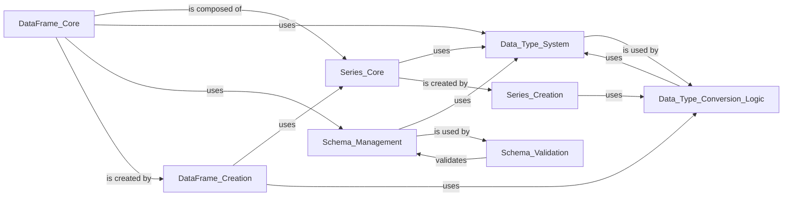

## Component Details

This graph illustrates the core data structures and schema management within the Polars library, focusing on the fundamental building blocks for data representation and integrity. It details how DataFrames and Series are structured, how data types are defined and managed, and the mechanisms for creating these structures and ensuring their schema validity through type conversion and validation logic.

### DataFrame_Core
The primary two-dimensional data structure in Polars, representing tabular data with rows and named columns. It provides a rich set of eager methods for data manipulation, transformation, and analysis.

**Related Classes/Methods**:

- <a href="https://github.com/pola-rs/polars/blob/master/py-polars/polars/dataframe/frame.py#L201-L12391" target="_blank" rel="noopener noreferrer">`polars.dataframe.frame.DataFrame` (201:12391)</a>

### Series_Core
The primary one-dimensional data structure in Polars, representing a single column of data. It supports various data types and provides methods for element-wise operations, transformations, and aggregations.

**Related Classes/Methods**:

- <a href="https://github.com/pola-rs/polars/blob/master/py-polars/polars/series/series.py#L180-L8011" target="_blank" rel="noopener noreferrer">`polars.series.series.Series` (180:8011)</a>

### Data_Type_System
This component defines and manages the various data types supported by Polars, including numeric, temporal, boolean, string, and nested types. It ensures type consistency and facilitates efficient data storage and processing.

**Related Classes/Methods**:

- <a href="https://github.com/pola-rs/polars/blob/master/py-polars/polars/datatypes/classes.py#L112-L254" target="_blank" rel="noopener noreferrer">`polars.datatypes.classes.DataType` (112:254)</a>
- <a href="https://github.com/pola-rs/polars/blob/master/py-polars/polars/datatypes/classes.py#L257-L296" target="_blank" rel="noopener noreferrer">`polars.datatypes.classes.NumericType` (257:296)</a>
- <a href="https://github.com/pola-rs/polars/blob/master/py-polars/polars/datatypes/classes.py#L299-L300" target="_blank" rel="noopener noreferrer">`polars.datatypes.classes.IntegerType` (299:300)</a>
- <a href="https://github.com/pola-rs/polars/blob/master/py-polars/polars/datatypes/classes.py#L303-L304" target="_blank" rel="noopener noreferrer">`polars.datatypes.classes.SignedIntegerType` (303:304)</a>
- <a href="https://github.com/pola-rs/polars/blob/master/py-polars/polars/datatypes/classes.py#L307-L308" target="_blank" rel="noopener noreferrer">`polars.datatypes.classes.UnsignedIntegerType` (307:308)</a>
- <a href="https://github.com/pola-rs/polars/blob/master/py-polars/polars/datatypes/classes.py#L311-L312" target="_blank" rel="noopener noreferrer">`polars.datatypes.classes.FloatType` (311:312)</a>
- <a href="https://github.com/pola-rs/polars/blob/master/py-polars/polars/datatypes/classes.py#L315-L316" target="_blank" rel="noopener noreferrer">`polars.datatypes.classes.TemporalType` (315:316)</a>
- <a href="https://github.com/pola-rs/polars/blob/master/py-polars/polars/datatypes/classes.py#L319-L320" target="_blank" rel="noopener noreferrer">`polars.datatypes.classes.NestedType` (319:320)</a>
- <a href="https://github.com/pola-rs/polars/blob/master/py-polars/polars/datatypes/classes.py#L323-L324" target="_blank" rel="noopener noreferrer">`polars.datatypes.classes.ObjectType` (323:324)</a>
- <a href="https://github.com/pola-rs/polars/blob/master/py-polars/polars/datatypes/classes.py#L327-L328" target="_blank" rel="noopener noreferrer">`polars.datatypes.classes.Int8` (327:328)</a>
- <a href="https://github.com/pola-rs/polars/blob/master/py-polars/polars/datatypes/classes.py#L331-L332" target="_blank" rel="noopener noreferrer">`polars.datatypes.classes.Int16` (331:332)</a>
- <a href="https://github.com/pola-rs/polars/blob/master/py-polars/polars/datatypes/classes.py#L335-L336" target="_blank" rel="noopener noreferrer">`polars.datatypes.classes.Int32` (335:336)</a>
- <a href="https://github.com/pola-rs/polars/blob/master/py-polars/polars/datatypes/classes.py#L339-L340" target="_blank" rel="noopener noreferrer">`polars.datatypes.classes.Int64` (339:340)</a>
- <a href="https://github.com/pola-rs/polars/blob/master/py-polars/polars/datatypes/classes.py#L343-L351" target="_blank" rel="noopener noreferrer">`polars.datatypes.classes.Int128` (343:351)</a>
- <a href="https://github.com/pola-rs/polars/blob/master/py-polars/polars/datatypes/classes.py#L354-L355" target="_blank" rel="noopener noreferrer">`polars.datatypes.classes.UInt8` (354:355)</a>
- <a href="https://github.com/pola-rs/polars/blob/master/py-polars/polars/datatypes/classes.py#L358-L359" target="_blank" rel="noopener noreferrer">`polars.datatypes.classes.UInt16` (358:359)</a>
- <a href="https://github.com/pola-rs/polars/blob/master/py-polars/polars/datatypes/classes.py#L362-L363" target="_blank" rel="noopener noreferrer">`polars.datatypes.classes.UInt32` (362:363)</a>
- <a href="https://github.com/pola-rs/polars/blob/master/py-polars/polars/datatypes/classes.py#L366-L367" target="_blank" rel="noopener noreferrer">`polars.datatypes.classes.UInt64` (366:367)</a>
- <a href="https://github.com/pola-rs/polars/blob/master/py-polars/polars/datatypes/classes.py#L370-L371" target="_blank" rel="noopener noreferrer">`polars.datatypes.classes.Float32` (370:371)</a>
- <a href="https://github.com/pola-rs/polars/blob/master/py-polars/polars/datatypes/classes.py#L374-L375" target="_blank" rel="noopener noreferrer">`polars.datatypes.classes.Float64` (374:375)</a>
- <a href="https://github.com/pola-rs/polars/blob/master/py-polars/polars/datatypes/classes.py#L378-L431" target="_blank" rel="noopener noreferrer">`polars.datatypes.classes.Decimal` (378:431)</a>
- <a href="https://github.com/pola-rs/polars/blob/master/py-polars/polars/datatypes/classes.py#L434-L435" target="_blank" rel="noopener noreferrer">`polars.datatypes.classes.Boolean` (434:435)</a>
- <a href="https://github.com/pola-rs/polars/blob/master/py-polars/polars/datatypes/classes.py#L438-L439" target="_blank" rel="noopener noreferrer">`polars.datatypes.classes.String` (438:439)</a>
- <a href="https://github.com/pola-rs/polars/blob/master/py-polars/polars/datatypes/classes.py#L446-L447" target="_blank" rel="noopener noreferrer">`polars.datatypes.classes.Binary` (446:447)</a>
- <a href="https://github.com/pola-rs/polars/blob/master/py-polars/polars/datatypes/classes.py#L450-L459" target="_blank" rel="noopener noreferrer">`polars.datatypes.classes.Date` (450:459)</a>
- <a href="https://github.com/pola-rs/polars/blob/master/py-polars/polars/datatypes/classes.py#L462-L508" target="_blank" rel="noopener noreferrer">`polars.datatypes.classes.Time` (462:508)</a>
- <a href="https://github.com/pola-rs/polars/blob/master/py-polars/polars/datatypes/classes.py#L511-L570" target="_blank" rel="noopener noreferrer">`polars.datatypes.classes.Datetime` (511:570)</a>
- <a href="https://github.com/pola-rs/polars/blob/master/py-polars/polars/datatypes/classes.py#L573-L615" target="_blank" rel="noopener noreferrer">`polars.datatypes.classes.Duration` (573:615)</a>
- <a href="https://github.com/pola-rs/polars/blob/master/py-polars/polars/datatypes/classes.py#L618-L650" target="_blank" rel="noopener noreferrer">`polars.datatypes.classes.Categorical` (618:650)</a>
- <a href="https://github.com/pola-rs/polars/blob/master/py-polars/polars/datatypes/classes.py#L653-L735" target="_blank" rel="noopener noreferrer">`polars.datatypes.classes.Enum` (653:735)</a>
- <a href="https://github.com/pola-rs/polars/blob/master/py-polars/polars/datatypes/classes.py#L738-L739" target="_blank" rel="noopener noreferrer">`polars.datatypes.classes.Object` (738:739)</a>
- <a href="https://github.com/pola-rs/polars/blob/master/py-polars/polars/datatypes/classes.py#L742-L743" target="_blank" rel="noopener noreferrer">`polars.datatypes.classes.Null` (742:743)</a>
- <a href="https://github.com/pola-rs/polars/blob/master/py-polars/polars/datatypes/classes.py#L746-L747" target="_blank" rel="noopener noreferrer">`polars.datatypes.classes.Unknown` (746:747)</a>
- <a href="https://github.com/pola-rs/polars/blob/master/py-polars/polars/datatypes/classes.py#L750-L804" target="_blank" rel="noopener noreferrer">`polars.datatypes.classes.List` (750:804)</a>
- <a href="https://github.com/pola-rs/polars/blob/master/py-polars/polars/datatypes/classes.py#L807-L917" target="_blank" rel="noopener noreferrer">`polars.datatypes.classes.Array` (807:917)</a>
- <a href="https://github.com/pola-rs/polars/blob/master/py-polars/polars/datatypes/classes.py#L920-L947" target="_blank" rel="noopener noreferrer">`polars.datatypes.classes.Field` (920:947)</a>
- <a href="https://github.com/pola-rs/polars/blob/master/py-polars/polars/datatypes/classes.py#L950-L1025" target="_blank" rel="noopener noreferrer">`polars.datatypes.classes.Struct` (950:1025)</a>

### Schema_Management
This component is responsible for defining, accessing, and validating the schema of DataFrames, which includes column names and their corresponding data types. It ensures data integrity and consistency.

**Related Classes/Methods**:

- <a href="https://github.com/pola-rs/polars/blob/master/py-polars/polars/schema.py#L52-L216" target="_blank" rel="noopener noreferrer">`polars.schema.Schema` (52:216)</a>
- <a href="https://github.com/pola-rs/polars/blob/master/py-polars/polars/schema.py#L42-L49" target="_blank" rel="noopener noreferrer">`polars.schema._check_dtype` (42:49)</a>
- `polars.schema._required_init_args` (full file reference)

### DataFrame_Creation
This component provides utilities for constructing DataFrames from various input formats, including dictionaries, sequences, NumPy arrays, Pandas DataFrames, and Arrow tables.

**Related Classes/Methods**:

- <a href="https://github.com/pola-rs/polars/blob/master/py-polars/polars/_utils/construction/dataframe.py#L76-L175" target="_blank" rel="noopener noreferrer">`polars._utils.construction.dataframe.dict_to_pydf` (76:175)</a>
- <a href="https://github.com/pola-rs/polars/blob/master/py-polars/polars/_utils/construction/dataframe.py#L447-L470" target="_blank" rel="noopener noreferrer">`polars._utils.construction.dataframe.sequence_to_pydf` (447:470)</a>
- <a href="https://github.com/pola-rs/polars/blob/master/py-polars/polars/_utils/construction/dataframe.py#L1333-L1357" target="_blank" rel="noopener noreferrer">`polars._utils.construction.dataframe.series_to_pydf` (1333:1357)</a>
- <a href="https://github.com/pola-rs/polars/blob/master/py-polars/polars/_utils/construction/dataframe.py#L1197-L1330" target="_blank" rel="noopener noreferrer">`polars._utils.construction.dataframe.numpy_to_pydf` (1197:1330)</a>
- <a href="https://github.com/pola-rs/polars/blob/master/py-polars/polars/_utils/construction/dataframe.py#L1155-L1194" target="_blank" rel="noopener noreferrer">`polars._utils.construction.dataframe.arrow_to_pydf` (1155:1194)</a>
- <a href="https://github.com/pola-rs/polars/blob/master/py-polars/polars/_utils/construction/dataframe.py#L1073-L1131" target="_blank" rel="noopener noreferrer">`polars._utils.construction.dataframe.pandas_to_pydf` (1073:1131)</a>
- <a href="https://github.com/pola-rs/polars/blob/master/py-polars/polars/_utils/construction/dataframe.py#L957-L1046" target="_blank" rel="noopener noreferrer">`polars._utils.construction.dataframe.iterable_to_pydf` (957:1046)</a>
- <a href="https://github.com/pola-rs/polars/blob/master/py-polars/polars/_utils/construction/dataframe.py#L1360-L1384" target="_blank" rel="noopener noreferrer">`polars._utils.construction.dataframe.dataframe_to_pydf` (1360:1384)</a>
- <a href="https://github.com/pola-rs/polars/blob/master/py-polars/polars/_utils/construction/dataframe.py#L178-L265" target="_blank" rel="noopener noreferrer">`polars._utils.construction.dataframe._unpack_schema` (178:265)</a>
- <a href="https://github.com/pola-rs/polars/blob/master/py-polars/polars/_utils/construction/dataframe.py#L268-L293" target="_blank" rel="noopener noreferrer">`polars._utils.construction.dataframe._handle_columns_arg` (268:293)</a>
- <a href="https://github.com/pola-rs/polars/blob/master/py-polars/polars/_utils/construction/dataframe.py#L340-L423" target="_blank" rel="noopener noreferrer">`polars._utils.construction.dataframe._expand_dict_values` (340:423)</a>
- <a href="https://github.com/pola-rs/polars/blob/master/py-polars/polars/_utils/construction/dataframe.py#L426-L444" target="_blank" rel="noopener noreferrer">`polars._utils.construction.dataframe._expand_dict_data` (426:444)</a>
- <a href="https://github.com/pola-rs/polars/blob/master/py-polars/polars/_utils/construction/dataframe.py#L541-L623" target="_blank" rel="noopener noreferrer">`polars._utils.construction.dataframe._sequence_of_sequence_to_pydf` (541:623)</a>
- <a href="https://github.com/pola-rs/polars/blob/master/py-polars/polars/_utils/construction/dataframe.py#L626-L651" target="_blank" rel="noopener noreferrer">`polars._utils.construction.dataframe._sequence_of_series_to_pydf` (626:651)</a>
- <a href="https://github.com/pola-rs/polars/blob/master/py-polars/polars/_utils/construction/dataframe.py#L655-L689" target="_blank" rel="noopener noreferrer">`polars._utils.construction.dataframe._sequence_of_tuple_to_pydf` (655:689)</a>
- <a href="https://github.com/pola-rs/polars/blob/master/py-polars/polars/_utils/construction/dataframe.py#L731-L752" target="_blank" rel="noopener noreferrer">`polars._utils.construction.dataframe._sequence_of_elements_to_pydf` (731:752)</a>
- <a href="https://github.com/pola-rs/polars/blob/master/py-polars/polars/_utils/construction/dataframe.py#L765-L791" target="_blank" rel="noopener noreferrer">`polars._utils.construction.dataframe._sequence_of_pandas_to_pydf` (765:791)</a>
- <a href="https://github.com/pola-rs/polars/blob/master/py-polars/polars/_utils/construction/dataframe.py#L900-L944" target="_blank" rel="noopener noreferrer">`polars._utils.construction.dataframe._establish_dataclass_or_model_schema` (900:944)</a>
- <a href="https://github.com/pola-rs/polars/blob/master/py-polars/polars/convert/general.py#L53-L114" target="_blank" rel="noopener noreferrer">`polars.convert.general.from_dict` (53:114)</a>
- <a href="https://github.com/pola-rs/polars/blob/master/py-polars/polars/convert/general.py#L117-L223" target="_blank" rel="noopener noreferrer">`polars.convert.general.from_dicts` (117:223)</a>
- <a href="https://github.com/pola-rs/polars/blob/master/py-polars/polars/convert/general.py#L226-L307" target="_blank" rel="noopener noreferrer">`polars.convert.general.from_records` (226:307)</a>
- <a href="https://github.com/pola-rs/polars/blob/master/py-polars/polars/convert/general.py#L310-L372" target="_blank" rel="noopener noreferrer">`polars.convert.general.from_numpy` (310:372)</a>
- <a href="https://github.com/pola-rs/polars/blob/master/py-polars/polars/convert/general.py#L375-L450" target="_blank" rel="noopener noreferrer">`polars.convert.general.from_torch` (375:450)</a>
- <a href="https://github.com/pola-rs/polars/blob/master/py-polars/polars/convert/general.py#L458-L584" target="_blank" rel="noopener noreferrer">`polars.convert.general.from_arrow` (458:584)</a>
- <a href="https://github.com/pola-rs/polars/blob/master/py-polars/polars/convert/general.py#L588-L595" target="_blank" rel="noopener noreferrer">`polars.convert.general.from_pandas` (588:595)</a>
- <a href="https://github.com/pola-rs/polars/blob/master/py-polars/polars/convert/general.py#L964-L1038" target="_blank" rel="noopener noreferrer">`polars.convert.general.from_dataframe` (964:1038)</a>

### Series_Creation
This component provides utilities for constructing Series from various input formats, including sequences, iterables, NumPy arrays, Pandas Series, and Arrow arrays.

**Related Classes/Methods**:

- <a href="https://github.com/pola-rs/polars/blob/master/py-polars/polars/_utils/construction/series.py#L75-L315" target="_blank" rel="noopener noreferrer">`polars._utils.construction.series.sequence_to_pyseries` (75:315)</a>
- <a href="https://github.com/pola-rs/polars/blob/master/py-polars/polars/_utils/construction/series.py#L348-L387" target="_blank" rel="noopener noreferrer">`polars._utils.construction.series.iterable_to_pyseries` (348:387)</a>
- <a href="https://github.com/pola-rs/polars/blob/master/py-polars/polars/_utils/construction/series.py#L390-L417" target="_blank" rel="noopener noreferrer">`polars._utils.construction.series.pandas_to_pyseries` (390:417)</a>
- <a href="https://github.com/pola-rs/polars/blob/master/py-polars/polars/_utils/construction/series.py#L420-L468" target="_blank" rel="noopener noreferrer">`polars._utils.construction.series.arrow_to_pyseries` (420:468)</a>
- <a href="https://github.com/pola-rs/polars/blob/master/py-polars/polars/_utils/construction/series.py#L471-L501" target="_blank" rel="noopener noreferrer">`polars._utils.construction.series.numpy_to_pyseries` (471:501)</a>
- <a href="https://github.com/pola-rs/polars/blob/master/py-polars/polars/convert/general.py#L310-L372" target="_blank" rel="noopener noreferrer">`polars.convert.general.from_numpy` (310:372)</a>
- <a href="https://github.com/pola-rs/polars/blob/master/py-polars/polars/convert/general.py#L458-L584" target="_blank" rel="noopener noreferrer">`polars.convert.general.from_arrow` (458:584)</a>
- <a href="https://github.com/pola-rs/polars/blob/master/py-polars/polars/convert/general.py#L588-L595" target="_blank" rel="noopener noreferrer">`polars.convert.general.from_pandas` (588:595)</a>

### Data_Type_Conversion_Logic
This component handles the intricate logic of converting and parsing data types within Polars, ensuring compatibility and correctness across different data representations.

**Related Classes/Methods**:

- <a href="https://github.com/pola-rs/polars/blob/master/py-polars/polars/datatypes/convert.py#L68-L81" target="_blank" rel="noopener noreferrer">`polars.datatypes.convert.is_polars_dtype` (68:81)</a>
- <a href="https://github.com/pola-rs/polars/blob/master/py-polars/polars/datatypes/convert.py#L84-L136" target="_blank" rel="noopener noreferrer">`polars.datatypes.convert.unpack_dtypes` (84:136)</a>
- <a href="https://github.com/pola-rs/polars/blob/master/py-polars/polars/datatypes/convert.py#L338-L363" target="_blank" rel="noopener noreferrer">`polars.datatypes.convert.maybe_cast` (338:363)</a>
- <a href="https://github.com/pola-rs/polars/blob/master/py-polars/polars/datatypes/convert.py#L268-L275" target="_blank" rel="noopener noreferrer">`polars.datatypes.convert.dtype_to_py_type` (268:275)</a>
- <a href="https://github.com/pola-rs/polars/blob/master/py-polars/polars/datatypes/_parse.py#L44-L60" target="_blank" rel="noopener noreferrer">`polars.datatypes._parse.parse_into_dtype` (44:60)</a>
- <a href="https://github.com/pola-rs/polars/blob/master/py-polars/polars/datatypes/_parse.py#L63-L68" target="_blank" rel="noopener noreferrer">`polars.datatypes._parse.try_parse_into_dtype` (63:68)</a>
- <a href="https://github.com/pola-rs/polars/blob/master/py-polars/polars/datatypes/_parse.py#L72-L108" target="_blank" rel="noopener noreferrer">`polars.datatypes._parse.parse_py_type_into_dtype` (72:108)</a>
- <a href="https://github.com/pola-rs/polars/blob/master/py-polars/polars/datatypes/_parse.py#L147-L157" target="_blank" rel="noopener noreferrer">`polars.datatypes._parse._parse_forward_ref_into_dtype` (147:157)</a>
- <a href="https://github.com/pola-rs/polars/blob/master/py-polars/polars/datatypes/_parse.py#L111-L126" target="_blank" rel="noopener noreferrer">`polars.datatypes._parse._parse_generic_into_dtype` (111:126)</a>
- <a href="https://github.com/pola-rs/polars/blob/master/py-polars/polars/datatypes/_parse.py#L160-L178" target="_blank" rel="noopener noreferrer">`polars.datatypes._parse._parse_union_type_into_dtype` (160:178)</a>
- <a href="https://github.com/pola-rs/polars/blob/master/py-polars/polars/datatypes/constructor.py#L53-L66" target="_blank" rel="noopener noreferrer">`polars.datatypes.constructor.polars_type_to_constructor` (53:66)</a>
- <a href="https://github.com/pola-rs/polars/blob/master/py-polars/polars/datatypes/constructor.py#L164-L171" target="_blank" rel="noopener noreferrer">`polars.datatypes.constructor.py_type_to_constructor` (164:171)</a>
- <a href="https://github.com/pola-rs/polars/blob/master/py-polars/polars/datatypes/convert.py#L322-L335" target="_blank" rel="noopener noreferrer">`polars.datatypes.convert.numpy_char_code_to_dtype` (322:335)</a>

### Schema_Validation
This component is responsible for validating schemas, ensuring data integrity and consistency.

**Related Classes/Methods**:

- <a href="https://github.com/pola-rs/polars/blob/master/py-polars/polars/schema.py#L42-L49" target="_blank" rel="noopener noreferrer">`polars.schema._check_dtype` (42:49)</a>
- <a href="https://github.com/pola-rs/polars/blob/master/py-polars/polars/schema.py#L123-L127" target="_blank" rel="noopener noreferrer">`polars.schema.Schema.__setitem__` (123:127)</a>

### [FAQ](https://github.com/CodeBoarding/GeneratedOnBoardings/tree/main?tab=readme-ov-file#faq)