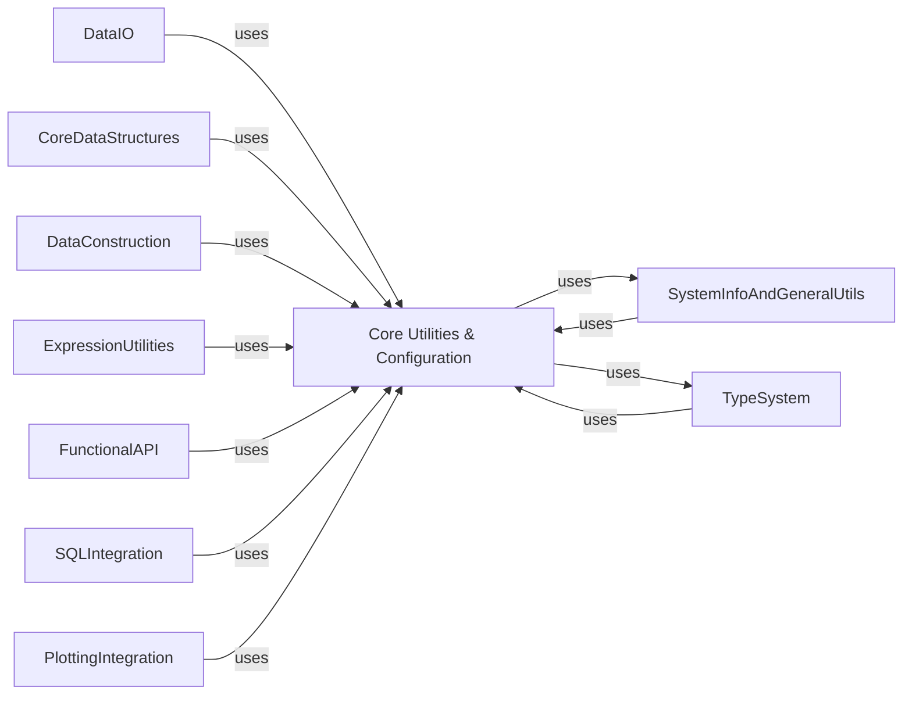

## Component Details

The 'Core Utilities & Configuration' component serves as the foundational layer for the Polars library, providing essential services such as managing global and session-specific configurations, handling dynamic loading and version checks of external dependencies, issuing deprecation and unstable feature warnings, and facilitating various data type conversions. Its purpose is to ensure the overall stability, adaptability, and efficient operation of Polars by centralizing core utility functions and configuration mechanisms that are critical for other components across the library.

### Core Utilities & Configuration
This component encompasses a collection of foundational utility functions, global configurations, and dependency management mechanisms used throughout the Polars library. It handles aspects like deprecation warnings, type conversions, asynchronous operations, and CPU feature checks, ensuring the library's stability and adaptability.

**Related Classes/Methods**:

- `polars._utils.deprecation` (full file reference)
- `polars._utils.convert` (full file reference)
- <a href="https://github.com/pola-rs/polars/blob/master/py-polars/polars/config.py#L148-L1513" target="_blank" rel="noopener noreferrer">`polars.config.Config` (148:1513)</a>
- <a href="https://github.com/pola-rs/polars/blob/master/py-polars/polars/dependencies.py#L28-L102" target="_blank" rel="noopener noreferrer">`polars.dependencies._LazyModule` (28:102)</a>

### DataIO
Provides functionalities for reading and writing data in various formats (CSV, IPC, Parquet, NDJSON, JSON, Delta, Excel) and interacting with databases. It also includes utilities for file path normalization and cloud credential provisioning.

**Related Classes/Methods**:

- `polars.py-polars.polars.io.delta` (full file reference)
- `polars.py-polars.polars.io.ndjson` (full file reference)
- `polars.py-polars.polars.io.csv.functions` (full file reference)
- `polars.py-polars.polars.io.ipc.functions` (full file reference)
- `polars.py-polars.polars.io.parquet.functions` (full file reference)
- `polars.py-polars.polars.io.json.read` (full file reference)

### CoreDataStructures
Defines the fundamental data structures in Polars: DataFrame, LazyFrame, and Series, along with their primary methods for data manipulation and transformation.

**Related Classes/Methods**:

- <a href="https://github.com/pola-rs/polars/blob/master/py-polars/polars/dataframe/frame.py#L201-L12391" target="_blank" rel="noopener noreferrer">`polars.py-polars.polars.dataframe.frame.DataFrame` (201:12391)</a>
- <a href="https://github.com/pola-rs/polars/blob/master/py-polars/polars/lazyframe/frame.py#L235-L8350" target="_blank" rel="noopener noreferrer">`polars.py-polars.polars.lazyframe.frame.LazyFrame` (235:8350)</a>
- <a href="https://github.com/pola-rs/polars/blob/master/py-polars/polars/series/series.py#L180-L8011" target="_blank" rel="noopener noreferrer">`polars.py-polars.polars.series.series.Series` (180:8011)</a>

### DataConstruction
Handles the creation of Polars Series and DataFrames from various Python data types (dictionaries, sequences, NumPy arrays, Pandas DataFrames/Series, Arrow tables) and manages type conversions.

**Related Classes/Methods**:

- <a href="https://github.com/pola-rs/polars/blob/master/py-polars/polars/_utils/construction/dataframe.py#L76-L175" target="_blank" rel="noopener noreferrer">`polars.py-polars.polars._utils.construction.dataframe.dict_to_pydf` (76:175)</a>
- <a href="https://github.com/pola-rs/polars/blob/master/py-polars/polars/_utils/construction/series.py#L75-L315" target="_blank" rel="noopener noreferrer">`polars.py-polars.polars._utils.construction.series.sequence_to_pyseries` (75:315)</a>

### ExpressionUtilities
Provides utilities for parsing various inputs into Polars expressions and managing internal conversions for expressions.

**Related Classes/Methods**:

- <a href="https://github.com/pola-rs/polars/blob/master/py-polars/polars/_utils/parse/expr.py#L20-L63" target="_blank" rel="noopener noreferrer">`polars.py-polars.polars._utils.parse.expr.parse_into_expression` (20:63)</a>
- <a href="https://github.com/pola-rs/polars/blob/master/py-polars/polars/_utils/wrap.py#L24-L25" target="_blank" rel="noopener noreferrer">`polars.py-polars.polars._utils.wrap.wrap_expr` (24:25)</a>

### FunctionalAPI
Exposes a collection of global functions for creating expressions, literals, performing eager and lazy operations, aggregations, and generating ranges (time, date, int, linear space).

**Related Classes/Methods**:

- <a href="https://github.com/pola-rs/polars/blob/master/py-polars/polars/functions/col.py#L31-L97" target="_blank" rel="noopener noreferrer">`polars.py-polars.polars.functions.col._create_col` (31:97)</a>
- <a href="https://github.com/pola-rs/polars/blob/master/py-polars/polars/functions/lit.py#L30-L202" target="_blank" rel="noopener noreferrer">`polars.py-polars.polars.functions.lit.lit` (30:202)</a>
- <a href="https://github.com/pola-rs/polars/blob/master/py-polars/polars/functions/eager.py#L26-L306" target="_blank" rel="noopener noreferrer">`polars.py-polars.polars.functions.eager.concat` (26:306)</a>
- <a href="https://github.com/pola-rs/polars/blob/master/py-polars/polars/functions/lazy.py#L545-L607" target="_blank" rel="noopener noreferrer">`polars.py-polars.polars.functions.lazy.first` (545:607)</a>

### SQLIntegration
Facilitates the execution of SQL queries against Polars data structures by providing a SQL context and ensuring compatibility with various data sources.

**Related Classes/Methods**:

- <a href="https://github.com/pola-rs/polars/blob/master/py-polars/polars/sql/context.py#L99-L677" target="_blank" rel="noopener noreferrer">`polars.py-polars.polars.sql.context.SQLContext` (99:677)</a>

### TypeSystem
Defines and manages Polars' internal data types, including parsing, conversion, and validation of types.

**Related Classes/Methods**:

- <a href="https://github.com/pola-rs/polars/blob/master/py-polars/polars/datatypes/_parse.py#L44-L60" target="_blank" rel="noopener noreferrer">`polars.datatypes._parse.parse_into_dtype` (44:60)</a>
- <a href="https://github.com/pola-rs/polars/blob/master/py-polars/polars/datatypes/classes.py#L112-L254" target="_blank" rel="noopener noreferrer">`polars.datatypes.classes.DataType` (112:254)</a>

### SystemInfoAndGeneralUtils
Provides utilities for retrieving Polars version information, CPU details, and general-purpose helper functions like path normalization, sequence checks, and stack level finding.

**Related Classes/Methods**:

- <a href="https://github.com/pola-rs/polars/blob/master/py-polars/polars/meta/versions.py#L10-L68" target="_blank" rel="noopener noreferrer">`polars.py-polars.polars.meta.versions.show_versions` (10:68)</a>
- <a href="https://github.com/pola-rs/polars/blob/master/py-polars/polars/_cpu_check.py#L53-L54" target="_blank" rel="noopener noreferrer">`polars._cpu_check.get_lts_cpu` (53:54)</a>
- <a href="https://github.com/pola-rs/polars/blob/master/py-polars/polars/_utils/various.py#L223-L234" target="_blank" rel="noopener noreferrer">`polars.py-polars.polars._utils.various.normalize_filepath` (223:234)</a>

### PlottingIntegration
Integrates plotting capabilities for Polars DataFrames and Series, leveraging external plotting libraries.

**Related Classes/Methods**:

- <a href="https://github.com/pola-rs/polars/blob/master/py-polars/polars/dataframe/plotting.py#L34-L257" target="_blank" rel="noopener noreferrer">`polars.dataframe.plotting.DataFramePlot` (34:257)</a>
- <a href="https://github.com/pola-rs/polars/blob/master/py-polars/polars/series/plotting.py#L23-L191" target="_blank" rel="noopener noreferrer">`polars.series.plotting.SeriesPlot` (23:191)</a>

### [FAQ](https://github.com/CodeBoarding/GeneratedOnBoardings/tree/main?tab=readme-ov-file#faq)