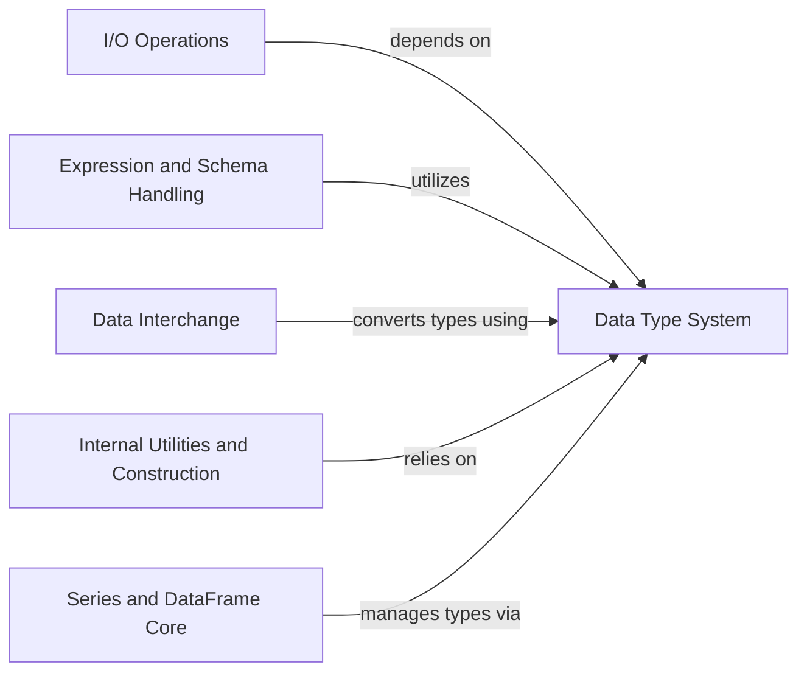

## Component Details

The Data Type System is the central component responsible for defining, parsing, converting, and managing all data types within the Polars ecosystem. It provides the foundational data type classes, mechanisms to parse various inputs into these types, utilities for converting between Polars and external type systems (like Python and NumPy), and functions for internal representation and construction. Its core responsibility is to ensure data integrity, type compatibility, and efficient data handling across all Polars operations.

### Data Type System
This component is the central authority for defining, parsing, converting, and managing all data types within the Polars ecosystem. It provides the foundational data type classes, mechanisms to parse various inputs into these types, utilities for converting between Polars and external type systems (like Python and NumPy), and functions for internal representation and construction. Its core responsibility is to ensure data integrity, type compatibility, and efficient data handling across all Polars operations.

**Related Classes/Methods**:

- <a href="https://github.com/pola-rs/polars/blob/master/py-polars/polars/datatypes/convert.py#L68-L81" target="_blank" rel="noopener noreferrer">`polars.datatypes.convert.is_polars_dtype` (68:81)</a>
- <a href="https://github.com/pola-rs/polars/blob/master/py-polars/polars/datatypes/convert.py#L84-L136" target="_blank" rel="noopener noreferrer">`polars.datatypes.convert.unpack_dtypes` (84:136)</a>
- <a href="https://github.com/pola-rs/polars/blob/master/py-polars/polars/datatypes/convert.py#L268-L275" target="_blank" rel="noopener noreferrer">`polars.datatypes.convert.dtype_to_py_type` (268:275)</a>
- <a href="https://github.com/pola-rs/polars/blob/master/py-polars/polars/datatypes/convert.py#L287-L310" target="_blank" rel="noopener noreferrer">`polars.datatypes.convert.dtype_short_repr_to_dtype` (287:310)</a>
- <a href="https://github.com/pola-rs/polars/blob/master/py-polars/polars/datatypes/convert.py#L313-L319" target="_blank" rel="noopener noreferrer">`polars.datatypes.convert.supported_numpy_char_code` (313:319)</a>
- <a href="https://github.com/pola-rs/polars/blob/master/py-polars/polars/datatypes/convert.py#L322-L335" target="_blank" rel="noopener noreferrer">`polars.datatypes.convert.numpy_char_code_to_dtype` (322:335)</a>
- <a href="https://github.com/pola-rs/polars/blob/master/py-polars/polars/datatypes/convert.py#L258-L265" target="_blank" rel="noopener noreferrer">`polars.datatypes.convert.dtype_to_ffiname` (258:265)</a>
- <a href="https://github.com/pola-rs/polars/blob/master/py-polars/polars/datatypes/_parse.py#L44-L60" target="_blank" rel="noopener noreferrer">`polars.datatypes._parse.parse_into_dtype` (44:60)</a>
- <a href="https://github.com/pola-rs/polars/blob/master/py-polars/polars/datatypes/_parse.py#L72-L108" target="_blank" rel="noopener noreferrer">`polars.datatypes._parse.parse_py_type_into_dtype` (72:108)</a>
- <a href="https://github.com/pola-rs/polars/blob/master/py-polars/polars/datatypes/_parse.py#L63-L68" target="_blank" rel="noopener noreferrer">`polars.datatypes._parse.try_parse_into_dtype` (63:68)</a>
- <a href="https://github.com/pola-rs/polars/blob/master/py-polars/polars/datatypes/_parse.py#L147-L157" target="_blank" rel="noopener noreferrer">`polars.datatypes._parse._parse_forward_ref_into_dtype` (147:157)</a>
- <a href="https://github.com/pola-rs/polars/blob/master/py-polars/polars/datatypes/_parse.py#L160-L178" target="_blank" rel="noopener noreferrer">`polars.datatypes._parse._parse_union_type_into_dtype` (160:178)</a>
- <a href="https://github.com/pola-rs/polars/blob/master/py-polars/polars/datatypes/_parse.py#L111-L126" target="_blank" rel="noopener noreferrer">`polars.datatypes._parse._parse_generic_into_dtype` (111:126)</a>
- <a href="https://github.com/pola-rs/polars/blob/master/py-polars/polars/datatypes/_parse.py#L181-L186" target="_blank" rel="noopener noreferrer">`polars.datatypes._parse._raise_on_invalid_dtype` (181:186)</a>
- <a href="https://github.com/pola-rs/polars/blob/master/py-polars/polars/datatypes/classes.py#L750-L804" target="_blank" rel="noopener noreferrer">`polars.datatypes.classes.List` (750:804)</a>
- <a href="https://github.com/pola-rs/polars/blob/master/py-polars/polars/datatypes/classes.py#L378-L431" target="_blank" rel="noopener noreferrer">`polars.datatypes.classes.Decimal` (378:431)</a>
- <a href="https://github.com/pola-rs/polars/blob/master/py-polars/polars/datatypes/classes.py#L511-L570" target="_blank" rel="noopener noreferrer">`polars.datatypes.classes.Datetime` (511:570)</a>
- <a href="https://github.com/pola-rs/polars/blob/master/py-polars/polars/datatypes/classes.py#L653-L735" target="_blank" rel="noopener noreferrer">`polars.datatypes.classes.Enum` (653:735)</a>
- <a href="https://github.com/pola-rs/polars/blob/master/py-polars/polars/datatypes/classes.py#L339-L340" target="_blank" rel="noopener noreferrer">`polars.datatypes.classes.Int64` (339:340)</a>
- <a href="https://github.com/pola-rs/polars/blob/master/py-polars/polars/datatypes/classes.py#L374-L375" target="_blank" rel="noopener noreferrer">`polars.datatypes.classes.Float64` (374:375)</a>
- <a href="https://github.com/pola-rs/polars/blob/master/py-polars/polars/datatypes/classes.py#L438-L439" target="_blank" rel="noopener noreferrer">`polars.datatypes.classes.String` (438:439)</a>
- <a href="https://github.com/pola-rs/polars/blob/master/py-polars/polars/datatypes/classes.py#L434-L435" target="_blank" rel="noopener noreferrer">`polars.datatypes.classes.Boolean` (434:435)</a>
- <a href="https://github.com/pola-rs/polars/blob/master/py-polars/polars/datatypes/classes.py#L450-L459" target="_blank" rel="noopener noreferrer">`polars.datatypes.classes.Date` (450:459)</a>
- <a href="https://github.com/pola-rs/polars/blob/master/py-polars/polars/datatypes/classes.py#L462-L508" target="_blank" rel="noopener noreferrer">`polars.datatypes.classes.Time` (462:508)</a>
- <a href="https://github.com/pola-rs/polars/blob/master/py-polars/polars/datatypes/classes.py#L446-L447" target="_blank" rel="noopener noreferrer">`polars.datatypes.classes.Binary` (446:447)</a>
- <a href="https://github.com/pola-rs/polars/blob/master/py-polars/polars/datatypes/classes.py#L738-L739" target="_blank" rel="noopener noreferrer">`polars.datatypes.classes.Object` (738:739)</a>
- <a href="https://github.com/pola-rs/polars/blob/master/py-polars/polars/datatypes/classes.py#L742-L743" target="_blank" rel="noopener noreferrer">`polars.datatypes.classes.Null` (742:743)</a>
- <a href="https://github.com/pola-rs/polars/blob/master/py-polars/polars/datatypes/classes.py#L573-L615" target="_blank" rel="noopener noreferrer">`polars.datatypes.classes.Duration` (573:615)</a>
- <a href="https://github.com/pola-rs/polars/blob/master/py-polars/polars/datatypes/classes.py#L179-L181" target="_blank" rel="noopener noreferrer">`polars.datatypes.classes.DataType.is_integer` (179:181)</a>
- <a href="https://github.com/pola-rs/polars/blob/master/py-polars/polars/datatypes/classes.py#L147-L166" target="_blank" rel="noopener noreferrer">`polars.datatypes.classes.DataType.is_` (147:166)</a>
- <a href="https://github.com/pola-rs/polars/blob/master/py-polars/polars/datatypes/classes.py#L214-L236" target="_blank" rel="noopener noreferrer">`polars.datatypes.classes.DataType:from_python` (214:236)</a>
- <a href="https://github.com/pola-rs/polars/blob/master/py-polars/polars/datatypes/classes.py#L239-L254" target="_blank" rel="noopener noreferrer">`polars.datatypes.classes.DataType:to_python` (239:254)</a>
- <a href="https://github.com/pola-rs/polars/blob/master/py-polars/polars/datatypes/classes.py#L807-L917" target="_blank" rel="noopener noreferrer">`polars.datatypes.classes.Array` (807:917)</a>
- <a href="https://github.com/pola-rs/polars/blob/master/py-polars/polars/datatypes/classes.py#L920-L947" target="_blank" rel="noopener noreferrer">`polars.datatypes.classes.Field` (920:947)</a>
- <a href="https://github.com/pola-rs/polars/blob/master/py-polars/polars/datatypes/classes.py#L950-L1025" target="_blank" rel="noopener noreferrer">`polars.datatypes.classes.Struct` (950:1025)</a>
- <a href="https://github.com/pola-rs/polars/blob/master/py-polars/polars/datatypes/constructor.py#L53-L66" target="_blank" rel="noopener noreferrer">`polars.datatypes.constructor.polars_type_to_constructor` (53:66)</a>
- <a href="https://github.com/pola-rs/polars/blob/master/py-polars/polars/datatypes/constructor.py#L164-L171" target="_blank" rel="noopener noreferrer">`polars.datatypes.constructor.py_type_to_constructor` (164:171)</a>
- <a href="https://github.com/pola-rs/polars/blob/master/py-polars/polars/datatypes/constructor.py#L117-L127" target="_blank" rel="noopener noreferrer">`polars.datatypes.constructor.numpy_values_and_dtype` (117:127)</a>
- <a href="https://github.com/pola-rs/polars/blob/master/py-polars/polars/datatypes/constructor.py#L130-L150" target="_blank" rel="noopener noreferrer">`polars.datatypes.constructor.numpy_type_to_constructor` (130:150)</a>
- <a href="https://github.com/pola-rs/polars/blob/master/py-polars/polars/datatypes/constructor.py#L94-L114" target="_blank" rel="noopener noreferrer">`polars.datatypes.constructor._normalise_numpy_dtype` (94:114)</a>
- <a href="https://github.com/pola-rs/polars/blob/master/py-polars/polars/datatypes/constructor.py#L72-L90" target="_blank" rel="noopener noreferrer">`polars.datatypes.constructor._set_numpy_to_constructor` (72:90)</a>
- <a href="https://github.com/pola-rs/polars/blob/master/py-polars/polars/datatypes/group.py#L50-L72" target="_blank" rel="noopener noreferrer">`polars.datatypes.group.DataTypeGroup:__new__` (50:72)</a>
- <a href="https://github.com/pola-rs/polars/blob/master/py-polars/polars/datatypes/_utils.py#L7-L17" target="_blank" rel="noopener noreferrer">`polars.datatypes._utils.dtype_to_init_repr` (7:17)</a>
- <a href="https://github.com/pola-rs/polars/blob/master/py-polars/polars/datatypes/_utils.py#L20-L27" target="_blank" rel="noopener noreferrer">`polars.datatypes._utils._dtype_to_init_repr_list` (20:27)</a>
- <a href="https://github.com/pola-rs/polars/blob/master/py-polars/polars/datatypes/_utils.py#L30-L37" target="_blank" rel="noopener noreferrer">`polars.datatypes._utils._dtype_to_init_repr_array` (30:37)</a>
- <a href="https://github.com/pola-rs/polars/blob/master/py-polars/polars/datatypes/_utils.py#L40-L48" target="_blank" rel="noopener noreferrer">`polars.datatypes._utils._dtype_to_init_repr_struct` (40:48)</a>
- <a href="https://github.com/pola-rs/polars/blob/master/py-polars/polars/datatypes/convert.py#L240-L251" target="_blank" rel="noopener noreferrer">`polars.datatypes.convert._DataTypeMappings:REPR_TO_DTYPE` (240:251)</a>
- `polars.datatypes.convert._DataTypeMappings.REPR_TO_DTYPE._dtype_str_repr_safe` (157:161)

### I/O Operations
This component handles reading and scanning data from various sources like CSV, Delta Lake, and databases. It often involves parsing and inferring data types during the input process.

**Related Classes/Methods**:

- <a href="https://github.com/pola-rs/polars/blob/master/py-polars/polars/io/delta.py#L485-L494" target="_blank" rel="noopener noreferrer">`polars.io.delta:_check_for_unsupported_types` (485:494)</a>
- <a href="https://github.com/pola-rs/polars/blob/master/py-polars/polars/io/csv/batched_reader.py#L29-L109" target="_blank" rel="noopener noreferrer">`polars.io.csv.batched_reader.BatchedCsvReader:__init__` (29:109)</a>
- <a href="https://github.com/pola-rs/polars/blob/master/py-polars/polars/io/csv/functions.py#L583-L726" target="_blank" rel="noopener noreferrer">`polars.io.csv.functions:_read_csv_impl` (583:726)</a>
- <a href="https://github.com/pola-rs/polars/blob/master/py-polars/polars/io/csv/functions.py#L1383-L1484" target="_blank" rel="noopener noreferrer">`polars.io.csv.functions:_scan_csv_impl` (1383:1484)</a>
- <a href="https://github.com/pola-rs/polars/blob/master/py-polars/polars/io/database/_inference.py#L42-L206" target="_blank" rel="noopener noreferrer">`polars.io.database._inference:dtype_from_database_typename` (42:206)</a>
- <a href="https://github.com/pola-rs/polars/blob/master/py-polars/polars/io/database/_inference.py#L209-L250" target="_blank" rel="noopener noreferrer">`polars.io.database._inference:dtype_from_cursor_description` (209:250)</a>

### Expression and Schema Handling
This component deals with the creation and manipulation of expressions and the definition and management of data schemas. It includes functionalities for casting expressions and defining schema structures.

**Related Classes/Methods**:

- <a href="https://github.com/pola-rs/polars/blob/master/py-polars/polars/selectors.py#L256-L307" target="_blank" rel="noopener noreferrer">`polars.selectors:_combine_as_selector` (256:307)</a>
- <a href="https://github.com/pola-rs/polars/blob/master/py-polars/polars/schema.py#L91-L108" target="_blank" rel="noopener noreferrer">`polars.schema.Schema:__init__` (91:108)</a>
- <a href="https://github.com/pola-rs/polars/blob/master/py-polars/polars/schema.py#L123-L127" target="_blank" rel="noopener noreferrer">`polars.schema.Schema:__setitem__` (123:127)</a>
- <a href="https://github.com/pola-rs/polars/blob/master/py-polars/polars/expr/string.py#L1230-L1275" target="_blank" rel="noopener noreferrer">`polars.expr.string.ExprStringNameSpace:json_decode` (1230:1275)</a>
- <a href="https://github.com/pola-rs/polars/blob/master/py-polars/polars/expr/expr.py#L1802-L1847" target="_blank" rel="noopener noreferrer">`polars.expr.expr.Expr:cast` (1802:1847)</a>
- <a href="https://github.com/pola-rs/polars/blob/master/py-polars/polars/functions/col.py#L31-L97" target="_blank" rel="noopener noreferrer">`polars.functions.col:_create_col` (31:97)</a>
- <a href="https://github.com/pola-rs/polars/blob/master/py-polars/polars/functions/col.py#L112-L117" target="_blank" rel="noopener noreferrer">`polars.functions.col._polars_dtype_match` (112:117)</a>
- <a href="https://github.com/pola-rs/polars/blob/master/py-polars/polars/functions/col.py#L100-L109" target="_blank" rel="noopener noreferrer">`polars.functions.col._python_dtype_match` (100:109)</a>
- <a href="https://github.com/pola-rs/polars/blob/master/py-polars/polars/functions/lit.py#L30-L202" target="_blank" rel="noopener noreferrer">`polars.functions.lit:lit` (30:202)</a>

### Data Interchange
This component facilitates data exchange with other data manipulation libraries, particularly focusing on the Apache Arrow Data Interchange Protocol. It handles conversions between Polars data types and the interchange protocol's data types.

**Related Classes/Methods**:

- <a href="https://github.com/pola-rs/polars/blob/master/py-polars/polars/interchange/from_dataframe.py#L67-L81" target="_blank" rel="noopener noreferrer">`polars.interchange.from_dataframe:_protocol_df_chunk_to_polars` (67:81)</a>
- <a href="https://github.com/pola-rs/polars/blob/master/py-polars/polars/interchange/from_dataframe.py#L139-L182" target="_blank" rel="noopener noreferrer">`polars.interchange.from_dataframe:_categorical_column_to_series` (139:182)</a>
- <a href="https://github.com/pola-rs/polars/blob/master/py-polars/polars/interchange/from_dataframe.py#L185-L211" target="_blank" rel="noopener noreferrer">`polars.interchange.from_dataframe:_construct_data_buffer` (185:211)</a>
- <a href="https://github.com/pola-rs/polars/blob/master/py-polars/polars/interchange/from_dataframe.py#L214-L234" target="_blank" rel="noopener noreferrer">`polars.interchange.from_dataframe:_construct_offsets_buffer` (214:234)</a>
- <a href="https://github.com/pola-rs/polars/blob/master/py-polars/polars/interchange/column.py#L54-L57" target="_blank" rel="noopener noreferrer">`polars.interchange.column.PolarsColumn:dtype` (54:57)</a>
- <a href="https://github.com/pola-rs/polars/blob/master/py-polars/polars/interchange/column.py#L172-L175" target="_blank" rel="noopener noreferrer">`polars.interchange.column.PolarsColumn:_wrap_data_buffer` (172:175)</a>
- <a href="https://github.com/pola-rs/polars/blob/master/py-polars/polars/interchange/utils.py#L57-L71" target="_blank" rel="noopener noreferrer">`polars.interchange.utils.polars_dtype_to_dtype` (57:71)</a>
- <a href="https://github.com/pola-rs/polars/blob/master/py-polars/polars/interchange/utils.py#L112-L125" target="_blank" rel="noopener noreferrer">`polars.interchange.utils.dtype_to_polars_dtype` (112:125)</a>
- <a href="https://github.com/pola-rs/polars/blob/master/py-polars/polars/interchange/utils.py#L74-L78" target="_blank" rel="noopener noreferrer">`polars.interchange.utils._datetime_to_dtype` (74:78)</a>
- <a href="https://github.com/pola-rs/polars/blob/master/py-polars/polars/interchange/utils.py#L81-L84" target="_blank" rel="noopener noreferrer">`polars.interchange.utils._duration_to_dtype` (81:84)</a>
- <a href="https://github.com/pola-rs/polars/blob/master/py-polars/polars/interchange/utils.py#L128-L145" target="_blank" rel="noopener noreferrer">`polars.interchange.utils._temporal_dtype_to_polars_dtype` (128:145)</a>

### Internal Utilities and Construction
This component provides various internal utility functions and handles the construction of Polars Series and DataFrames from different data structures, including Python sequences and NumPy arrays.

**Related Classes/Methods**:

- `polars._utils.convert:maybe_cast` (full file reference)
- <a href="https://github.com/pola-rs/polars/blob/master/py-polars/polars/_utils/various.py#L181-L194" target="_blank" rel="noopener noreferrer">`polars._utils.various:range_to_series` (181:194)</a>
- <a href="https://github.com/pola-rs/polars/blob/master/py-polars/polars/_utils/various.py#L286-L405" target="_blank" rel="noopener noreferrer">`polars._utils.various:_cast_repr_strings_with_schema` (286:405)</a>
- <a href="https://github.com/pola-rs/polars/blob/master/py-polars/polars/_utils/construction/dataframe.py#L178-L265" target="_blank" rel="noopener noreferrer">`polars._utils.construction.dataframe:_unpack_schema` (178:265)</a>
- <a href="https://github.com/pola-rs/polars/blob/master/py-polars/polars/_utils/construction/dataframe.py#L655-L689" target="_blank" rel="noopener noreferrer">`polars._utils.construction.dataframe:_sequence_of_tuple_to_pydf` (655:689)</a>
- <a href="https://github.com/pola-rs/polars/blob/master/py-polars/polars/_utils/construction/dataframe.py#L900-L944" target="_blank" rel="noopener noreferrer">`polars._utils.construction.dataframe:_establish_dataclass_or_model_schema` (900:944)</a>
- <a href="https://github.com/pola-rs/polars/blob/master/py-polars/polars/_utils/construction/series.py#L75-L315" target="_blank" rel="noopener noreferrer">`polars._utils.construction.series:sequence_to_pyseries` (75:315)</a>
- <a href="https://github.com/pola-rs/polars/blob/master/py-polars/polars/_utils/construction/series.py#L471-L501" target="_blank" rel="noopener noreferrer">`polars._utils.construction.series:numpy_to_pyseries` (471:501)</a>
- <a href="https://github.com/pola-rs/polars/blob/master/py-polars/polars/_utils/unstable.py#L23-L48" target="_blank" rel="noopener noreferrer">`polars._utils.unstable.issue_unstable_warning` (23:48)</a>
- <a href="https://github.com/pola-rs/polars/blob/master/py-polars/polars/_utils/various.py#L707-L732" target="_blank" rel="noopener noreferrer">`polars._utils.various.qualified_type_name` (707:732)</a>
- <a href="https://github.com/pola-rs/polars/blob/master/py-polars/polars/convert/general.py#L805-L915" target="_blank" rel="noopener noreferrer">`polars.convert.general:_from_dataframe_repr` (805:915)</a>
- <a href="https://github.com/pola-rs/polars/blob/master/py-polars/polars/convert/general.py#L918-L961" target="_blank" rel="noopener noreferrer">`polars.convert.general:_from_series_repr` (918:961)</a>
- <a href="https://github.com/pola-rs/polars/blob/master/py-polars/polars/series/utils.py#L152-L176" target="_blank" rel="noopener noreferrer">`polars.series.utils:get_ffi_func` (152:176)</a>

### Series and DataFrame Core
This component represents the core functionalities of Polars Series and LazyFrames, including their initialization, type casting, arithmetic operations, and null handling.

**Related Classes/Methods**:

- <a href="https://github.com/pola-rs/polars/blob/master/py-polars/polars/lazyframe/frame.py#L3689-L3791" target="_blank" rel="noopener noreferrer">`polars.lazyframe.frame.LazyFrame:cast` (3689:3791)</a>
- <a href="https://github.com/pola-rs/polars/blob/master/py-polars/polars/lazyframe/frame.py#L6652-L6790" target="_blank" rel="noopener noreferrer">`polars.lazyframe.frame.LazyFrame:fill_null` (6652:6790)</a>
- <a href="https://github.com/pola-rs/polars/blob/master/py-polars/polars/series/series.py#L270-L374" target="_blank" rel="noopener noreferrer">`polars.series.series.Series:__init__` (270:374)</a>
- <a href="https://github.com/pola-rs/polars/blob/master/py-polars/polars/series/series.py#L756-L829" target="_blank" rel="noopener noreferrer">`polars.series.series.Series:_comp` (756:829)</a>
- <a href="https://github.com/pola-rs/polars/blob/master/py-polars/polars/series/series.py#L1133-L1147" target="_blank" rel="noopener noreferrer">`polars.series.series.Series:_recursive_cast_to_dtype` (1133:1147)</a>
- <a href="https://github.com/pola-rs/polars/blob/master/py-polars/polars/series/series.py#L1150-L1150" target="_blank" rel="noopener noreferrer">`polars.series.series.Series:__truediv__` (1150:1150)</a>
- <a href="https://github.com/pola-rs/polars/blob/master/py-polars/polars/series/series.py#L1057-L1098" target="_blank" rel="noopener noreferrer">`polars.series.series.Series:_arithmetic` (1057:1098)</a>
- <a href="https://github.com/pola-rs/polars/blob/master/py-polars/polars/series/series.py#L4257-L4300" target="_blank" rel="noopener noreferrer">`polars.series.series.Series:cast` (4257:4300)</a>
- <a href="https://github.com/pola-rs/polars/blob/master/py-polars/polars/series/series.py#L4831-L4863" target="_blank" rel="noopener noreferrer">`polars.series.series.Series:to_init_repr` (4831:4863)</a>
- `polars.series.series:__array_ufunc__` (full file reference)
- <a href="https://github.com/pola-rs/polars/blob/master/py-polars/polars/series/series.py#L8014-L8032" target="_blank" rel="noopener noreferrer">`polars.series.series:_resolve_temporal_dtype` (8014:8032)</a>
- <a href="https://github.com/pola-rs/polars/blob/master/py-polars/polars/series/series.py#L180-L8011" target="_blank" rel="noopener noreferrer">`polars.series.series.Series` (180:8011)</a>

### [FAQ](https://github.com/CodeBoarding/GeneratedOnBoardings/tree/main?tab=readme-ov-file#faq)