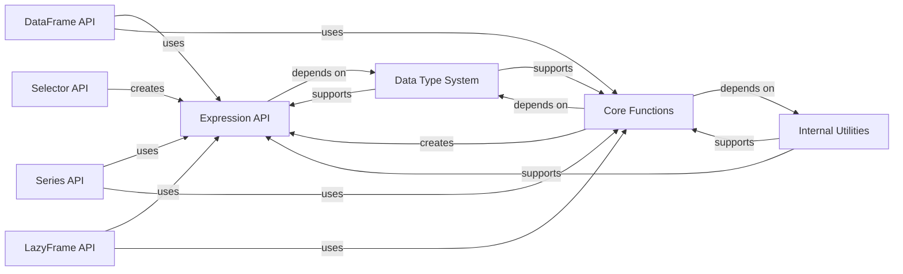

## Component Details

This component provides the powerful and flexible Expression API, allowing users to define complex data transformations and aggregations. It includes various expression types for different data operations (list, array, categorical, string, datetime, etc.) and a rich set of functions for both eager and lazy computations. This is where the core logic for data manipulation resides.

### Expression API
This component defines the fundamental building blocks for creating and manipulating expressions in Polars. It includes the base Expr class and various namespaces for specific data types (list, array, categorical, string, datetime, binary, struct) and operations (meta, when/then), enabling complex data transformations and queries.

**Related Classes/Methods**:

- <a href="https://github.com/pola-rs/polars/blob/master/py-polars/polars/expr/expr.py#L118-L11133" target="_blank" rel="noopener noreferrer">`polars.expr.expr.Expr` (118:11133)</a>
- <a href="https://github.com/pola-rs/polars/blob/master/py-polars/polars/expr/list.py#L24-L1421" target="_blank" rel="noopener noreferrer">`polars.expr.list.ExprListNameSpace` (24:1421)</a>
- <a href="https://github.com/pola-rs/polars/blob/master/py-polars/polars/expr/array.py#L14-L794" target="_blank" rel="noopener noreferrer">`polars.expr.array.ExprArrayNameSpace` (14:794)</a>
- <a href="https://github.com/pola-rs/polars/blob/master/py-polars/polars/expr/categorical.py#L12-L306" target="_blank" rel="noopener noreferrer">`polars.expr.categorical.ExprCatNameSpace` (12:306)</a>
- <a href="https://github.com/pola-rs/polars/blob/master/py-polars/polars/expr/string.py#L40-L2979" target="_blank" rel="noopener noreferrer">`polars.expr.string.ExprStringNameSpace` (40:2979)</a>
- <a href="https://github.com/pola-rs/polars/blob/master/py-polars/polars/expr/datetime.py#L37-L2581" target="_blank" rel="noopener noreferrer">`polars.expr.datetime.ExprDateTimeNameSpace` (37:2581)</a>
- <a href="https://github.com/pola-rs/polars/blob/master/py-polars/polars/expr/binary.py#L21-L340" target="_blank" rel="noopener noreferrer">`polars.expr.binary.ExprBinaryNameSpace` (21:340)</a>
- <a href="https://github.com/pola-rs/polars/blob/master/py-polars/polars/expr/meta.py#L25-L448" target="_blank" rel="noopener noreferrer">`polars.expr.meta.ExprMetaNameSpace` (25:448)</a>
- <a href="https://github.com/pola-rs/polars/blob/master/py-polars/polars/expr/struct.py#L17-L357" target="_blank" rel="noopener noreferrer">`polars.expr.struct.ExprStructNameSpace` (17:357)</a>
- <a href="https://github.com/pola-rs/polars/blob/master/py-polars/polars/expr/whenthen.py#L20-L44" target="_blank" rel="noopener noreferrer">`polars.expr.whenthen.When` (20:44)</a>
- <a href="https://github.com/pola-rs/polars/blob/master/py-polars/polars/expr/whenthen.py#L47-L101" target="_blank" rel="noopener noreferrer">`polars.expr.whenthen.Then` (47:101)</a>
- <a href="https://github.com/pola-rs/polars/blob/master/py-polars/polars/expr/whenthen.py#L104-L128" target="_blank" rel="noopener noreferrer">`polars.expr.whenthen.ChainedWhen` (104:128)</a>
- <a href="https://github.com/pola-rs/polars/blob/master/py-polars/polars/expr/whenthen.py#L131-L185" target="_blank" rel="noopener noreferrer">`polars.expr.whenthen.ChainedThen` (131:185)</a>

### Core Functions
This component provides a collection of global functions essential for Polars operations, including functions for creating expressions, performing horizontal and vertical aggregations, generating data ranges, and other general utility operations.

**Related Classes/Methods**:

- <a href="https://github.com/pola-rs/polars/blob/master/py-polars/polars/functions/col.py#L120-L375" target="_blank" rel="noopener noreferrer">`polars.functions.col.Col` (120:375)</a>
- <a href="https://github.com/pola-rs/polars/blob/master/py-polars/polars/functions/lit.py#L30-L202" target="_blank" rel="noopener noreferrer">`polars.functions.lit.lit` (30:202)</a>
- `polars.functions.as_datatype` (full file reference)
- <a href="https://github.com/pola-rs/polars/blob/master/py-polars/polars/functions/len.py#L21-L68" target="_blank" rel="noopener noreferrer">`polars.functions.len.len` (21:68)</a>
- `polars.functions.eager` (full file reference)
- `polars.functions.whenthen` (full file reference)
- `polars.functions.lazy` (full file reference)
- `polars.functions.business` (full file reference)
- <a href="https://github.com/pola-rs/polars/blob/master/py-polars/polars/functions/repeat.py#L54-L60" target="_blank" rel="noopener noreferrer">`polars.functions.repeat` (54:60)</a>
- `polars.functions.aggregation.horizontal` (full file reference)
- `polars.functions.aggregation.vertical` (full file reference)
- `polars.functions.range` (full file reference)

### Data Type System
This component defines the various data types supported by Polars and provides utilities for type conversion and parsing, ensuring data integrity and efficient type handling across the library.

**Related Classes/Methods**:

- `polars.datatypes.classes` (full file reference)
- `polars.datatypes.convert` (full file reference)
- `polars.datatypes._parse` (full file reference)

### Internal Utilities
This component comprises various internal utility functions and modules that support the core functionalities of Polars, including parsing expressions, wrapping objects, handling deprecations, performing type conversions, and other foundational helper logic.

**Related Classes/Methods**:

- `polars._utils.wrap` (full file reference)
- `polars._utils.parse` (full file reference)
- `polars._utils.deprecation` (full file reference)
- `polars._utils.various` (full file reference)
- `polars._utils.convert` (full file reference)
- `polars._utils.udfs` (full file reference)
- <a href="https://github.com/pola-rs/polars/blob/master/py-polars/polars/_utils/unstable.py#L51-L63" target="_blank" rel="noopener noreferrer">`polars._utils.unstable` (51:63)</a>
- `polars._utils.serde` (full file reference)
- `polars._utils.construction` (full file reference)

### Selector API
This component provides a set of functions and a proxy object for selecting columns based on various criteria, such as name, data type, or patterns, facilitating flexible column selection in Polars operations.

**Related Classes/Methods**:

- `polars.selectors` (full file reference)
- <a href="https://github.com/pola-rs/polars/blob/master/py-polars/polars/selectors.py#L310-L515" target="_blank" rel="noopener noreferrer">`polars.selectors._selector_proxy_` (310:515)</a>

### DataFrame API
This component encapsulates the core functionalities for working with DataFrames, the primary tabular data structure in Polars. It includes methods for data manipulation, comparisons, and various transformations, as well as functionalities for grouping data.

**Related Classes/Methods**:

- <a href="https://github.com/pola-rs/polars/blob/master/py-polars/polars/dataframe/frame.py#L201-L12391" target="_blank" rel="noopener noreferrer">`polars.dataframe.frame.DataFrame` (201:12391)</a>
- <a href="https://github.com/pola-rs/polars/blob/master/py-polars/polars/dataframe/group_by.py#L35-L769" target="_blank" rel="noopener noreferrer">`polars.dataframe.group_by.GroupBy` (35:769)</a>
- <a href="https://github.com/pola-rs/polars/blob/master/py-polars/polars/dataframe/group_by.py#L772-L908" target="_blank" rel="noopener noreferrer">`polars.dataframe.group_by.RollingGroupBy` (772:908)</a>
- <a href="https://github.com/pola-rs/polars/blob/master/py-polars/polars/dataframe/group_by.py#L911-L1067" target="_blank" rel="noopener noreferrer">`polars.dataframe.group_by.DynamicGroupBy` (911:1067)</a>

### Series API
This component handles operations on Series, which represent single columns of data in Polars. It provides methods for arithmetic operations, comparisons, and various data transformations, along with namespaces for specific data types within a Series.

**Related Classes/Methods**:

- <a href="https://github.com/pola-rs/polars/blob/master/py-polars/polars/series/series.py#L180-L8011" target="_blank" rel="noopener noreferrer">`polars.series.series.Series` (180:8011)</a>
- <a href="https://github.com/pola-rs/polars/blob/master/py-polars/polars/series/list.py#L23-L1079" target="_blank" rel="noopener noreferrer">`polars.series.list.ListNameSpace` (23:1079)</a>
- <a href="https://github.com/pola-rs/polars/blob/master/py-polars/polars/series/array.py#L18-L644" target="_blank" rel="noopener noreferrer">`polars.series.array.ArrayNameSpace` (18:644)</a>
- <a href="https://github.com/pola-rs/polars/blob/master/py-polars/polars/series/categorical.py#L15-L293" target="_blank" rel="noopener noreferrer">`polars.series.categorical.CatNameSpace` (15:293)</a>
- <a href="https://github.com/pola-rs/polars/blob/master/py-polars/polars/series/datetime.py#L35-L2248" target="_blank" rel="noopener noreferrer">`polars.series.datetime.DateTimeNameSpace` (35:2248)</a>
- <a href="https://github.com/pola-rs/polars/blob/master/py-polars/polars/series/string.py#L36-L2265" target="_blank" rel="noopener noreferrer">`polars.series.string.StringNameSpace` (36:2265)</a>
- <a href="https://github.com/pola-rs/polars/blob/master/py-polars/polars/series/struct.py#L28-L154" target="_blank" rel="noopener noreferrer">`polars.series.struct.StructNameSpace` (28:154)</a>
- <a href="https://github.com/pola-rs/polars/blob/master/py-polars/polars/series/binary.py#L20-L250" target="_blank" rel="noopener noreferrer">`polars.series.binary.BinaryNameSpace` (20:250)</a>
- `polars.series.utils` (full file reference)

### LazyFrame API
This component enables deferred execution and optimization of Polars queries, allowing for efficient processing of large datasets by building and optimizing a query plan before actual computation. It includes LazyFrame and LazyGroupBy functionalities.

**Related Classes/Methods**:

- <a href="https://github.com/pola-rs/polars/blob/master/py-polars/polars/lazyframe/frame.py#L235-L8350" target="_blank" rel="noopener noreferrer">`polars.lazyframe.frame.LazyFrame` (235:8350)</a>
- <a href="https://github.com/pola-rs/polars/blob/master/py-polars/polars/lazyframe/group_by.py#L24-L667" target="_blank" rel="noopener noreferrer">`polars.lazyframe.group_by.LazyGroupBy` (24:667)</a>
- <a href="https://github.com/pola-rs/polars/blob/master/py-polars/polars/lazyframe/opt_flags.py#L24-L265" target="_blank" rel="noopener noreferrer">`polars.lazyframe.opt_flags.QueryOptFlags` (24:265)</a>

### [FAQ](https://github.com/CodeBoarding/GeneratedOnBoardings/tree/main?tab=readme-ov-file#faq)