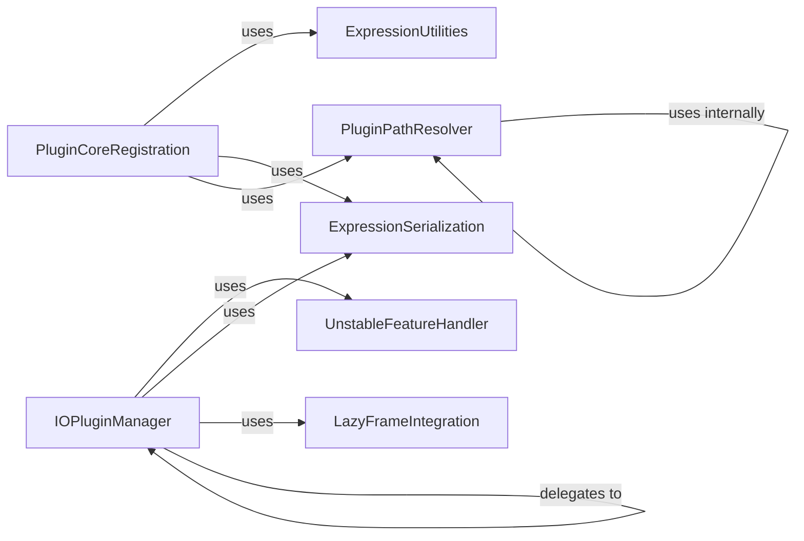

## Component Details

The Extension & Plugin System in Polars provides a flexible and robust mechanism for extending the library's core functionality. It allows developers to integrate custom operations, particularly through Rust-based plugins and custom I/O sources. The system manages the registration, path resolution, and data serialization necessary for these extensions to interact seamlessly with Polars' expression and LazyFrame APIs. Key components handle the core plugin registration, dynamic library path resolution, I/O source management, and the serialization/deserialization of data and expressions, ensuring that external functionalities can be efficiently incorporated and executed within the Polars framework.

### PluginCoreRegistration
This component handles the core functionality for registering external plugin functions within the Polars expression system. It serves as the primary interface for users to integrate custom Rust functions, managing the conversion of Python expressions and keyword arguments for the underlying plugin execution.

**Related Classes/Methods**:

- <a href="https://github.com/pola-rs/polars/blob/master/py-polars/polars/plugins.py#L24-L108" target="_blank" rel="noopener noreferrer">`polars.plugins.register_plugin_function` (24:108)</a>
- <a href="https://github.com/pola-rs/polars/blob/master/py-polars/polars/expr/expr.py#L10890-L10969" target="_blank" rel="noopener noreferrer">`polars.expr.expr.Expr.register_plugin` (10890:10969)</a>

### PluginPathResolver
This component is responsible for resolving and validating the file paths of dynamic plugin libraries. It includes logic to determine if a given path points to a valid dynamic library file and to convert paths to their absolute or virtual environment-relative forms.

**Related Classes/Methods**:

- <a href="https://github.com/pola-rs/polars/blob/master/py-polars/polars/plugins.py#L124-L137" target="_blank" rel="noopener noreferrer">`polars.plugins._resolve_plugin_path` (124:137)</a>
- <a href="https://github.com/pola-rs/polars/blob/master/py-polars/polars/plugins.py#L144-L155" target="_blank" rel="noopener noreferrer">`polars.plugins._resolve_file_path` (144:155)</a>
- <a href="https://github.com/pola-rs/polars/blob/master/py-polars/polars/plugins.py#L140-L141" target="_blank" rel="noopener noreferrer">`polars.plugins._is_dynamic_lib` (140:141)</a>

### IOPluginManager
This component facilitates the registration of custom I/O source plugins, allowing deferred execution of data loading operations. It integrates user-defined functions that produce DataFrames with Polars' LazyFrame API, enabling flexible data ingestion.

**Related Classes/Methods**:

- <a href="https://github.com/pola-rs/polars/blob/master/py-polars/polars/io/plugins.py#L20-L96" target="_blank" rel="noopener noreferrer">`polars.io.plugins.register_io_source` (20:96)</a>
- <a href="https://github.com/pola-rs/polars/blob/master/py-polars/polars/io/plugins.py#L100-L178" target="_blank" rel="noopener noreferrer">`polars.io.plugins._defer` (100:178)</a>

### ExpressionSerialization
This component manages the serialization of Python objects, specifically keyword arguments for plugins, into a binary format suitable for inter-process communication or persistence. It also handles the deserialization of expressions from various formats.

**Related Classes/Methods**:

- <a href="https://github.com/pola-rs/polars/blob/master/py-polars/polars/plugins.py#L111-L120" target="_blank" rel="noopener noreferrer">`polars.plugins._serialize_kwargs` (111:120)</a>
- <a href="https://github.com/pola-rs/polars/blob/master/py-polars/polars/expr/expr.py#L360-L419" target="_blank" rel="noopener noreferrer">`polars.expr.expr.Expr.deserialize` (360:419)</a>

### ExpressionUtilities
This component provides fundamental utility functions for parsing diverse inputs into standardized Polars expressions and for wrapping native Polars expressions, ensuring consistency and compatibility within the expression framework.

**Related Classes/Methods**:

- <a href="https://github.com/pola-rs/polars/blob/master/py-polars/polars/_utils/parse/expr.py#L78-L105" target="_blank" rel="noopener noreferrer">`polars._utils.parse.expr.parse_into_list_of_expressions` (78:105)</a>
- <a href="https://github.com/pola-rs/polars/blob/master/py-polars/polars/_utils/wrap.py#L24-L25" target="_blank" rel="noopener noreferrer">`polars._utils.wrap.wrap_expr` (24:25)</a>

### LazyFrameIntegration
This component provides the mechanism for integrating custom Python functions as scan operations within the LazyFrame API. It enables deferred execution of data processing logic, optimizing query plans by pushing down predicates and column selections.

**Related Classes/Methods**:

- <a href="https://github.com/pola-rs/polars/blob/master/py-polars/polars/lazyframe/frame.py#L431-L455" target="_blank" rel="noopener noreferrer">`polars.lazyframe.frame.LazyFrame._scan_python_function` (431:455)</a>

### UnstableFeatureHandler
This component is responsible for marking and managing features within Polars that are considered unstable. It provides a decorator to indicate that a function's API or behavior might change in future releases without being considered a breaking change.

**Related Classes/Methods**:

- <a href="https://github.com/pola-rs/polars/blob/master/py-polars/polars/_utils/unstable.py#L51-L63" target="_blank" rel="noopener noreferrer">`polars._utils.unstable.unstable` (51:63)</a>

### [FAQ](https://github.com/CodeBoarding/GeneratedOnBoardings/tree/main?tab=readme-ov-file#faq)