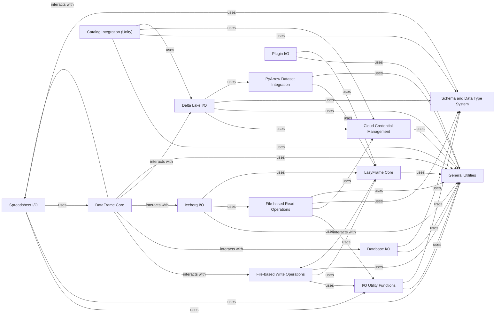

## Component Details

The Input/Output & Data Connectors component in Polars is a comprehensive subsystem responsible for managing all data ingress and egress. It supports a wide array of file formats including CSV, Parquet, IPC, JSON, and Excel, and integrates with external data sources such as various databases and cloud storage services. This component also facilitates interaction with data catalogs for metadata management and handles credential management for secure data access, ensuring efficient and flexible data flow within the Polars ecosystem.

### File-based Read Operations
This component is responsible for reading data from various file formats such as CSV, JSON, NDJSON, Avro, IPC (Feather), and Parquet. It provides functions for both eager and lazy reading, including schema inference and handling of various read options.

**Related Classes/Methods**:

- `polars.io.csv.functions` (full file reference)
- <a href="https://github.com/pola-rs/polars/blob/master/py-polars/polars/io/csv/functions.py#L49-L580" target="_blank" rel="noopener noreferrer">`polars.io.csv.functions:read_csv` (49:580)</a>
- <a href="https://github.com/pola-rs/polars/blob/master/py-polars/polars/io/csv/functions.py#L1045-L1380" target="_blank" rel="noopener noreferrer">`polars.io.csv.functions:scan_csv` (1045:1380)</a>
- <a href="https://github.com/pola-rs/polars/blob/master/py-polars/polars/io/csv/functions.py#L732-L1039" target="_blank" rel="noopener noreferrer">`polars.io.csv.functions:read_csv_batched` (732:1039)</a>
- <a href="https://github.com/pola-rs/polars/blob/master/py-polars/polars/io/json/read.py#L22-L101" target="_blank" rel="noopener noreferrer">`polars.io.json.read:read_json` (22:101)</a>
- <a href="https://github.com/pola-rs/polars/blob/master/py-polars/polars/io/ndjson.py#L29-L196" target="_blank" rel="noopener noreferrer">`polars.io.ndjson:read_ndjson` (29:196)</a>
- <a href="https://github.com/pola-rs/polars/blob/master/py-polars/polars/io/ndjson.py#L201-L354" target="_blank" rel="noopener noreferrer">`polars.io.ndjson:scan_ndjson` (201:354)</a>
- <a href="https://github.com/pola-rs/polars/blob/master/py-polars/polars/io/avro.py#L18-L49" target="_blank" rel="noopener noreferrer">`polars.io.avro:read_avro` (18:49)</a>
- <a href="https://github.com/pola-rs/polars/blob/master/py-polars/polars/io/ipc/functions.py#L43-L183" target="_blank" rel="noopener noreferrer">`polars.io.ipc.functions:read_ipc` (43:183)</a>
- <a href="https://github.com/pola-rs/polars/blob/master/py-polars/polars/io/ipc/functions.py#L235-L312" target="_blank" rel="noopener noreferrer">`polars.io.ipc.functions:read_ipc_stream` (235:312)</a>
- <a href="https://github.com/pola-rs/polars/blob/master/py-polars/polars/io/ipc/functions.py#L341-L361" target="_blank" rel="noopener noreferrer">`polars.io.ipc.functions:read_ipc_schema` (341:361)</a>
- <a href="https://github.com/pola-rs/polars/blob/master/py-polars/polars/io/ipc/functions.py#L366-L514" target="_blank" rel="noopener noreferrer">`polars.io.ipc.functions:scan_ipc` (366:514)</a>
- `polars.io.parquet.functions` (full file reference)
- <a href="https://github.com/pola-rs/polars/blob/master/py-polars/polars/io/parquet/functions.py#L48-L283" target="_blank" rel="noopener noreferrer">`polars.io.parquet.functions:read_parquet` (48:283)</a>
- <a href="https://github.com/pola-rs/polars/blob/master/py-polars/polars/io/parquet/functions.py#L340-L360" target="_blank" rel="noopener noreferrer">`polars.io.parquet.functions:read_parquet_schema` (340:360)</a>
- <a href="https://github.com/pola-rs/polars/blob/master/py-polars/polars/io/parquet/functions.py#L363-L387" target="_blank" rel="noopener noreferrer">`polars.io.parquet.functions:read_parquet_metadata` (363:387)</a>
- <a href="https://github.com/pola-rs/polars/blob/master/py-polars/polars/io/parquet/functions.py#L392-L648" target="_blank" rel="noopener noreferrer">`polars.io.parquet.functions:scan_parquet` (392:648)</a>
- <a href="https://github.com/pola-rs/polars/blob/master/py-polars/polars/io/clipboard.py#L16-L36" target="_blank" rel="noopener noreferrer">`polars.io.clipboard:read_clipboard` (16:36)</a>

### File-based Write Operations
This component handles writing Polars DataFrames and LazyFrames to various file formats, including CSV, JSON, NDJSON, Avro, IPC, and Parquet. It integrates with lazy execution for efficient data sinking.

**Related Classes/Methods**:

- <a href="https://github.com/pola-rs/polars/blob/master/py-polars/polars/dataframe/frame.py#L2781-L2781" target="_blank" rel="noopener noreferrer">`polars.dataframe.frame.DataFrame:write_json` (2781:2781)</a>
- <a href="https://github.com/pola-rs/polars/blob/master/py-polars/polars/dataframe/frame.py#L2833-L2833" target="_blank" rel="noopener noreferrer">`polars.dataframe.frame.DataFrame:write_ndjson` (2833:2833)</a>
- <a href="https://github.com/pola-rs/polars/blob/master/py-polars/polars/dataframe/frame.py#L2887-L2907" target="_blank" rel="noopener noreferrer">`polars.dataframe.frame.DataFrame:write_csv` (2887:2907)</a>
- <a href="https://github.com/pola-rs/polars/blob/master/py-polars/polars/dataframe/frame.py#L3121-L3160" target="_blank" rel="noopener noreferrer">`polars.dataframe.frame.DataFrame:write_avro` (3121:3160)</a>
- <a href="https://github.com/pola-rs/polars/blob/master/py-polars/polars/dataframe/frame.py#L3723-L3734" target="_blank" rel="noopener noreferrer">`polars.dataframe.frame.DataFrame:write_ipc` (3723:3734)</a>
- <a href="https://github.com/pola-rs/polars/blob/master/py-polars/polars/dataframe/frame.py#L3842-L3848" target="_blank" rel="noopener noreferrer">`polars.dataframe.frame.DataFrame:write_ipc_stream` (3842:3848)</a>
- <a href="https://github.com/pola-rs/polars/blob/master/py-polars/polars/dataframe/frame.py#L3917-L4144" target="_blank" rel="noopener noreferrer">`polars.dataframe.frame.DataFrame:write_parquet` (3917:4144)</a>
- <a href="https://github.com/pola-rs/polars/blob/master/py-polars/polars/dataframe/frame.py#L3100-L3119" target="_blank" rel="noopener noreferrer">`polars.dataframe.frame.DataFrame:write_clipboard` (3100:3119)</a>
- <a href="https://github.com/pola-rs/polars/blob/master/py-polars/polars/lazyframe/frame.py#L2492-L2517" target="_blank" rel="noopener noreferrer">`polars.lazyframe.frame.LazyFrame:sink_parquet` (2492:2517)</a>
- <a href="https://github.com/pola-rs/polars/blob/master/py-polars/polars/lazyframe/frame.py#L2817-L2834" target="_blank" rel="noopener noreferrer">`polars.lazyframe.frame.LazyFrame:sink_ipc` (2817:2834)</a>
- <a href="https://github.com/pola-rs/polars/blob/master/py-polars/polars/lazyframe/frame.py#L3021-L3049" target="_blank" rel="noopener noreferrer">`polars.lazyframe.frame.LazyFrame:sink_csv` (3021:3049)</a>
- <a href="https://github.com/pola-rs/polars/blob/master/py-polars/polars/lazyframe/frame.py#L3309-L3324" target="_blank" rel="noopener noreferrer">`polars.lazyframe.frame.LazyFrame:sink_ndjson` (3309:3324)</a>

### Spreadsheet I/O
This component provides functionality for reading and writing data from and to spreadsheet formats like Excel (XLSX) and ODS. It manages parsing options and handles data conversion.

**Related Classes/Methods**:

- <a href="https://github.com/pola-rs/polars/blob/master/py-polars/polars/io/spreadsheet/functions.py#L112-L129" target="_blank" rel="noopener noreferrer">`polars.io.spreadsheet.functions:read_excel` (112:129)</a>
- <a href="https://github.com/pola-rs/polars/blob/master/py-polars/polars/io/spreadsheet/functions.py#L429-L442" target="_blank" rel="noopener noreferrer">`polars.io.spreadsheet.functions:read_ods` (429:442)</a>
- <a href="https://github.com/pola-rs/polars/blob/master/py-polars/polars/io/spreadsheet/functions.py#L51-L78" target="_blank" rel="noopener noreferrer">`polars.io.spreadsheet.functions:_sources` (51:78)</a>
- <a href="https://github.com/pola-rs/polars/blob/master/py-polars/polars/io/spreadsheet/functions.py#L86-L108" target="_blank" rel="noopener noreferrer">`polars.io.spreadsheet.functions:_unpack_read_results` (86:108)</a>
- <a href="https://github.com/pola-rs/polars/blob/master/py-polars/polars/io/spreadsheet/functions.py#L641-L714" target="_blank" rel="noopener noreferrer">`polars.io.spreadsheet.functions:_read_spreadsheet` (641:714)</a>
- <a href="https://github.com/pola-rs/polars/blob/master/py-polars/polars/io/spreadsheet/functions.py#L717-L768" target="_blank" rel="noopener noreferrer">`polars.io.spreadsheet.functions:_get_read_options` (717:768)</a>
- <a href="https://github.com/pola-rs/polars/blob/master/py-polars/polars/io/spreadsheet/functions.py#L821-L888" target="_blank" rel="noopener noreferrer">`polars.io.spreadsheet.functions:_initialise_spreadsheet_parser` (821:888)</a>
- <a href="https://github.com/pola-rs/polars/blob/master/py-polars/polars/io/spreadsheet/functions.py#L891-L956" target="_blank" rel="noopener noreferrer">`polars.io.spreadsheet.functions:_csv_buffer_to_frame` (891:956)</a>
- <a href="https://github.com/pola-rs/polars/blob/master/py-polars/polars/io/spreadsheet/functions.py#L959-L990" target="_blank" rel="noopener noreferrer">`polars.io.spreadsheet.functions:_drop_null_data` (959:990)</a>
- <a href="https://github.com/pola-rs/polars/blob/master/py-polars/polars/io/spreadsheet/functions.py#L993-L1000" target="_blank" rel="noopener noreferrer">`polars.io.spreadsheet.functions:_empty_frame` (993:1000)</a>
- <a href="https://github.com/pola-rs/polars/blob/master/py-polars/polars/io/spreadsheet/functions.py#L1003-L1011" target="_blank" rel="noopener noreferrer">`polars.io.spreadsheet.functions:_reorder_columns` (1003:1011)</a>
- <a href="https://github.com/pola-rs/polars/blob/master/py-polars/polars/io/spreadsheet/functions.py#L1014-L1155" target="_blank" rel="noopener noreferrer">`polars.io.spreadsheet.functions:_read_spreadsheet_calamine` (1014:1155)</a>
- <a href="https://github.com/pola-rs/polars/blob/master/py-polars/polars/io/spreadsheet/functions.py#L1158-L1267" target="_blank" rel="noopener noreferrer">`polars.io.spreadsheet.functions:_read_spreadsheet_openpyxl` (1158:1267)</a>
- <a href="https://github.com/pola-rs/polars/blob/master/py-polars/polars/io/spreadsheet/functions.py#L1270-L1318" target="_blank" rel="noopener noreferrer">`polars.io.spreadsheet.functions:_read_spreadsheet_xlsx2csv` (1270:1318)</a>
- <a href="https://github.com/pola-rs/polars/blob/master/py-polars/polars/io/spreadsheet/_write_utils.py#L67-L76" target="_blank" rel="noopener noreferrer">`polars.io.spreadsheet._write_utils:_XLFormatCache:get` (67:76)</a>
- <a href="https://github.com/pola-rs/polars/blob/master/py-polars/polars/io/spreadsheet/_write_utils.py#L64-L65" target="_blank" rel="noopener noreferrer">`polars.io.spreadsheet._write_utils:_XLFormatCache._key` (64:65)</a>
- <a href="https://github.com/pola-rs/polars/blob/master/py-polars/polars/io/spreadsheet/_write_utils.py#L111-L158" target="_blank" rel="noopener noreferrer">`polars.io.spreadsheet._write_utils:_xl_apply_conditional_formats` (111:158)</a>
- <a href="https://github.com/pola-rs/polars/blob/master/py-polars/polars/io/spreadsheet/_write_utils.py#L162-L169" target="_blank" rel="noopener noreferrer">`polars.io.spreadsheet._write_utils:_xl_column_range` (162:169)</a>
- <a href="https://github.com/pola-rs/polars/blob/master/py-polars/polars/io/spreadsheet/_write_utils.py#L206-L225" target="_blank" rel="noopener noreferrer">`polars.io.spreadsheet._write_utils:_xl_column_multi_range` (206:225)</a>
- <a href="https://github.com/pola-rs/polars/blob/master/py-polars/polars/io/spreadsheet/_write_utils.py#L228-L279" target="_blank" rel="noopener noreferrer">`polars.io.spreadsheet._write_utils:_xl_inject_dummy_table_columns` (228:279)</a>
- <a href="https://github.com/pola-rs/polars/blob/master/py-polars/polars/io/spreadsheet/_write_utils.py#L282-L326" target="_blank" rel="noopener noreferrer">`polars.io.spreadsheet._write_utils:_xl_inject_sparklines` (282:326)</a>
- <a href="https://github.com/pola-rs/polars/blob/master/py-polars/polars/io/spreadsheet/_write_utils.py#L329-L334" target="_blank" rel="noopener noreferrer">`polars.io.spreadsheet._write_utils:_xl_rowcols_to_range` (329:334)</a>
- <a href="https://github.com/pola-rs/polars/blob/master/py-polars/polars/io/spreadsheet/_write_utils.py#L337-L531" target="_blank" rel="noopener noreferrer">`polars.io.spreadsheet._write_utils:_xl_setup_table_columns` (337:531)</a>
- <a href="https://github.com/pola-rs/polars/blob/master/py-polars/polars/io/spreadsheet/_write_utils.py#L568-L619" target="_blank" rel="noopener noreferrer">`polars.io.spreadsheet._write_utils:_xl_setup_workbook` (568:619)</a>
- <a href="https://github.com/pola-rs/polars/blob/master/py-polars/polars/io/spreadsheet/_write_utils.py#L622-L631" target="_blank" rel="noopener noreferrer">`polars.io.spreadsheet._write_utils:_xl_table_formula` (622:631)</a>
- <a href="https://github.com/pola-rs/polars/blob/master/py-polars/polars/dataframe/frame.py#L3162-L3720" target="_blank" rel="noopener noreferrer">`polars.dataframe.frame.DataFrame:write_excel` (3162:3720)</a>

### Delta Lake I/O
This component provides functionalities for interacting with Delta Lake tables, including scanning and writing data. It handles Delta Lake specific checks and credential management.

**Related Classes/Methods**:

- <a href="https://github.com/pola-rs/polars/blob/master/py-polars/polars/io/delta.py#L26-L162" target="_blank" rel="noopener noreferrer">`polars.io.delta:read_delta` (26:162)</a>
- <a href="https://github.com/pola-rs/polars/blob/master/py-polars/polars/io/delta.py#L165-L412" target="_blank" rel="noopener noreferrer">`polars.io.delta:scan_delta` (165:412)</a>
- <a href="https://github.com/pola-rs/polars/blob/master/py-polars/polars/io/delta.py#L427-L476" target="_blank" rel="noopener noreferrer">`polars.io.delta:_get_delta_lake_table` (427:476)</a>
- <a href="https://github.com/pola-rs/polars/blob/master/py-polars/polars/io/delta.py#L485-L494" target="_blank" rel="noopener noreferrer">`polars.io.delta:_check_for_unsupported_types` (485:494)</a>
- <a href="https://github.com/pola-rs/polars/blob/master/py-polars/polars/dataframe/frame.py#L4414-L4423" target="_blank" rel="noopener noreferrer">`polars.dataframe.frame.DataFrame:write_delta` (4414:4423)</a>

### Iceberg I/O
This component enables scanning of Iceberg datasets, providing an interface to read data stored in the Iceberg format.

**Related Classes/Methods**:

- <a href="https://github.com/pola-rs/polars/blob/master/py-polars/polars/io/iceberg/functions.py#L15-L139" target="_blank" rel="noopener noreferrer">`polars.io.iceberg.functions:scan_iceberg` (15:139)</a>
- <a href="https://github.com/pola-rs/polars/blob/master/py-polars/polars/io/iceberg/dataset.py#L53-L57" target="_blank" rel="noopener noreferrer">`polars.io.iceberg.dataset.IcebergDataset:schema` (53:57)</a>
- <a href="https://github.com/pola-rs/polars/blob/master/py-polars/polars/io/iceberg/dataset.py#L59-L210" target="_blank" rel="noopener noreferrer">`polars.io.iceberg.dataset.IcebergDataset:to_dataset_scan` (59:210)</a>
- <a href="https://github.com/pola-rs/polars/blob/master/py-polars/polars/io/iceberg/dataset.py#L216-L225" target="_blank" rel="noopener noreferrer">`polars.io.iceberg.dataset.IcebergDataset:metadata_path` (216:225)</a>
- <a href="https://github.com/pola-rs/polars/blob/master/py-polars/polars/io/iceberg/dataset.py#L227-L244" target="_blank" rel="noopener noreferrer">`polars.io.iceberg.dataset.IcebergDataset:table` (227:244)</a>
- <a href="https://github.com/pola-rs/polars/blob/master/py-polars/polars/io/iceberg/dataset.py#L253-L275" target="_blank" rel="noopener noreferrer">`polars.io.iceberg.dataset.IcebergDataset:__getstate__` (253:275)</a>
- <a href="https://github.com/pola-rs/polars/blob/master/py-polars/polars/io/iceberg/dataset.py#L277-L298" target="_blank" rel="noopener noreferrer">`polars.io.iceberg.dataset.IcebergDataset:__setstate__` (277:298)</a>
- <a href="https://github.com/pola-rs/polars/blob/master/py-polars/polars/io/iceberg/_utils.py#L39-L88" target="_blank" rel="noopener noreferrer">`polars.io.iceberg._utils:_scan_pyarrow_dataset_impl` (39:88)</a>
- <a href="https://github.com/pola-rs/polars/blob/master/py-polars/polars/io/iceberg/_utils.py#L123-L124" target="_blank" rel="noopener noreferrer">`polars.io.iceberg._utils:_` (123:124)</a>
- <a href="https://github.com/pola-rs/polars/blob/master/py-polars/polars/dataframe/frame.py#L4375-L4411" target="_blank" rel="noopener noreferrer">`polars.dataframe.frame.DataFrame:write_iceberg` (4375:4411)</a>

### Database I/O
This component facilitates reading and writing data to various relational databases using different database connectors (e.g., SQLAlchemy, ADBC, ConnectorX). It handles query execution, data fetching, and type inference.

**Related Classes/Methods**:

- `polars.io.database.functions` (full file reference)
- <a href="https://github.com/pola-rs/polars/blob/master/py-polars/polars/io/database/_executor.py#L79-L89" target="_blank" rel="noopener noreferrer">`polars.io.database._executor.ConnectionExecutor:__init__` (79:89)</a>
- <a href="https://github.com/pola-rs/polars/blob/master/py-polars/polars/io/database/_executor.py#L94-L108" target="_blank" rel="noopener noreferrer">`polars.io.database._executor.ConnectionExecutor:__exit__` (94:108)</a>
- <a href="https://github.com/pola-rs/polars/blob/master/py-polars/polars/io/database/_executor.py#L114-L123" target="_blank" rel="noopener noreferrer">`polars.io.database._executor.ConnectionExecutor:_apply_overrides` (114:123)</a>
- <a href="https://github.com/pola-rs/polars/blob/master/py-polars/polars/io/database/_executor.py#L133-L144" target="_blank" rel="noopener noreferrer">`polars.io.database._executor.ConnectionExecutor:_check_module_version` (133:144)</a>
- <a href="https://github.com/pola-rs/polars/blob/master/py-polars/polars/io/database/_executor.py#L194-L238" target="_blank" rel="noopener noreferrer">`polars.io.database._executor.ConnectionExecutor:_from_arrow` (194:238)</a>
- <a href="https://github.com/pola-rs/polars/blob/master/py-polars/polars/io/database/_executor.py#L240-L304" target="_blank" rel="noopener noreferrer">`polars.io.database._executor.ConnectionExecutor:_from_rows` (240:304)</a>
- <a href="https://github.com/pola-rs/polars/blob/master/py-polars/polars/io/database/_executor.py#L306-L332" target="_blank" rel="noopener noreferrer">`polars.io.database._executor.ConnectionExecutor:_inject_type_overrides` (306:332)</a>
- <a href="https://github.com/pola-rs/polars/blob/master/py-polars/polars/io/database/_executor.py#L383-L414" target="_blank" rel="noopener noreferrer">`polars.io.database._executor.ConnectionExecutor:_normalise_cursor` (383:414)</a>
- <a href="https://github.com/pola-rs/polars/blob/master/py-polars/polars/io/database/_executor.py#L416-L424" target="_blank" rel="noopener noreferrer">`polars.io.database._executor.ConnectionExecutor:_sqlalchemy_async_execute` (416:424)</a>
- <a href="https://github.com/pola-rs/polars/blob/master/py-polars/polars/io/database/_executor.py#L426-L467" target="_blank" rel="noopener noreferrer">`polars.io.database._executor.ConnectionExecutor:_sqlalchemy_setup` (426:467)</a>
- <a href="https://github.com/pola-rs/polars/blob/master/py-polars/polars/io/database/_executor.py#L469-L514" target="_blank" rel="noopener noreferrer">`polars.io.database._executor.ConnectionExecutor:execute` (469:514)</a>
- <a href="https://github.com/pola-rs/polars/blob/master/py-polars/polars/io/database/_executor.py#L516-L563" target="_blank" rel="noopener noreferrer">`polars.io.database._executor.ConnectionExecutor:to_polars` (516:563)</a>
- <a href="https://github.com/pola-rs/polars/blob/master/py-polars/polars/io/database/_cursor_proxies.py#L37-L45" target="_blank" rel="noopener noreferrer">`polars.io.database._cursor_proxies.ODBCCursorProxy:fetch_arrow_table` (37:45)</a>
- <a href="https://github.com/pola-rs/polars/blob/master/py-polars/polars/io/database/_cursor_proxies.py#L79-L84" target="_blank" rel="noopener noreferrer">`polars.io.database._cursor_proxies.SurrealDBCursorProxy:__init__` (79:84)</a>
- <a href="https://github.com/pola-rs/polars/blob/master/py-polars/polars/io/database/_cursor_proxies.py#L117-L135" target="_blank" rel="noopener noreferrer">`polars.io.database._cursor_proxies.SurrealDBCursorProxy:fetchall` (117:135)</a>
- <a href="https://github.com/pola-rs/polars/blob/master/py-polars/polars/io/database/_cursor_proxies.py#L137-L147" target="_blank" rel="noopener noreferrer">`polars.io.database._cursor_proxies.SurrealDBCursorProxy:fetchmany` (137:147)</a>
- <a href="https://github.com/pola-rs/polars/blob/master/py-polars/polars/io/database/_inference.py#L42-L206" target="_blank" rel="noopener noreferrer">`polars.io.database._inference:dtype_from_database_typename` (42:206)</a>
- <a href="https://github.com/pola-rs/polars/blob/master/py-polars/polars/io/database/_inference.py#L209-L250" target="_blank" rel="noopener noreferrer">`polars.io.database._inference:dtype_from_cursor_description` (209:250)</a>
- <a href="https://github.com/pola-rs/polars/blob/master/py-polars/polars/io/database/functions.py#L23-L32" target="_blank" rel="noopener noreferrer">`polars.io.database.functions:read_database` (23:32)</a>
- <a href="https://github.com/pola-rs/polars/blob/master/py-polars/polars/io/database/functions.py#L261-L272" target="_blank" rel="noopener noreferrer">`polars.io.database.functions:read_database_uri` (261:272)</a>
- <a href="https://github.com/pola-rs/polars/blob/master/py-polars/polars/io/database/_utils.py#L17-L24" target="_blank" rel="noopener noreferrer">`polars.io.database._utils:_run_async` (17:24)</a>
- <a href="https://github.com/pola-rs/polars/blob/master/py-polars/polars/io/database/_utils.py#L27-L53" target="_blank" rel="noopener noreferrer">`polars.io.database._utils:_read_sql_connectorx` (27:53)</a>
- <a href="https://github.com/pola-rs/polars/blob/master/py-polars/polars/io/database/_utils.py#L56-L65" target="_blank" rel="noopener noreferrer">`polars.io.database._utils:_read_sql_adbc` (56:65)</a>
- <a href="https://github.com/pola-rs/polars/blob/master/py-polars/polars/io/database/_utils.py#L68-L89" target="_blank" rel="noopener noreferrer">`polars.io.database._utils:_open_adbc_connection` (68:89)</a>
- <a href="https://github.com/pola-rs/polars/blob/master/py-polars/polars/dataframe/frame.py#L4146-L4372" target="_blank" rel="noopener noreferrer">`polars.dataframe.frame.DataFrame:write_database` (4146:4372)</a>

### Cloud Credential Management
This component is responsible for building and managing credential providers for various cloud storage services (AWS, Azure, GCP), enabling secure access to data stored in the cloud.

**Related Classes/Methods**:

- <a href="https://github.com/pola-rs/polars/blob/master/py-polars/polars/io/cloud/_utils.py#L10-L20" target="_blank" rel="noopener noreferrer">`polars.io.cloud._utils:_first_scan_path` (10:20)</a>
- <a href="https://github.com/pola-rs/polars/blob/master/py-polars/polars/io/cloud/credential_provider/_builder.py#L71-L97" target="_blank" rel="noopener noreferrer">`polars.io.cloud.credential_provider._builder.CredentialProviderBuilder:build_credential_provider` (71:97)</a>
- <a href="https://github.com/pola-rs/polars/blob/master/py-polars/polars/io/cloud/credential_provider/_builder.py#L100-L104" target="_blank" rel="noopener noreferrer">`polars.io.cloud.credential_provider._builder.CredentialProviderBuilder:from_initialized_provider` (100:104)</a>
- <a href="https://github.com/pola-rs/polars/blob/master/py-polars/polars/io/cloud/credential_provider/_builder.py#L106-L112" target="_blank" rel="noopener noreferrer">`polars.io.cloud.credential_provider._builder.CredentialProviderBuilder:__getstate__` (106:112)</a>
- <a href="https://github.com/pola-rs/polars/blob/master/py-polars/polars/io/cloud/credential_provider/_builder.py#L114-L118" target="_blank" rel="noopener noreferrer">`polars.io.cloud.credential_provider._builder.CredentialProviderBuilder:__setstate__` (114:118)</a>
- <a href="https://github.com/pola-rs/polars/blob/master/py-polars/polars/io/cloud/credential_provider/_builder.py#L164-L173" target="_blank" rel="noopener noreferrer">`polars.io.cloud.credential_provider._builder.AutoInit:__call__` (164:173)</a>
- <a href="https://github.com/pola-rs/polars/blob/master/py-polars/polars/io/cloud/credential_provider/_builder.py#L191-L376" target="_blank" rel="noopener noreferrer">`polars.io.cloud.credential_provider._builder:_init_credential_provider_builder` (191:376)</a>
- <a href="https://github.com/pola-rs/polars/blob/master/py-polars/polars/io/cloud/credential_provider/_providers.py#L75-L103" target="_blank" rel="noopener noreferrer">`polars.io.cloud.credential_provider._providers.CredentialProviderAWS:__init__` (75:103)</a>
- <a href="https://github.com/pola-rs/polars/blob/master/py-polars/polars/io/cloud/credential_provider/_providers.py#L105-L124" target="_blank" rel="noopener noreferrer">`polars.io.cloud.credential_provider._providers.CredentialProviderAWS:__call__` (105:124)</a>
- <a href="https://github.com/pola-rs/polars/blob/master/py-polars/polars/io/cloud/credential_provider/_providers.py#L145-L160" target="_blank" rel="noopener noreferrer">`polars.io.cloud.credential_provider._providers.CredentialProviderAWS:_storage_update_options` (145:160)</a>
- <a href="https://github.com/pola-rs/polars/blob/master/py-polars/polars/io/cloud/credential_provider/_providers.py#L163-L192" target="_blank" rel="noopener noreferrer">`polars.io.cloud.credential_provider._providers.CredentialProviderAWS:_can_use_as_provider` (163:192)</a>
- <a href="https://github.com/pola-rs/polars/blob/master/py-polars/polars/io/cloud/credential_provider/_providers.py#L229-L284" target="_blank" rel="noopener noreferrer">`polars.io.cloud.credential_provider._providers.CredentialProviderAzure:__init__` (229:284)</a>
- <a href="https://github.com/pola-rs/polars/blob/master/py-polars/polars/io/cloud/credential_provider/_providers.py#L286-L304" target="_blank" rel="noopener noreferrer">`polars.io.cloud.credential_provider._providers.CredentialProviderAzure:__call__` (286:304)</a>
- <a href="https://github.com/pola-rs/polars/blob/master/py-polars/polars/io/cloud/credential_provider/_providers.py#L306-L345" target="_blank" rel="noopener noreferrer">`polars.io.cloud.credential_provider._providers.CredentialProviderAzure:_try_get_azure_storage_account_credential_if_permitted` (306:345)</a>
- <a href="https://github.com/pola-rs/polars/blob/master/py-polars/polars/io/cloud/credential_provider/_providers.py#L369-L396" target="_blank" rel="noopener noreferrer">`polars.io.cloud.credential_provider._providers.CredentialProviderAzure:_get_azure_storage_account_key_az_cli` (369:396)</a>
- <a href="https://github.com/pola-rs/polars/blob/master/py-polars/polars/io/cloud/credential_provider/_providers.py#L399-L403" target="_blank" rel="noopener noreferrer">`polars.io.cloud.credential_provider._providers.CredentialProviderAzure:_azcli_version` (399:403)</a>
- <a href="https://github.com/pola-rs/polars/blob/master/py-polars/polars/io/cloud/credential_provider/_providers.py#L423-L463" target="_blank" rel="noopener noreferrer">`polars.io.cloud.credential_provider._providers.CredentialProviderGCP:__init__` (423:463)</a>
- <a href="https://github.com/pola-rs/polars/blob/master/py-polars/polars/io/cloud/credential_provider/_providers.py#L490-L513" target="_blank" rel="noopener noreferrer">`polars.io.cloud.credential_provider._providers:_get_credentials_from_provider_expiry_aware` (490:513)</a>

### I/O Utility Functions
This component provides a collection of general utility functions used across various I/O operations, including parsing arguments, normalizing file paths, handling row indices, and managing partitioning schemes for writing.

**Related Classes/Methods**:

- <a href="https://github.com/pola-rs/polars/blob/master/py-polars/polars/io/_utils.py#L23-L57" target="_blank" rel="noopener noreferrer">`polars.io._utils:parse_columns_arg` (23:57)</a>
- <a href="https://github.com/pola-rs/polars/blob/master/py-polars/polars/io/_utils.py#L82-L89" target="_blank" rel="noopener noreferrer">`polars.io._utils:prepare_file_arg` (82:89)</a>
- <a href="https://github.com/pola-rs/polars/blob/master/py-polars/polars/io/_utils.py#L60-L63" target="_blank" rel="noopener noreferrer">`polars.io._utils:_ensure_columns_are_unique` (60:63)</a>
- <a href="https://github.com/pola-rs/polars/blob/master/py-polars/polars/io/_utils.py#L279-L290" target="_blank" rel="noopener noreferrer">`polars.io._utils:_check_empty` (279:290)</a>
- `polars.io._utils.prepare_file_arg.managed_file` (full file reference)
- <a href="https://github.com/pola-rs/polars/blob/master/py-polars/polars/io/_utils.py#L293-L294" target="_blank" rel="noopener noreferrer">`polars.io._utils.looks_like_url` (293:294)</a>
- <a href="https://github.com/pola-rs/polars/blob/master/py-polars/polars/io/_utils.py#L297-L304" target="_blank" rel="noopener noreferrer">`polars.io._utils.process_file_url` (297:304)</a>
- <a href="https://github.com/pola-rs/polars/blob/master/py-polars/polars/io/scan_options/cast_options.py#L20-L87" target="_blank" rel="noopener noreferrer">`polars.io.scan_options.cast_options.ScanCastOptions:__init__` (20:87)</a>
- <a href="https://github.com/pola-rs/polars/blob/master/py-polars/polars/io/scan_options/cast_options.py#L90-L91" target="_blank" rel="noopener noreferrer">`polars.io.scan_options.cast_options.ScanCastOptions:_default` (90:91)</a>
- <a href="https://github.com/pola-rs/polars/blob/master/py-polars/polars/io/partition.py#L125-L137" target="_blank" rel="noopener noreferrer">`polars.io.partition:_cast_base_file_path_cb` (125:137)</a>
- <a href="https://github.com/pola-rs/polars/blob/master/py-polars/polars/io/partition.py#L140-L160" target="_blank" rel="noopener noreferrer">`polars.io.partition:_cast_keyed_file_path_cb` (140:160)</a>
- <a href="https://github.com/pola-rs/polars/blob/master/py-polars/polars/io/partition.py#L163-L185" target="_blank" rel="noopener noreferrer">`polars.io.partition:_prepare_per_partition_sort_by` (163:185)</a>
- <a href="https://github.com/pola-rs/polars/blob/master/py-polars/polars/io/partition.py#L188-L198" target="_blank" rel="noopener noreferrer">`polars.io.partition:_prepare_finish_callback` (188:198)</a>
- <a href="https://github.com/pola-rs/polars/blob/master/py-polars/polars/io/partition.py#L250-L271" target="_blank" rel="noopener noreferrer">`polars.io.partition.PartitionMaxSize:__init__` (250:271)</a>
- <a href="https://github.com/pola-rs/polars/blob/master/py-polars/polars/io/partition.py#L274-L296" target="_blank" rel="noopener noreferrer">`polars.io.partition:_lower_by` (274:296)</a>
- <a href="https://github.com/pola-rs/polars/blob/master/py-polars/polars/io/partition.py#L377-L402" target="_blank" rel="noopener noreferrer">`polars.io.partition.PartitionByKey:__init__` (377:402)</a>
- <a href="https://github.com/pola-rs/polars/blob/master/py-polars/polars/io/partition.py#L466-L491" target="_blank" rel="noopener noreferrer">`polars.io.partition.PartitionParted:__init__` (466:491)</a>
- <a href="https://github.com/pola-rs/polars/blob/master/py-polars/polars/io/scan_options/_options.py#L15-L47" target="_blank" rel="noopener noreferrer">`polars.io.scan_options._options.ScanOptions` (15:47)</a>

### DataFrame Core
This component represents the fundamental DataFrame object in Polars, providing methods for eager data manipulation, transformation, and interaction with various I/O operations for writing data.

**Related Classes/Methods**:

- <a href="https://github.com/pola-rs/polars/blob/master/py-polars/polars/dataframe/frame.py#L201-L12391" target="_blank" rel="noopener noreferrer">`polars.dataframe.frame.DataFrame` (201:12391)</a>
- <a href="https://github.com/pola-rs/polars/blob/master/py-polars/polars/dataframe/frame.py#L523-L527" target="_blank" rel="noopener noreferrer">`polars.dataframe.frame.DataFrame._from_pydf` (523:527)</a>
- <a href="https://github.com/pola-rs/polars/blob/master/py-polars/polars/dataframe/frame.py#L530-L571" target="_blank" rel="noopener noreferrer">`polars.dataframe.frame.DataFrame._from_arrow` (530:571)</a>
- <a href="https://github.com/pola-rs/polars/blob/master/py-polars/polars/dataframe/frame.py#L6060-L6110" target="_blank" rel="noopener noreferrer">`polars.dataframe.frame.DataFrame.head` (6060:6110)</a>
- <a href="https://github.com/pola-rs/polars/blob/master/py-polars/polars/dataframe/frame.py#L6483-L6553" target="_blank" rel="noopener noreferrer">`polars.dataframe.frame.DataFrame.with_row_index` (6483:6553)</a>
- <a href="https://github.com/pola-rs/polars/blob/master/py-polars/polars/dataframe/frame.py#L6024-L6058" target="_blank" rel="noopener noreferrer">`polars.dataframe.frame.DataFrame.slice` (6024:6058)</a>
- <a href="https://github.com/pola-rs/polars/blob/master/py-polars/polars/dataframe/frame.py#L11695-L11707" target="_blank" rel="noopener noreferrer">`polars.dataframe.frame.DataFrame.is_empty` (11695:11707)</a>
- <a href="https://github.com/pola-rs/polars/blob/master/py-polars/polars/dataframe/frame.py#L9866-L10018" target="_blank" rel="noopener noreferrer">`polars.dataframe.frame.DataFrame.with_columns` (9866:10018)</a>
- <a href="https://github.com/pola-rs/polars/blob/master/py-polars/polars/dataframe/frame.py#L4886-L4936" target="_blank" rel="noopener noreferrer">`polars.dataframe.frame.DataFrame.rename` (4886:4936)</a>
- <a href="https://github.com/pola-rs/polars/blob/master/py-polars/polars/dataframe/frame.py#L1702-L1742" target="_blank" rel="noopener noreferrer">`polars.dataframe.frame.DataFrame:to_arrow` (1702:1742)</a>
- <a href="https://github.com/pola-rs/polars/blob/master/py-polars/polars/dataframe/frame.py#L2455-L2551" target="_blank" rel="noopener noreferrer">`polars.dataframe.frame.DataFrame:to_pandas` (2455:2551)</a>
- <a href="https://github.com/pola-rs/polars/blob/master/py-polars/polars/dataframe/frame.py#L9690-L9725" target="_blank" rel="noopener noreferrer">`polars.dataframe.frame.DataFrame:lazy` (9690:9725)</a>

### LazyFrame Core
This component represents the LazyFrame object, which enables lazy query planning and optimization in Polars. It provides methods for building query plans and sinking data to various destinations.

**Related Classes/Methods**:

- <a href="https://github.com/pola-rs/polars/blob/master/py-polars/polars/lazyframe/frame.py#L235-L8350" target="_blank" rel="noopener noreferrer">`polars.lazyframe.frame.LazyFrame` (235:8350)</a>
- <a href="https://github.com/pola-rs/polars/blob/master/py-polars/polars/lazyframe/frame.py#L4281-L4388" target="_blank" rel="noopener noreferrer">`polars.lazyframe.frame.LazyFrame:select` (4281:4388)</a>
- <a href="https://github.com/pola-rs/polars/blob/master/py-polars/polars/lazyframe/frame.py#L2068-L2084" target="_blank" rel="noopener noreferrer">`polars.lazyframe.frame.LazyFrame:collect` (2068:2084)</a>
- <a href="https://github.com/pola-rs/polars/blob/master/py-polars/polars/lazyframe/frame.py#L431-L455" target="_blank" rel="noopener noreferrer">`polars.lazyframe.frame.LazyFrame._scan_python_function` (431:455)</a>
- <a href="https://github.com/pola-rs/polars/blob/master/py-polars/polars/lazyframe/frame.py#L171-L172" target="_blank" rel="noopener noreferrer">`polars.lazyframe.frame._select_engine` (171:172)</a>
- <a href="https://github.com/pola-rs/polars/blob/master/py-polars/polars/lazyframe/frame.py#L175-L189" target="_blank" rel="noopener noreferrer">`polars.lazyframe.frame._to_sink_target` (175:189)</a>
- <a href="https://github.com/pola-rs/polars/blob/master/py-polars/polars/lazyframe/frame.py#L419-L422" target="_blank" rel="noopener noreferrer">`polars.lazyframe.frame.LazyFrame._from_pyldf` (419:422)</a>
- <a href="https://github.com/pola-rs/polars/blob/master/py-polars/polars/lazyframe/opt_flags.py#L136-L142" target="_blank" rel="noopener noreferrer">`polars.lazyframe.opt_flags.QueryOptFlags._eager` (136:142)</a>

### Schema and Data Type System
This component defines and manages the data types and schemas used within Polars, including parsing, conversion, and validation of data types.

**Related Classes/Methods**:

- <a href="https://github.com/pola-rs/polars/blob/master/py-polars/polars/schema.py#L52-L216" target="_blank" rel="noopener noreferrer">`polars.schema.Schema` (52:216)</a>
- <a href="https://github.com/pola-rs/polars/blob/master/py-polars/polars/datatypes/_parse.py#L44-L60" target="_blank" rel="noopener noreferrer">`polars.datatypes._parse.parse_into_dtype` (44:60)</a>
- <a href="https://github.com/pola-rs/polars/blob/master/py-polars/polars/datatypes/_parse.py#L72-L108" target="_blank" rel="noopener noreferrer">`polars.datatypes._parse.parse_py_type_into_dtype` (72:108)</a>
- <a href="https://github.com/pola-rs/polars/blob/master/py-polars/polars/datatypes/convert.py#L84-L136" target="_blank" rel="noopener noreferrer">`polars.datatypes.convert.unpack_dtypes` (84:136)</a>
- <a href="https://github.com/pola-rs/polars/blob/master/py-polars/polars/datatypes/classes.py#L750-L804" target="_blank" rel="noopener noreferrer">`polars.datatypes.classes.List` (750:804)</a>
- <a href="https://github.com/pola-rs/polars/blob/master/py-polars/polars/datatypes/classes.py#L378-L431" target="_blank" rel="noopener noreferrer">`polars.datatypes.classes.Decimal` (378:431)</a>
- <a href="https://github.com/pola-rs/polars/blob/master/py-polars/polars/datatypes/classes.py#L511-L570" target="_blank" rel="noopener noreferrer">`polars.datatypes.classes.Datetime` (511:570)</a>

### General Utilities
This component provides a collection of miscellaneous utility functions used across the Polars library, including handling deprecation warnings, unstable feature warnings, file path normalization, version parsing, and logging.

**Related Classes/Methods**:

- <a href="https://github.com/pola-rs/polars/blob/master/py-polars/polars/_utils/deprecation.py#L105-L133" target="_blank" rel="noopener noreferrer">`polars._utils.deprecation.deprecate_renamed_parameter` (105:133)</a>
- <a href="https://github.com/pola-rs/polars/blob/master/py-polars/polars/_utils/deprecation.py#L47-L61" target="_blank" rel="noopener noreferrer">`polars._utils.deprecation.issue_deprecation_warning` (47:61)</a>
- <a href="https://github.com/pola-rs/polars/blob/master/py-polars/polars/_utils/unstable.py#L23-L48" target="_blank" rel="noopener noreferrer">`polars._utils.unstable.issue_unstable_warning` (23:48)</a>
- <a href="https://github.com/pola-rs/polars/blob/master/py-polars/polars/_utils/unstable.py#L51-L63" target="_blank" rel="noopener noreferrer">`polars._utils.unstable.unstable` (51:63)</a>
- <a href="https://github.com/pola-rs/polars/blob/master/py-polars/polars/_utils/various.py#L223-L234" target="_blank" rel="noopener noreferrer">`polars._utils.various.normalize_filepath` (223:234)</a>
- <a href="https://github.com/pola-rs/polars/blob/master/py-polars/polars/_utils/various.py#L70-L76" target="_blank" rel="noopener noreferrer">`polars._utils.various._process_null_values` (70:76)</a>
- <a href="https://github.com/pola-rs/polars/blob/master/py-polars/polars/_utils/various.py#L92-L111" target="_blank" rel="noopener noreferrer">`polars._utils.various.is_path_or_str_sequence` (92:111)</a>
- <a href="https://github.com/pola-rs/polars/blob/master/py-polars/polars/_utils/various.py#L146-L161" target="_blank" rel="noopener noreferrer">`polars._utils.various.is_str_sequence` (146:161)</a>
- <a href="https://github.com/pola-rs/polars/blob/master/py-polars/polars/_utils/various.py#L125-L133" target="_blank" rel="noopener noreferrer">`polars._utils.various.is_int_sequence` (125:133)</a>
- <a href="https://github.com/pola-rs/polars/blob/master/py-polars/polars/_utils/various.py#L707-L732" target="_blank" rel="noopener noreferrer">`polars._utils.various.qualified_type_name` (707:732)</a>
- <a href="https://github.com/pola-rs/polars/blob/master/py-polars/polars/_utils/various.py#L237-L241" target="_blank" rel="noopener noreferrer">`polars._utils.various.parse_version` (237:241)</a>
- <a href="https://github.com/pola-rs/polars/blob/master/py-polars/polars/_utils/various.py#L251-L258" target="_blank" rel="noopener noreferrer">`polars._utils.various.deduplicate_names` (251:258)</a>
- <a href="https://github.com/pola-rs/polars/blob/master/py-polars/polars/_utils/wrap.py#L16-L17" target="_blank" rel="noopener noreferrer">`polars._utils.wrap.wrap_ldf` (16:17)</a>
- <a href="https://github.com/pola-rs/polars/blob/master/py-polars/polars/_utils/wrap.py#L12-L13" target="_blank" rel="noopener noreferrer">`polars._utils.wrap.wrap_df` (12:13)</a>
- <a href="https://github.com/pola-rs/polars/blob/master/py-polars/polars/_utils/logging.py#L6-L7" target="_blank" rel="noopener noreferrer">`polars._utils.logging.verbose` (6:7)</a>
- <a href="https://github.com/pola-rs/polars/blob/master/py-polars/polars/_utils/logging.py#L10-L11" target="_blank" rel="noopener noreferrer">`polars._utils.logging.eprint` (10:11)</a>
- <a href="https://github.com/pola-rs/polars/blob/master/py-polars/polars/_utils/nest_asyncio.py#L47-L54" target="_blank" rel="noopener noreferrer">`polars._utils.nest_asyncio.apply` (47:54)</a>
- <a href="https://github.com/pola-rs/polars/blob/master/py-polars/polars/_utils/parquet.py#L6-L15" target="_blank" rel="noopener noreferrer">`polars._utils.parquet.wrap_parquet_metadata_callback` (6:15)</a>
- <a href="https://github.com/pola-rs/polars/blob/master/py-polars/polars/dependencies.py#L244-L306" target="_blank" rel="noopener noreferrer">`polars.dependencies.import_optional` (244:306)</a>
- <a href="https://github.com/pola-rs/polars/blob/master/py-polars/polars/exceptions.py#L120-L121" target="_blank" rel="noopener noreferrer">`polars.exceptions.ModuleUpgradeRequiredError` (120:121)</a>
- <a href="https://github.com/pola-rs/polars/blob/master/py-polars/polars/exceptions.py#L124-L125" target="_blank" rel="noopener noreferrer">`polars.exceptions.ParameterCollisionError` (124:125)</a>
- <a href="https://github.com/pola-rs/polars/blob/master/py-polars/polars/exceptions.py#L128-L129" target="_blank" rel="noopener noreferrer">`polars.exceptions.UnsuitableSQLError` (128:129)</a>
- <a href="https://github.com/pola-rs/polars/blob/master/py-polars/polars/convert/general.py#L458-L584" target="_blank" rel="noopener noreferrer">`polars.convert.general.from_arrow` (458:584)</a>
- <a href="https://github.com/pola-rs/polars/blob/master/py-polars/polars/functions/col.py#L120-L375" target="_blank" rel="noopener noreferrer">`polars.functions.col.Col` (120:375)</a>
- <a href="https://github.com/pola-rs/polars/blob/master/py-polars/polars/functions/lazy.py#L675-L719" target="_blank" rel="noopener noreferrer">`polars.functions.lazy.nth` (675:719)</a>
- <a href="https://github.com/pola-rs/polars/blob/master/py-polars/polars/functions/eager.py#L26-L306" target="_blank" rel="noopener noreferrer">`polars.functions.eager.concat` (26:306)</a>
- <a href="https://github.com/pola-rs/polars/blob/master/py-polars/polars/functions/lit.py#L30-L202" target="_blank" rel="noopener noreferrer">`polars.functions.lit.lit` (30:202)</a>
- <a href="https://github.com/pola-rs/polars/blob/master/py-polars/polars/functions/aggregation/horizontal.py#L21-L63" target="_blank" rel="noopener noreferrer">`polars.functions.aggregation.horizontal.all_horizontal` (21:63)</a>
- <a href="https://github.com/pola-rs/polars/blob/master/py-polars/polars/functions/aggregation/vertical.py#L11-L70" target="_blank" rel="noopener noreferrer">`polars.functions.aggregation.vertical.all` (11:70)</a>
- <a href="https://github.com/pola-rs/polars/blob/master/py-polars/polars/selectors.py#L976-L1074" target="_blank" rel="noopener noreferrer">`polars.selectors.by_index` (976:1074)</a>
- <a href="https://github.com/pola-rs/polars/blob/master/py-polars/polars/selectors.py#L1077-L1176" target="_blank" rel="noopener noreferrer">`polars.selectors.by_name` (1077:1176)</a>
- <a href="https://github.com/pola-rs/polars/blob/master/py-polars/polars/selectors.py#L231-L253" target="_blank" rel="noopener noreferrer">`polars.selectors._expand_selector_dicts` (231:253)</a>
- <a href="https://github.com/pola-rs/polars/blob/master/py-polars/polars/selectors.py#L196-L228" target="_blank" rel="noopener noreferrer">`polars.selectors._expand_selectors` (196:228)</a>
- <a href="https://github.com/pola-rs/polars/blob/master/py-polars/polars/selectors.py#L2322-L2373" target="_blank" rel="noopener noreferrer">`polars.selectors.numeric` (2322:2373)</a>
- <a href="https://github.com/pola-rs/polars/blob/master/py-polars/polars/expr/expr.py#L360-L419" target="_blank" rel="noopener noreferrer">`polars.expr.expr.Expr.deserialize` (360:419)</a>
- <a href="https://github.com/pola-rs/polars/blob/master/py-polars/polars/expr/expr.py#L697-L755" target="_blank" rel="noopener noreferrer">`polars.expr.expr.Expr.alias` (697:755)</a>
- <a href="https://github.com/pola-rs/polars/blob/master/py-polars/polars/series/series.py#L180-L8011" target="_blank" rel="noopener noreferrer">`polars.series.series.Series` (180:8011)</a>
- <a href="https://github.com/pola-rs/polars/blob/master/py-polars/polars/series/string.py#L87-L154" target="_blank" rel="noopener noreferrer">`polars.series.string.StringNameSpace.to_datetime` (87:154)</a>
- <a href="https://github.com/pola-rs/polars/blob/master/py-polars/polars/series/string.py#L1099-L1206" target="_blank" rel="noopener noreferrer">`polars.series.string.StringNameSpace.replace` (1099:1206)</a>
- <a href="https://github.com/pola-rs/polars/blob/master/py-polars/polars/series/string.py#L156-L189" target="_blank" rel="noopener noreferrer">`polars.series.string.StringNameSpace.to_time` (156:189)</a>
- <a href="https://github.com/pola-rs/polars/blob/master/py-polars/polars/interchange/protocol.py#L292-L294" target="_blank" rel="noopener noreferrer">`polars.interchange.protocol.CompatLevel.oldest` (292:294)</a>

### PyArrow Dataset Integration
This component provides an interface for scanning PyArrow datasets, allowing Polars to leverage Arrow's dataset capabilities for efficient data loading.

**Related Classes/Methods**:

- <a href="https://github.com/pola-rs/polars/blob/master/py-polars/polars/io/pyarrow_dataset/functions.py#L14-L76" target="_blank" rel="noopener noreferrer">`polars.io.pyarrow_dataset.functions.scan_pyarrow_dataset` (14:76)</a>
- <a href="https://github.com/pola-rs/polars/blob/master/py-polars/polars/io/pyarrow_dataset/anonymous_scan.py#L13-L39" target="_blank" rel="noopener noreferrer">`polars.io.pyarrow_dataset.anonymous_scan._scan_pyarrow_dataset` (13:39)</a>
- <a href="https://github.com/pola-rs/polars/blob/master/py-polars/polars/io/pyarrow_dataset/anonymous_scan.py#L42-L103" target="_blank" rel="noopener noreferrer">`polars.io.pyarrow_dataset.anonymous_scan._scan_pyarrow_dataset_impl` (42:103)</a>

### Catalog Integration (Unity)
This component provides integration with external data catalogs, specifically Unity Catalog, to retrieve table information and facilitate data scanning and writing based on catalog metadata.

**Related Classes/Methods**:

- <a href="https://github.com/pola-rs/polars/blob/master/py-polars/polars/catalog/unity/models.py#L66-L88" target="_blank" rel="noopener noreferrer">`polars.catalog.unity.models.TableInfo:get_polars_schema` (66:88)</a>
- <a href="https://github.com/pola-rs/polars/blob/master/py-polars/polars/catalog/unity/models.py#L103-L117" target="_blank" rel="noopener noreferrer">`polars.catalog.unity.models.ColumnInfo:get_polars_dtype` (103:117)</a>
- <a href="https://github.com/pola-rs/polars/blob/master/py-polars/polars/catalog/unity/client.py#L45-L687" target="_blank" rel="noopener noreferrer">`polars.catalog.unity.client.Catalog` (45:687)</a>
- <a href="https://github.com/pola-rs/polars/blob/master/py-polars/polars/catalog/unity/client.py#L54-L109" target="_blank" rel="noopener noreferrer">`polars.catalog.unity.client.Catalog:__init__` (54:109)</a>
- <a href="https://github.com/pola-rs/polars/blob/master/py-polars/polars/catalog/unity/client.py#L179-L291" target="_blank" rel="noopener noreferrer">`polars.catalog.unity.client.Catalog:scan_table` (179:291)</a>
- <a href="https://github.com/pola-rs/polars/blob/master/py-polars/polars/catalog/unity/client.py#L293-L396" target="_blank" rel="noopener noreferrer">`polars.catalog.unity.client.Catalog:write_table` (293:396)</a>
- <a href="https://github.com/pola-rs/polars/blob/master/py-polars/polars/catalog/unity/client.py#L603-L676" target="_blank" rel="noopener noreferrer">`polars.catalog.unity.client.Catalog:_init_credentials` (603:676)</a>
- <a href="https://github.com/pola-rs/polars/blob/master/py-polars/polars/catalog/unity/client.py#L679-L687" target="_blank" rel="noopener noreferrer">`polars.catalog.unity.client.Catalog._get_databricks_token` (679:687)</a>
- <a href="https://github.com/pola-rs/polars/blob/master/py-polars/polars/catalog/unity/client.py#L722-L733" target="_blank" rel="noopener noreferrer">`polars.catalog.unity.client._extract_location_and_data_format` (722:733)</a>
- <a href="https://github.com/pola-rs/polars/blob/master/py-polars/polars/catalog/unity/client.py#L698-L700" target="_blank" rel="noopener noreferrer">`polars.catalog.unity.client.CatalogCredentialProvider:__call__` (698:700)</a>
- <a href="https://github.com/pola-rs/polars/blob/master/py-polars/polars/catalog/unity/client.py#L702-L719" target="_blank" rel="noopener noreferrer">`polars.catalog.unity.client.CatalogCredentialProvider._credentials_iter` (702:719)</a>

### Plugin I/O
This component allows users to register custom I/O sources, extending Polars' capabilities to read data from new or specialized data formats.

**Related Classes/Methods**:

- <a href="https://github.com/pola-rs/polars/blob/master/py-polars/polars/io/plugins.py#L20-L96" target="_blank" rel="noopener noreferrer">`polars.io.plugins:register_io_source` (20:96)</a>
- <a href="https://github.com/pola-rs/polars/blob/master/py-polars/polars/io/plugins.py#L100-L178" target="_blank" rel="noopener noreferrer">`polars.io.plugins:_defer` (100:178)</a>

### [FAQ](https://github.com/CodeBoarding/GeneratedOnBoardings/tree/main?tab=readme-ov-file#faq)