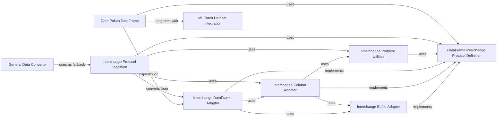

## Component Details

The Interoperability subsystem in Polars is designed to facilitate seamless data exchange and integration with external data processing and machine learning libraries. Its primary purpose is to enable Polars DataFrames to be easily consumed by and converted from other data structures that adhere to established protocols, such as the DataFrame Interchange Protocol. This involves providing adapter components for Polars' internal data structures (DataFrame, Series, and their underlying buffers) to conform to the protocol's specifications, as well as ingestion mechanisms to convert external data into native Polars formats. Additionally, it offers specialized integrations, like the PyTorch Dataset, to streamline machine learning workflows. The core flow involves either adapting Polars data for external consumption or ingesting external data into Polars, often leveraging shared protocol definitions and utility functions for data type mapping and buffer management.

### Interchange DataFrame Adapter
This component implements the DataFrame part of the Dataframe Interchange Protocol. It acts as an adapter, wrapping a native Polars DataFrame and exposing its structure and data according to the protocol's specifications, allowing other libraries to consume Polars DataFrames.

**Related Classes/Methods**:

- <a href="https://github.com/pola-rs/polars/blob/master/py-polars/polars/interchange/dataframe.py#L18-L230" target="_blank" rel="noopener noreferrer">`polars.interchange.dataframe.PolarsDataFrame` (18:230)</a>

### Interchange Column Adapter
This component implements the Column part of the Dataframe Interchange Protocol. It wraps a native Polars Series, providing methods to access column properties, underlying data buffers, and data chunks in a manner consistent with the interchange protocol.

**Related Classes/Methods**:

- <a href="https://github.com/pola-rs/polars/blob/master/py-polars/polars/interchange/column.py#L24-L195" target="_blank" rel="noopener noreferrer">`polars.interchange.column.PolarsColumn` (24:195)</a>

### Interchange Buffer Adapter
This component implements the Buffer part of the Dataframe Interchange Protocol. It wraps a single chunk of data from a Polars Series, providing direct access to its memory pointer and size, facilitating zero-copy data exchange when possible.

**Related Classes/Methods**:

- <a href="https://github.com/pola-rs/polars/blob/master/py-polars/polars/interchange/buffer.py#L19-L77" target="_blank" rel="noopener noreferrer">`polars.interchange.buffer.PolarsBuffer` (19:77)</a>

### Interchange Protocol Ingestion
This component is responsible for converting a generic DataFrame object that adheres to the Dataframe Interchange Protocol into a native Polars DataFrame. It orchestrates the process of iterating over data chunks and columns from the source object and reconstructing them into Polars Series and DataFrames, handling various data types and buffer types.

**Related Classes/Methods**:

- <a href="https://github.com/pola-rs/polars/blob/master/py-polars/polars/interchange/from_dataframe.py#L25-L50" target="_blank" rel="noopener noreferrer">`polars.interchange.from_dataframe.from_dataframe` (25:50)</a>
- <a href="https://github.com/pola-rs/polars/blob/master/py-polars/polars/interchange/from_dataframe.py#L53-L64" target="_blank" rel="noopener noreferrer">`polars.interchange.from_dataframe._from_dataframe` (53:64)</a>
- <a href="https://github.com/pola-rs/polars/blob/master/py-polars/polars/interchange/from_dataframe.py#L67-L81" target="_blank" rel="noopener noreferrer">`polars.interchange.from_dataframe._protocol_df_chunk_to_polars` (67:81)</a>
- <a href="https://github.com/pola-rs/polars/blob/master/py-polars/polars/interchange/from_dataframe.py#L84-L96" target="_blank" rel="noopener noreferrer">`polars.interchange.from_dataframe._column_to_series` (84:96)</a>
- <a href="https://github.com/pola-rs/polars/blob/master/py-polars/polars/interchange/from_dataframe.py#L99-L136" target="_blank" rel="noopener noreferrer">`polars.interchange.from_dataframe._string_column_to_series` (99:136)</a>
- <a href="https://github.com/pola-rs/polars/blob/master/py-polars/polars/interchange/from_dataframe.py#L139-L182" target="_blank" rel="noopener noreferrer">`polars.interchange.from_dataframe._categorical_column_to_series` (139:182)</a>
- <a href="https://github.com/pola-rs/polars/blob/master/py-polars/polars/interchange/from_dataframe.py#L185-L211" target="_blank" rel="noopener noreferrer">`polars.interchange.from_dataframe._construct_data_buffer` (185:211)</a>
- <a href="https://github.com/pola-rs/polars/blob/master/py-polars/polars/interchange/from_dataframe.py#L214-L234" target="_blank" rel="noopener noreferrer">`polars.interchange.from_dataframe._construct_offsets_buffer` (214:234)</a>
- <a href="https://github.com/pola-rs/polars/blob/master/py-polars/polars/interchange/from_dataframe.py#L237-L288" target="_blank" rel="noopener noreferrer">`polars.interchange.from_dataframe._construct_validity_buffer` (237:288)</a>
- <a href="https://github.com/pola-rs/polars/blob/master/py-polars/polars/interchange/from_dataframe.py#L291-L308" target="_blank" rel="noopener noreferrer">`polars.interchange.from_dataframe._construct_validity_buffer_from_bitmask` (291:308)</a>
- <a href="https://github.com/pola-rs/polars/blob/master/py-polars/polars/interchange/from_dataframe.py#L311-L328" target="_blank" rel="noopener noreferrer">`polars.interchange.from_dataframe._construct_validity_buffer_from_bytemask` (311:328)</a>

### Interchange Protocol Utilities
This component provides essential utility functions for the Dataframe Interchange Protocol, primarily focusing on data type conversions between Polars' internal types and the generic types defined by the protocol, as well as calculating buffer lengths.

**Related Classes/Methods**:

- <a href="https://github.com/pola-rs/polars/blob/master/py-polars/polars/interchange/utils.py#L57-L71" target="_blank" rel="noopener noreferrer">`polars.interchange.utils.polars_dtype_to_dtype` (57:71)</a>
- <a href="https://github.com/pola-rs/polars/blob/master/py-polars/polars/interchange/utils.py#L112-L125" target="_blank" rel="noopener noreferrer">`polars.interchange.utils.dtype_to_polars_dtype` (112:125)</a>
- <a href="https://github.com/pola-rs/polars/blob/master/py-polars/polars/interchange/utils.py#L74-L78" target="_blank" rel="noopener noreferrer">`polars.interchange.utils._datetime_to_dtype` (74:78)</a>
- <a href="https://github.com/pola-rs/polars/blob/master/py-polars/polars/interchange/utils.py#L81-L84" target="_blank" rel="noopener noreferrer">`polars.interchange.utils._duration_to_dtype` (81:84)</a>
- <a href="https://github.com/pola-rs/polars/blob/master/py-polars/polars/interchange/utils.py#L128-L145" target="_blank" rel="noopener noreferrer">`polars.interchange.utils._temporal_dtype_to_polars_dtype` (128:145)</a>
- <a href="https://github.com/pola-rs/polars/blob/master/py-polars/polars/interchange/utils.py#L148-L155" target="_blank" rel="noopener noreferrer">`polars.interchange.utils.get_buffer_length_in_elements` (148:155)</a>
- <a href="https://github.com/pola-rs/polars/blob/master/py-polars/polars/interchange/utils.py#L158-L170" target="_blank" rel="noopener noreferrer">`polars.interchange.utils.polars_dtype_to_data_buffer_dtype` (158:170)</a>

### DataFrame Interchange Protocol Definition
This component defines the abstract interfaces and compatibility levels for the DataFrame Interchange Protocol, including `Buffer`, `Column`, and `DataFrame` interfaces, and the `CompatLevel` enumeration.

**Related Classes/Methods**:

- <a href="https://github.com/pola-rs/polars/blob/master/py-polars/polars/interchange/protocol.py#L260-L297" target="_blank" rel="noopener noreferrer">`polars.interchange.protocol.CompatLevel` (260:297)</a>
- <a href="https://github.com/pola-rs/polars/blob/master/py-polars/polars/interchange/protocol.py#L131-L146" target="_blank" rel="noopener noreferrer">`polars.interchange.protocol.Buffer` (131:146)</a>
- <a href="https://github.com/pola-rs/polars/blob/master/py-polars/polars/interchange/protocol.py#L149-L186" target="_blank" rel="noopener noreferrer">`polars.interchange.protocol.Column` (149:186)</a>
- <a href="https://github.com/pola-rs/polars/blob/master/py-polars/polars/interchange/protocol.py#L189-L233" target="_blank" rel="noopener noreferrer">`polars.interchange.protocol.DataFrame` (189:233)</a>

### ML Torch Dataset Integration
This component provides a specialized PyTorch Dataset class that enables seamless integration of Polars DataFrames with PyTorch models. It facilitates efficient data loading and processing for machine learning workflows by converting DataFrame data into PyTorch Tensors.

**Related Classes/Methods**:

- <a href="https://github.com/pola-rs/polars/blob/master/py-polars/polars/ml/torch.py#L35-L213" target="_blank" rel="noopener noreferrer">`polars.ml.torch.PolarsDataset` (35:213)</a>

### Core Polars DataFrame
This is the fundamental two-dimensional data structure in Polars, representing a table with rows and columns. It offers a comprehensive set of functionalities for data manipulation, analysis, and interoperability with other data ecosystems, including exposing itself via the Dataframe Interchange Protocol and converting to PyTorch datasets.

**Related Classes/Methods**:

- <a href="https://github.com/pola-rs/polars/blob/master/py-polars/polars/dataframe/frame.py#L201-L12391" target="_blank" rel="noopener noreferrer">`polars.dataframe.frame.DataFrame` (201:12391)</a>

### General Data Converter
This component serves as a high-level utility for converting various external data formats, such as pandas DataFrames, NumPy arrays, and objects supporting the PyCapsule Interface or Dataframe Interchange Protocol, into native Polars DataFrames or Series. It prioritizes efficient conversion methods and provides fallbacks when necessary.

**Related Classes/Methods**:

- <a href="https://github.com/pola-rs/polars/blob/master/py-polars/polars/convert/general.py#L964-L1038" target="_blank" rel="noopener noreferrer">`polars.convert.general.from_dataframe` (964:1038)</a>

### [FAQ](https://github.com/CodeBoarding/GeneratedOnBoardings/tree/main?tab=readme-ov-file#faq)