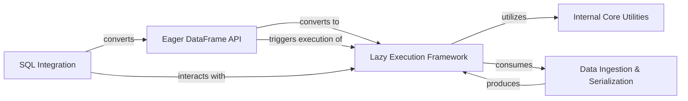

## Component Details

This graph illustrates the core components of the Polars data manipulation library, focusing on the interplay between its eager and lazy execution models, data ingestion/serialization capabilities, SQL integration, and underlying utility functions. The central purpose is to demonstrate how Polars efficiently processes data through deferred computation and optimized query plans, while also providing immediate execution options and flexible data I/O.

### Eager DataFrame API
This component provides the primary interface for immediate, in-memory data manipulation using Polars DataFrames. It offers a wide range of methods for data transformation, aggregation, and I/O operations that execute eagerly, returning results directly. It often converts operations to their lazy counterparts for optimized execution before collecting the results.

**Related Classes/Methods**:

- <a href="https://github.com/pola-rs/polars/blob/master/py-polars/polars/dataframe/frame.py#L2833-L2833" target="_blank" rel="noopener noreferrer">`polars.dataframe.frame.DataFrame:write_ndjson` (2833:2833)</a>
- <a href="https://github.com/pola-rs/polars/blob/master/py-polars/polars/dataframe/frame.py#L2887-L2907" target="_blank" rel="noopener noreferrer">`polars.dataframe.frame.DataFrame:write_csv` (2887:2907)</a>
- <a href="https://github.com/pola-rs/polars/blob/master/py-polars/polars/dataframe/frame.py#L3723-L3734" target="_blank" rel="noopener noreferrer">`polars.dataframe.frame.DataFrame:write_ipc` (3723:3734)</a>
- <a href="https://github.com/pola-rs/polars/blob/master/py-polars/polars/dataframe/frame.py#L3917-L4144" target="_blank" rel="noopener noreferrer">`polars.dataframe.frame.DataFrame:write_parquet` (3917:4144)</a>
- <a href="https://github.com/pola-rs/polars/blob/master/py-polars/polars/dataframe/frame.py#L5010-L5182" target="_blank" rel="noopener noreferrer">`polars.dataframe.frame.DataFrame:filter` (5010:5182)</a>
- <a href="https://github.com/pola-rs/polars/blob/master/py-polars/polars/dataframe/frame.py#L5184-L5327" target="_blank" rel="noopener noreferrer">`polars.dataframe.frame.DataFrame:remove` (5184:5327)</a>
- <a href="https://github.com/pola-rs/polars/blob/master/py-polars/polars/dataframe/frame.py#L5443-L5542" target="_blank" rel="noopener noreferrer">`polars.dataframe.frame.DataFrame:describe` (5443:5542)</a>
- <a href="https://github.com/pola-rs/polars/blob/master/py-polars/polars/dataframe/frame.py#L5605-L5713" target="_blank" rel="noopener noreferrer">`polars.dataframe.frame.DataFrame:sort` (5605:5713)</a>
- <a href="https://github.com/pola-rs/polars/blob/master/py-polars/polars/dataframe/frame.py#L5808-L5894" target="_blank" rel="noopener noreferrer">`polars.dataframe.frame.DataFrame:top_k` (5808:5894)</a>
- <a href="https://github.com/pola-rs/polars/blob/master/py-polars/polars/dataframe/frame.py#L5897-L5983" target="_blank" rel="noopener noreferrer">`polars.dataframe.frame.DataFrame:bottom_k` (5897:5983)</a>
- <a href="https://github.com/pola-rs/polars/blob/master/py-polars/polars/dataframe/frame.py#L6205-L6293" target="_blank" rel="noopener noreferrer">`polars.dataframe.frame.DataFrame:drop_nans` (6205:6293)</a>
- <a href="https://github.com/pola-rs/polars/blob/master/py-polars/polars/dataframe/frame.py#L6295-L6414" target="_blank" rel="noopener noreferrer">`polars.dataframe.frame.DataFrame:drop_nulls` (6295:6414)</a>
- <a href="https://github.com/pola-rs/polars/blob/master/py-polars/polars/dataframe/frame.py#L7324-L7675" target="_blank" rel="noopener noreferrer">`polars.dataframe.frame.DataFrame:join_asof` (7324:7675)</a>
- <a href="https://github.com/pola-rs/polars/blob/master/py-polars/polars/dataframe/frame.py#L7678-L7922" target="_blank" rel="noopener noreferrer">`polars.dataframe.frame.DataFrame:join` (7678:7922)</a>
- <a href="https://github.com/pola-rs/polars/blob/master/py-polars/polars/dataframe/frame.py#L7925-L8004" target="_blank" rel="noopener noreferrer">`polars.dataframe.frame.DataFrame:join_where` (7925:8004)</a>
- <a href="https://github.com/pola-rs/polars/blob/master/py-polars/polars/dataframe/frame.py#L8273-L8362" target="_blank" rel="noopener noreferrer">`polars.dataframe.frame.DataFrame:drop` (8273:8362)</a>
- <a href="https://github.com/pola-rs/polars/blob/master/py-polars/polars/dataframe/frame.py#L8398-L8488" target="_blank" rel="noopener noreferrer">`polars.dataframe.frame.DataFrame:cast` (8398:8488)</a>
- <a href="https://github.com/pola-rs/polars/blob/master/py-polars/polars/dataframe/frame.py#L8700-L8802" target="_blank" rel="noopener noreferrer">`polars.dataframe.frame.DataFrame:fill_null` (8700:8802)</a>
- <a href="https://github.com/pola-rs/polars/blob/master/py-polars/polars/dataframe/frame.py#L8804-L8850" target="_blank" rel="noopener noreferrer">`polars.dataframe.frame.DataFrame:fill_nan` (8804:8850)</a>
- <a href="https://github.com/pola-rs/polars/blob/master/py-polars/polars/dataframe/frame.py#L8852-L8915" target="_blank" rel="noopener noreferrer">`polars.dataframe.frame.DataFrame:explode` (8852:8915)</a>
- <a href="https://github.com/pola-rs/polars/blob/master/py-polars/polars/dataframe/frame.py#L9537-L9614" target="_blank" rel="noopener noreferrer">`polars.dataframe.frame.DataFrame:shift` (9537:9614)</a>
- <a href="https://github.com/pola-rs/polars/blob/master/py-polars/polars/dataframe/frame.py#L9690-L9725" target="_blank" rel="noopener noreferrer">`polars.dataframe.frame.DataFrame:lazy` (9690:9725)</a>
- <a href="https://github.com/pola-rs/polars/blob/master/py-polars/polars/dataframe/frame.py#L9727-L9833" target="_blank" rel="noopener noreferrer">`polars.dataframe.frame.DataFrame:select` (9727:9833)</a>
- <a href="https://github.com/pola-rs/polars/blob/master/py-polars/polars/dataframe/frame.py#L9835-L9864" target="_blank" rel="noopener noreferrer">`polars.dataframe.frame.DataFrame:select_seq` (9835:9864)</a>
- <a href="https://github.com/pola-rs/polars/blob/master/py-polars/polars/dataframe/frame.py#L9866-L10018" target="_blank" rel="noopener noreferrer">`polars.dataframe.frame.DataFrame:with_columns` (9866:10018)</a>
- <a href="https://github.com/pola-rs/polars/blob/master/py-polars/polars/dataframe/frame.py#L10020-L10058" target="_blank" rel="noopener noreferrer">`polars.dataframe.frame.DataFrame:with_columns_seq` (10020:10058)</a>
- <a href="https://github.com/pola-rs/polars/blob/master/py-polars/polars/dataframe/frame.py#L10102-L10127" target="_blank" rel="noopener noreferrer">`polars.dataframe.frame.DataFrame:max` (10102:10127)</a>
- <a href="https://github.com/pola-rs/polars/blob/master/py-polars/polars/dataframe/frame.py#L10157-L10182" target="_blank" rel="noopener noreferrer">`polars.dataframe.frame.DataFrame:min` (10157:10182)</a>
- <a href="https://github.com/pola-rs/polars/blob/master/py-polars/polars/dataframe/frame.py#L10212-L10237" target="_blank" rel="noopener noreferrer">`polars.dataframe.frame.DataFrame:sum` (10212:10237)</a>
- <a href="https://github.com/pola-rs/polars/blob/master/py-polars/polars/dataframe/frame.py#L10275-L10301" target="_blank" rel="noopener noreferrer">`polars.dataframe.frame.DataFrame:mean` (10275:10301)</a>
- <a href="https://github.com/pola-rs/polars/blob/master/py-polars/polars/dataframe/frame.py#L10339-L10380" target="_blank" rel="noopener noreferrer">`polars.dataframe.frame.DataFrame:std` (10339:10380)</a>
- <a href="https://github.com/pola-rs/polars/blob/master/py-polars/polars/dataframe/frame.py#L10382-L10423" target="_blank" rel="noopener noreferrer">`polars.dataframe.frame.DataFrame:var` (10382:10423)</a>
- <a href="https://github.com/pola-rs/polars/blob/master/py-polars/polars/dataframe/frame.py#L10425-L10450" target="_blank" rel="noopener noreferrer">`polars.dataframe.frame.DataFrame:median` (10425:10450)</a>
- <a href="https://github.com/pola-rs/polars/blob/master/py-polars/polars/dataframe/frame.py#L10485-L10523" target="_blank" rel="noopener noreferrer">`polars.dataframe.frame.DataFrame:quantile` (10485:10523)</a>
- <a href="https://github.com/pola-rs/polars/blob/master/py-polars/polars/dataframe/frame.py#L10603-L10694" target="_blank" rel="noopener noreferrer">`polars.dataframe.frame.DataFrame:unique` (10603:10694)</a>
- <a href="https://github.com/pola-rs/polars/blob/master/py-polars/polars/dataframe/frame.py#L10776-L10807" target="_blank" rel="noopener noreferrer">`polars.dataframe.frame.DataFrame:approx_n_unique` (10776:10807)</a>
- <a href="https://github.com/pola-rs/polars/blob/master/py-polars/polars/dataframe/frame.py#L11739-L11796" target="_blank" rel="noopener noreferrer">`polars.dataframe.frame.DataFrame:unnest` (11739:11796)</a>
- <a href="https://github.com/pola-rs/polars/blob/master/py-polars/polars/dataframe/frame.py#L11834-L11914" target="_blank" rel="noopener noreferrer">`polars.dataframe.frame.DataFrame:merge_sorted` (11834:11914)</a>
- <a href="https://github.com/pola-rs/polars/blob/master/py-polars/polars/dataframe/frame.py#L11916-L11948" target="_blank" rel="noopener noreferrer">`polars.dataframe.frame.DataFrame:set_sorted` (11916:11948)</a>
- <a href="https://github.com/pola-rs/polars/blob/master/py-polars/polars/dataframe/frame.py#L11951-L12106" target="_blank" rel="noopener noreferrer">`polars.dataframe.frame.DataFrame:update` (11951:12106)</a>
- <a href="https://github.com/pola-rs/polars/blob/master/py-polars/polars/dataframe/frame.py#L12108-L12129" target="_blank" rel="noopener noreferrer">`polars.dataframe.frame.DataFrame:count` (12108:12129)</a>
- <a href="https://github.com/pola-rs/polars/blob/master/py-polars/polars/dataframe/frame.py#L12175-L12336" target="_blank" rel="noopener noreferrer">`polars.dataframe.frame.DataFrame:match_to_schema` (12175:12336)</a>
- <a href="https://github.com/pola-rs/polars/blob/master/py-polars/polars/dataframe/group_by.py#L130-L242" target="_blank" rel="noopener noreferrer">`polars.dataframe.group_by.GroupBy:agg` (130:242)</a>
- <a href="https://github.com/pola-rs/polars/blob/master/py-polars/polars/dataframe/group_by.py#L318-L370" target="_blank" rel="noopener noreferrer">`polars.dataframe.group_by.GroupBy:head` (318:370)</a>
- <a href="https://github.com/pola-rs/polars/blob/master/py-polars/polars/dataframe/group_by.py#L372-L424" target="_blank" rel="noopener noreferrer">`polars.dataframe.group_by.GroupBy:tail` (372:424)</a>
- <a href="https://github.com/pola-rs/polars/blob/master/py-polars/polars/dataframe/group_by.py#L833-L864" target="_blank" rel="noopener noreferrer">`polars.dataframe.group_by.RollingGroupBy:agg` (833:864)</a>
- <a href="https://github.com/pola-rs/polars/blob/master/py-polars/polars/dataframe/group_by.py#L866-L908" target="_blank" rel="noopener noreferrer">`polars.dataframe.group_by.RollingGroupBy:map_groups` (866:908)</a>
- <a href="https://github.com/pola-rs/polars/blob/master/py-polars/polars/dataframe/group_by.py#L985-L1020" target="_blank" rel="noopener noreferrer">`polars.dataframe.group_by.DynamicGroupBy:agg` (985:1020)</a>
- <a href="https://github.com/pola-rs/polars/blob/master/py-polars/polars/dataframe/group_by.py#L1022-L1067" target="_blank" rel="noopener noreferrer">`polars.dataframe.group_by.DynamicGroupBy:map_groups` (1022:1067)</a>
- <a href="https://github.com/pola-rs/polars/blob/master/py-polars/polars/functions/eager.py#L26-L306" target="_blank" rel="noopener noreferrer">`polars.functions.eager:concat` (26:306)</a>

### Lazy Execution Framework
This component is the core of Polars' lazy execution model, enabling deferred computation and query optimization. It allows users to construct a query plan as a directed acyclic graph (DAG) of operations on LazyFrame objects without immediate execution. This design facilitates advanced query planning, optimization, and efficient processing of large datasets. It includes functionalities for chaining operations, managing query optimization flags, handling lazy group-by operations, and defining how lazy queries are collected or sunk to various output formats.

**Related Classes/Methods**:

- <a href="https://github.com/pola-rs/polars/blob/master/py-polars/polars/lazyframe/frame.py#L235-L8350" target="_blank" rel="noopener noreferrer">`polars.lazyframe.frame.LazyFrame` (235:8350)</a>
- <a href="https://github.com/pola-rs/polars/blob/master/py-polars/polars/lazyframe/group_by.py#L24-L667" target="_blank" rel="noopener noreferrer">`polars.lazyframe.group_by.LazyGroupBy` (24:667)</a>
- <a href="https://github.com/pola-rs/polars/blob/master/py-polars/polars/lazyframe/opt_flags.py#L24-L265" target="_blank" rel="noopener noreferrer">`polars.lazyframe.opt_flags.QueryOptFlags` (24:265)</a>
- <a href="https://github.com/pola-rs/polars/blob/master/py-polars/polars/lazyframe/frame.py#L2492-L2517" target="_blank" rel="noopener noreferrer">`polars.lazyframe.frame.LazyFrame:sink_parquet` (2492:2517)</a>
- <a href="https://github.com/pola-rs/polars/blob/master/py-polars/polars/lazyframe/frame.py#L2817-L2834" target="_blank" rel="noopener noreferrer">`polars.lazyframe.frame.LazyFrame:sink_ipc` (2817:2834)</a>
- <a href="https://github.com/pola-rs/polars/blob/master/py-polars/polars/lazyframe/frame.py#L3021-L3049" target="_blank" rel="noopener noreferrer">`polars.lazyframe.frame.LazyFrame:sink_csv` (3021:3049)</a>
- <a href="https://github.com/pola-rs/polars/blob/master/py-polars/polars/lazyframe/frame.py#L3309-L3324" target="_blank" rel="noopener noreferrer">`polars.lazyframe.frame.LazyFrame:sink_ndjson` (3309:3324)</a>
- <a href="https://github.com/pola-rs/polars/blob/master/py-polars/polars/lazyframe/frame.py#L2068-L2084" target="_blank" rel="noopener noreferrer">`polars.lazyframe.frame.LazyFrame:collect` (2068:2084)</a>
- <a href="https://github.com/pola-rs/polars/blob/master/py-polars/polars/lazyframe/frame.py#L2339-L2345" target="_blank" rel="noopener noreferrer">`polars.lazyframe.frame.LazyFrame:collect_async` (2339:2345)</a>
- <a href="https://github.com/pola-rs/polars/blob/master/py-polars/polars/lazyframe/frame.py#L1149-L1303" target="_blank" rel="noopener noreferrer">`polars.lazyframe.frame.LazyFrame:explain` (1149:1303)</a>
- <a href="https://github.com/pola-rs/polars/blob/master/py-polars/polars/lazyframe/frame.py#L1307-L1462" target="_blank" rel="noopener noreferrer">`polars.lazyframe.frame.LazyFrame:show_graph` (1307:1462)</a>
- <a href="https://github.com/pola-rs/polars/blob/master/py-polars/polars/lazyframe/frame.py#L1464-L1488" target="_blank" rel="noopener noreferrer">`polars.lazyframe.frame.LazyFrame:inspect` (1464:1488)</a>
- <a href="https://github.com/pola-rs/polars/blob/master/py-polars/polars/lazyframe/frame.py#L1490-L1608" target="_blank" rel="noopener noreferrer">`polars.lazyframe.frame.LazyFrame:sort` (1490:1608)</a>
- <a href="https://github.com/pola-rs/polars/blob/master/py-polars/polars/lazyframe/frame.py#L1610-L1692" target="_blank" rel="noopener noreferrer">`polars.lazyframe.frame.LazyFrame:sql` (1610:1692)</a>
- <a href="https://github.com/pola-rs/polars/blob/master/py-polars/polars/lazyframe/frame.py#L1695-L1770" target="_blank" rel="noopener noreferrer">`polars.lazyframe.frame.LazyFrame:top_k` (1695:1770)</a>
- <a href="https://github.com/pola-rs/polars/blob/master/py-polars/polars/lazyframe/frame.py#L1773-L1848" target="_blank" rel="noopener noreferrer">`polars.lazyframe.frame.LazyFrame:bottom_k` (1773:1848)</a>
- <a href="https://github.com/pola-rs/polars/blob/master/py-polars/polars/lazyframe/frame.py#L1851-L2065" target="_blank" rel="noopener noreferrer">`polars.lazyframe.frame.LazyFrame:profile` (1851:2065)</a>
- <a href="https://github.com/pola-rs/polars/blob/master/py-polars/polars/lazyframe/frame.py#L3491-L3540" target="_blank" rel="noopener noreferrer">`polars.lazyframe.frame.LazyFrame:fetch` (3491:3540)</a>
- <a href="https://github.com/pola-rs/polars/blob/master/py-polars/polars/lazyframe/frame.py#L3681-L3687" target="_blank" rel="noopener noreferrer">`polars.lazyframe.frame.LazyFrame:cache` (3681:3687)</a>
- <a href="https://github.com/pola-rs/polars/blob/master/py-polars/polars/lazyframe/frame.py#L3689-L3791" target="_blank" rel="noopener noreferrer">`polars.lazyframe.frame.LazyFrame:cast` (3689:3791)</a>
- <a href="https://github.com/pola-rs/polars/blob/master/py-polars/polars/lazyframe/frame.py#L3793-L3837" target="_blank" rel="noopener noreferrer">`polars.lazyframe.frame.LazyFrame:clear` (3793:3837)</a>
- <a href="https://github.com/pola-rs/polars/blob/master/py-polars/polars/lazyframe/frame.py#L3864-L3947" target="_blank" rel="noopener noreferrer">`polars.lazyframe.frame.LazyFrame:_filter` (3864:3947)</a>
- <a href="https://github.com/pola-rs/polars/blob/master/py-polars/polars/lazyframe/frame.py#L3949-L4125" target="_blank" rel="noopener noreferrer">`polars.lazyframe.frame.LazyFrame:filter` (3949:4125)</a>
- <a href="https://github.com/pola-rs/polars/blob/master/py-polars/polars/lazyframe/frame.py#L4127-L4279" target="_blank" rel="noopener noreferrer">`polars.lazyframe.frame.LazyFrame:remove` (4127:4279)</a>
- <a href="https://github.com/pola-rs/polars/blob/master/py-polars/polars/lazyframe/frame.py#L4281-L4388" target="_blank" rel="noopener noreferrer">`polars.lazyframe.frame.LazyFrame:select` (4281:4388)</a>
- <a href="https://github.com/pola-rs/polars/blob/master/py-polars/polars/lazyframe/frame.py#L4390-L4418" target="_blank" rel="noopener noreferrer">`polars.lazyframe.frame.LazyFrame:select_seq` (4390:4418)</a>
- <a href="https://github.com/pola-rs/polars/blob/master/py-polars/polars/lazyframe/frame.py#L4420-L4526" target="_blank" rel="noopener noreferrer">`polars.lazyframe.frame.LazyFrame:group_by` (4420:4526)</a>
- <a href="https://github.com/pola-rs/polars/blob/master/py-polars/polars/lazyframe/frame.py#L4529-L4665" target="_blank" rel="noopener noreferrer">`polars.lazyframe.frame.LazyFrame:rolling` (4529:4665)</a>
- <a href="https://github.com/pola-rs/polars/blob/master/py-polars/polars/lazyframe/frame.py#L4668-L5003" target="_blank" rel="noopener noreferrer">`polars.lazyframe.frame.LazyFrame:group_by_dynamic` (4668:5003)</a>
- <a href="https://github.com/pola-rs/polars/blob/master/py-polars/polars/lazyframe/frame.py#L5005-L5374" target="_blank" rel="noopener noreferrer">`polars.lazyframe.frame.LazyFrame:join_asof` (5005:5374)</a>
- <a href="https://github.com/pola-rs/polars/blob/master/py-polars/polars/lazyframe/frame.py#L5377-L5662" target="_blank" rel="noopener noreferrer">`polars.lazyframe.frame.LazyFrame:join` (5377:5662)</a>
- <a href="https://github.com/pola-rs/polars/blob/master/py-polars/polars/lazyframe/frame.py#L5665-L5742" target="_blank" rel="noopener noreferrer">`polars.lazyframe.frame.LazyFrame:join_where` (5665:5742)</a>
- <a href="https://github.com/pola-rs/polars/blob/master/py-polars/polars/lazyframe/frame.py#L5744-L5895" target="_blank" rel="noopener noreferrer">`polars.lazyframe.frame.LazyFrame:with_columns` (5744:5895)</a>
- <a href="https://github.com/pola-rs/polars/blob/master/py-polars/polars/lazyframe/frame.py#L5897-L5934" target="_blank" rel="noopener noreferrer">`polars.lazyframe.frame.LazyFrame:with_columns_seq` (5897:5934)</a>
- <a href="https://github.com/pola-rs/polars/blob/master/py-polars/polars/lazyframe/frame.py#L5940-L6000" target="_blank" rel="noopener noreferrer">`polars.lazyframe.frame.LazyFrame:with_context` (5940:6000)</a>
- <a href="https://github.com/pola-rs/polars/blob/master/py-polars/polars/lazyframe/frame.py#L6002-L6072" target="_blank" rel="noopener noreferrer">`polars.lazyframe.frame.LazyFrame:drop` (6002:6072)</a>
- <a href="https://github.com/pola-rs/polars/blob/master/py-polars/polars/lazyframe/frame.py#L6074-L6132" target="_blank" rel="noopener noreferrer">`polars.lazyframe.frame.LazyFrame:rename` (6074:6132)</a>
- <a href="https://github.com/pola-rs/polars/blob/master/py-polars/polars/lazyframe/frame.py#L6134-L6158" target="_blank" rel="noopener noreferrer">`polars.lazyframe.frame.LazyFrame:reverse` (6134:6158)</a>
- <a href="https://github.com/pola-rs/polars/blob/master/py-polars/polars/lazyframe/frame.py#L6160-L6236" target="_blank" rel="noopener noreferrer">`polars.lazyframe.frame.LazyFrame:shift` (6160:6236)</a>
- <a href="https://github.com/pola-rs/polars/blob/master/py-polars/polars/lazyframe/frame.py#L6238-L6273" target="_blank" rel="noopener noreferrer">`polars.lazyframe.frame.LazyFrame:slice` (6238:6273)</a>
- <a href="https://github.com/pola-rs/polars/blob/master/py-polars/polars/lazyframe/frame.py#L6275-L6318" target="_blank" rel="noopener noreferrer">`polars.lazyframe.frame.LazyFrame:limit` (6275:6318)</a>
- <a href="https://github.com/pola-rs/polars/blob/master/py-polars/polars/lazyframe/frame.py#L6320-L6361" target="_blank" rel="noopener noreferrer">`polars.lazyframe.frame.LazyFrame:head` (6320:6361)</a>
- <a href="https://github.com/pola-rs/polars/blob/master/py-polars/polars/lazyframe/frame.py#L6363-L6404" target="_blank" rel="noopener noreferrer">`polars.lazyframe.frame.LazyFrame:tail` (6363:6404)</a>
- <a href="https://github.com/pola-rs/polars/blob/master/py-polars/polars/lazyframe/frame.py#L6406-L6428" target="_blank" rel="noopener noreferrer">`polars.lazyframe.frame.LazyFrame:last` (6406:6428)</a>
- <a href="https://github.com/pola-rs/polars/blob/master/py-polars/polars/lazyframe/frame.py#L6430-L6452" target="_blank" rel="noopener noreferrer">`polars.lazyframe.frame.LazyFrame:first` (6430:6452)</a>
- <a href="https://github.com/pola-rs/polars/blob/master/py-polars/polars/lazyframe/frame.py#L6458-L6485" target="_blank" rel="noopener noreferrer">`polars.lazyframe.frame.LazyFrame:approx_n_unique` (6458:6485)</a>
- <a href="https://github.com/pola-rs/polars/blob/master/py-polars/polars/lazyframe/frame.py#L6487-L6562" target="_blank" rel="noopener noreferrer">`polars.lazyframe.frame.LazyFrame:with_row_index` (6487:6562)</a>
- <a href="https://github.com/pola-rs/polars/blob/master/py-polars/polars/lazyframe/frame.py#L6568-L6608" target="_blank" rel="noopener noreferrer">`polars.lazyframe.frame.LazyFrame:with_row_count` (6568:6608)</a>
- <a href="https://github.com/pola-rs/polars/blob/master/py-polars/polars/lazyframe/frame.py#L6610-L6650" target="_blank" rel="noopener noreferrer">`polars.lazyframe.frame.LazyFrame:gather_every` (6610:6650)</a>
- <a href="https://github.com/pola-rs/polars/blob/master/py-polars/polars/lazyframe/frame.py#L6652-L6790" target="_blank" rel="noopener noreferrer">`polars.lazyframe.frame.LazyFrame:fill_null` (6652:6790)</a>
- <a href="https://github.com/pola-rs/polars/blob/master/py-polars/polars/lazyframe/frame.py#L6792-L6833" target="_blank" rel="noopener noreferrer">`polars.lazyframe.frame.LazyFrame:fill_nan` (6792:6833)</a>
- <a href="https://github.com/pola-rs/polars/blob/master/py-polars/polars/lazyframe/frame.py#L6835-L6873" target="_blank" rel="noopener noreferrer">`polars.lazyframe.frame.LazyFrame:std` (6835:6873)</a>
- <a href="https://github.com/pola-rs/polars/blob/master/py-polars/polars/lazyframe/frame.py#L6875-L6913" target="_blank" rel="noopener noreferrer">`polars.lazyframe.frame.LazyFrame:var` (6875:6913)</a>
- <a href="https://github.com/pola-rs/polars/blob/master/py-polars/polars/lazyframe/frame.py#L6915-L6937" target="_blank" rel="noopener noreferrer">`polars.lazyframe.frame.LazyFrame:max` (6915:6937)</a>
- <a href="https://github.com/pola-rs/polars/blob/master/py-polars/polars/lazyframe/frame.py#L6939-L6961" target="_blank" rel="noopener noreferrer">`polars.lazyframe.frame.LazyFrame:min` (6939:6961)</a>
- <a href="https://github.com/pola-rs/polars/blob/master/py-polars/polars/lazyframe/frame.py#L6963-L6985" target="_blank" rel="noopener noreferrer">`polars.lazyframe.frame.LazyFrame:sum` (6963:6985)</a>
- <a href="https://github.com/pola-rs/polars/blob/master/py-polars/polars/lazyframe/frame.py#L6987-L7009" target="_blank" rel="noopener noreferrer">`polars.lazyframe.frame.LazyFrame:mean` (6987:7009)</a>
- <a href="https://github.com/pola-rs/polars/blob/master/py-polars/polars/lazyframe/frame.py#L7011-L7033" target="_blank" rel="noopener noreferrer">`polars.lazyframe.frame.LazyFrame:median` (7011:7033)</a>
- <a href="https://github.com/pola-rs/polars/blob/master/py-polars/polars/lazyframe/frame.py#L7035-L7058" target="_blank" rel="noopener noreferrer">`polars.lazyframe.frame.LazyFrame:null_count` (7035:7058)</a>
- <a href="https://github.com/pola-rs/polars/blob/master/py-polars/polars/lazyframe/frame.py#L7060-L7094" target="_blank" rel="noopener noreferrer">`polars.lazyframe.frame.LazyFrame:quantile` (7060:7094)</a>
- <a href="https://github.com/pola-rs/polars/blob/master/py-polars/polars/lazyframe/frame.py#L7096-L7138" target="_blank" rel="noopener noreferrer">`polars.lazyframe.frame.LazyFrame:explode` (7096:7138)</a>
- <a href="https://github.com/pola-rs/polars/blob/master/py-polars/polars/lazyframe/frame.py#L7140-L7227" target="_blank" rel="noopener noreferrer">`polars.lazyframe.frame.LazyFrame:unique` (7140:7227)</a>
- <a href="https://github.com/pola-rs/polars/blob/master/py-polars/polars/lazyframe/frame.py#L7229-L7315" target="_blank" rel="noopener noreferrer">`polars.lazyframe.frame.LazyFrame:drop_nans` (7229:7315)</a>
- <a href="https://github.com/pola-rs/polars/blob/master/py-polars/polars/lazyframe/frame.py#L7317-L7398" target="_blank" rel="noopener noreferrer">`polars.lazyframe.frame.LazyFrame:drop_nulls` (7317:7398)</a>
- <a href="https://github.com/pola-rs/polars/blob/master/py-polars/polars/lazyframe/frame.py#L7400-L7474" target="_blank" rel="noopener noreferrer">`polars.lazyframe.frame.LazyFrame:unpivot` (7400:7474)</a>
- <a href="https://github.com/pola-rs/polars/blob/master/py-polars/polars/lazyframe/frame.py#L7476-L7572" target="_blank" rel="noopener noreferrer">`polars.lazyframe.frame.LazyFrame:map_batches` (7476:7572)</a>
- <a href="https://github.com/pola-rs/polars/blob/master/py-polars/polars/lazyframe/frame.py#L7574-L7602" target="_blank" rel="noopener noreferrer">`polars.lazyframe.frame.LazyFrame:interpolate` (7574:7602)</a>
- <a href="https://github.com/pola-rs/polars/blob/master/py-polars/polars/lazyframe/frame.py#L7604-L7656" target="_blank" rel="noopener noreferrer">`polars.lazyframe.frame.LazyFrame:unnest` (7604:7656)</a>
- <a href="https://github.com/pola-rs/polars/blob/master/py-polars/polars/lazyframe/frame.py#L7658-L7731" target="_blank" rel="noopener noreferrer">`polars.lazyframe.frame.LazyFrame:merge_sorted` (7658:7731)</a>
- <a href="https://github.com/pola-rs/polars/blob/master/py-polars/polars/lazyframe/frame.py#L7733-L7762" target="_blank" rel="noopener noreferrer">`polars.lazyframe.frame.LazyFrame:set_sorted` (7733:7762)</a>
- <a href="https://github.com/pola-rs/polars/blob/master/py-polars/polars/lazyframe/frame.py#L7765-L8003" target="_blank" rel="noopener noreferrer">`polars.lazyframe.frame.LazyFrame:update` (7765:8003)</a>
- <a href="https://github.com/pola-rs/polars/blob/master/py-polars/polars/lazyframe/frame.py#L8005-L8024" target="_blank" rel="noopener noreferrer">`polars.lazyframe.frame.LazyFrame:count` (8005:8024)</a>
- <a href="https://github.com/pola-rs/polars/blob/master/py-polars/polars/lazyframe/frame.py#L8030-L8074" target="_blank" rel="noopener noreferrer">`polars.lazyframe.frame.LazyFrame:melt` (8030:8074)</a>
- <a href="https://github.com/pola-rs/polars/blob/master/py-polars/polars/lazyframe/frame.py#L8137-L8330" target="_blank" rel="noopener noreferrer">`polars.lazyframe.frame.LazyFrame:match_to_schema` (8137:8330)</a>
- <a href="https://github.com/pola-rs/polars/blob/master/py-polars/polars/lazyframe/frame.py#L8332-L8350" target="_blank" rel="noopener noreferrer">`polars.lazyframe.frame.LazyFrame:_to_metadata` (8332:8350)</a>
- <a href="https://github.com/pola-rs/polars/blob/master/py-polars/polars/lazyframe/frame.py#L391-L416" target="_blank" rel="noopener noreferrer">`polars.lazyframe.frame.LazyFrame:__init__` (391:416)</a>
- <a href="https://github.com/pola-rs/polars/blob/master/py-polars/polars/lazyframe/frame.py#L458-L519" target="_blank" rel="noopener noreferrer">`polars.lazyframe.frame.LazyFrame:deserialize` (458:519)</a>
- <a href="https://github.com/pola-rs/polars/blob/master/py-polars/polars/lazyframe/frame.py#L522-L561" target="_blank" rel="noopener noreferrer">`polars.lazyframe.frame.LazyFrame:columns` (522:561)</a>
- <a href="https://github.com/pola-rs/polars/blob/master/py-polars/polars/lazyframe/frame.py#L564-L603" target="_blank" rel="noopener noreferrer">`polars.lazyframe.frame.LazyFrame:dtypes` (564:603)</a>
- <a href="https://github.com/pola-rs/polars/blob/master/py-polars/polars/lazyframe/frame.py#L606-L638" target="_blank" rel="noopener noreferrer">`polars.lazyframe.frame.LazyFrame:schema` (606:638)</a>
- <a href="https://github.com/pola-rs/polars/blob/master/py-polars/polars/lazyframe/frame.py#L641-L678" target="_blank" rel="noopener noreferrer">`polars.lazyframe.frame.LazyFrame:width` (641:678)</a>
- <a href="https://github.com/pola-rs/polars/blob/master/py-polars/polars/lazyframe/frame.py#L691-L692" target="_blank" rel="noopener noreferrer">`polars.lazyframe.frame.LazyFrame:__eq__` (691:692)</a>
- <a href="https://github.com/pola-rs/polars/blob/master/py-polars/polars/lazyframe/frame.py#L694-L695" target="_blank" rel="noopener noreferrer">`polars.lazyframe.frame.LazyFrame:__ne__` (694:695)</a>
- <a href="https://github.com/pola-rs/polars/blob/master/py-polars/polars/lazyframe/frame.py#L697-L698" target="_blank" rel="noopener noreferrer">`polars.lazyframe.frame.LazyFrame:__gt__` (697:698)</a>
- <a href="https://github.com/pola-rs/polars/blob/master/py-polars/polars/lazyframe/frame.py#L700-L701" target="_blank" rel="noopener noreferrer">`polars.lazyframe.frame.LazyFrame:__lt__` (700:701)</a>
- <a href="https://github.com/pola-rs/polars/blob/master/py-polars/polars/lazyframe/frame.py#L703-L704" target="_blank" rel="noopener noreferrer">`polars.lazyframe.frame.LazyFrame:__ge__` (703:704)</a>
- <a href="https://github.com/pola-rs/polars/blob/master/py-polars/polars/lazyframe/frame.py#L706-L707" target="_blank" rel="noopener noreferrer">`polars.lazyframe.frame.LazyFrame:__le__` (706:707)</a>
- <a href="https://github.com/pola-rs/polars/blob/master/py-polars/polars/lazyframe/frame.py#L709-L710" target="_blank" rel="noopener noreferrer">`polars.lazyframe.frame.LazyFrame:__contains__` (709:710)</a>
- <a href="https://github.com/pola-rs/polars/blob/master/py-polars/polars/lazyframe/frame.py#L3839-L3862" target="_blank" rel="noopener noreferrer">`polars.lazyframe.frame.LazyFrame:clone` (3839:3862)</a>
- <a href="https://github.com/pola-rs/polars/blob/master/py-polars/polars/lazyframe/frame.py#L763-L768" target="_blank" rel="noopener noreferrer">`polars.lazyframe.frame.LazyFrame:__str__` (763:768)</a>
- <a href="https://github.com/pola-rs/polars/blob/master/py-polars/polars/lazyframe/frame.py#L774-L791" target="_blank" rel="noopener noreferrer">`polars.lazyframe.frame.LazyFrame:_repr_html_` (774:791)</a>
- <a href="https://github.com/pola-rs/polars/blob/master/py-polars/polars/lazyframe/frame.py#L941-L1145" target="_blank" rel="noopener noreferrer">`polars.lazyframe.frame.LazyFrame:describe` (941:1145)</a>
- <a href="https://github.com/pola-rs/polars/blob/master/py-polars/polars/lazyframe/group_by.py#L34-L154" target="_blank" rel="noopener noreferrer">`polars.lazyframe.group_by.LazyGroupBy:agg` (34:154)</a>
- <a href="https://github.com/pola-rs/polars/blob/master/py-polars/polars/lazyframe/group_by.py#L156-L223" target="_blank" rel="noopener noreferrer">`polars.lazyframe.group_by.LazyGroupBy:map_groups` (156:223)</a>
- <a href="https://github.com/pola-rs/polars/blob/master/py-polars/polars/lazyframe/group_by.py#L225-L270" target="_blank" rel="noopener noreferrer">`polars.lazyframe.group_by.LazyGroupBy:head` (225:270)</a>
- <a href="https://github.com/pola-rs/polars/blob/master/py-polars/polars/lazyframe/group_by.py#L272-L317" target="_blank" rel="noopener noreferrer">`polars.lazyframe.group_by.LazyGroupBy:tail` (272:317)</a>
- <a href="https://github.com/pola-rs/polars/blob/master/py-polars/polars/lazyframe/group_by.py#L319-L342" target="_blank" rel="noopener noreferrer">`polars.lazyframe.group_by.LazyGroupBy:all` (319:342)</a>
- <a href="https://github.com/pola-rs/polars/blob/master/py-polars/polars/lazyframe/group_by.py#L344-L380" target="_blank" rel="noopener noreferrer">`polars.lazyframe.group_by.LazyGroupBy:len` (344:380)</a>
- <a href="https://github.com/pola-rs/polars/blob/master/py-polars/polars/lazyframe/group_by.py#L383-L411" target="_blank" rel="noopener noreferrer">`polars.lazyframe.group_by.LazyGroupBy:count` (383:411)</a>
- <a href="https://github.com/pola-rs/polars/blob/master/py-polars/polars/lazyframe/group_by.py#L413-L439" target="_blank" rel="noopener noreferrer">`polars.lazyframe.group_by.LazyGroupBy:first` (413:439)</a>
- <a href="https://github.com/pola-rs/polars/blob/master/py-polars/polars/lazyframe/group_by.py#L441-L467" target="_blank" rel="noopener noreferrer">`polars.lazyframe.group_by.LazyGroupBy:last` (441:467)</a>
- <a href="https://github.com/pola-rs/polars/blob/master/py-polars/polars/lazyframe/group_by.py#L469-L495" target="_blank" rel="noopener noreferrer">`polars.lazyframe.group_by.LazyGroupBy:max` (469:495)</a>
- <a href="https://github.com/pola-rs/polars/blob/master/py-polars/polars/lazyframe/group_by.py#L497-L523" target="_blank" rel="noopener noreferrer">`polars.lazyframe.group_by.LazyGroupBy:mean` (497:523)</a>
- <a href="https://github.com/pola-rs/polars/blob/master/py-polars/polars/lazyframe/group_by.py#L525-L549" target="_blank" rel="noopener noreferrer">`polars.lazyframe.group_by.LazyGroupBy:median` (525:549)</a>
- <a href="https://github.com/pola-rs/polars/blob/master/py-polars/polars/lazyframe/group_by.py#L551-L577" target="_blank" rel="noopener noreferrer">`polars.lazyframe.group_by.LazyGroupBy:min` (551:577)</a>
- <a href="https://github.com/pola-rs/polars/blob/master/py-polars/polars/lazyframe/group_by.py#L579-L603" target="_blank" rel="noopener noreferrer">`polars.lazyframe.group_by.LazyGroupBy:n_unique` (579:603)</a>
- <a href="https://github.com/pola-rs/polars/blob/master/py-polars/polars/lazyframe/group_by.py#L605-L639" target="_blank" rel="noopener noreferrer">`polars.lazyframe.group_by.LazyGroupBy:quantile` (605:639)</a>
- <a href="https://github.com/pola-rs/polars/blob/master/py-polars/polars/lazyframe/group_by.py#L641-L667" target="_blank" rel="noopener noreferrer">`polars.lazyframe.group_by.LazyGroupBy:sum` (641:667)</a>
- <a href="https://github.com/pola-rs/polars/blob/master/py-polars/polars/functions/lazy.py#L1785-L1897" target="_blank" rel="noopener noreferrer">`polars.functions.lazy:collect_all` (1785:1897)</a>
- <a href="https://github.com/pola-rs/polars/blob/master/py-polars/polars/functions/lazy.py#L1901-L1907" target="_blank" rel="noopener noreferrer">`polars.functions.lazy:collect_all_async` (1901:1907)</a>
- <a href="https://github.com/pola-rs/polars/blob/master/py-polars/polars/functions/lazy.py#L1999-L2026" target="_blank" rel="noopener noreferrer">`polars.functions.lazy:explain_all` (1999:2026)</a>
- <a href="https://github.com/pola-rs/polars/blob/master/py-polars/polars/functions/lazy.py#L2030-L2034" target="_blank" rel="noopener noreferrer">`polars.functions.lazy:select` (2030:2034)</a>
- <a href="https://github.com/pola-rs/polars/blob/master/py-polars/polars/lazyframe/in_process.py#L28-L38" target="_blank" rel="noopener noreferrer">`polars.lazyframe.in_process.InProcessQuery:fetch` (28:38)</a>
- <a href="https://github.com/pola-rs/polars/blob/master/py-polars/polars/lazyframe/in_process.py#L40-L42" target="_blank" rel="noopener noreferrer">`polars.lazyframe.in_process.InProcessQuery:fetch_blocking` (40:42)</a>
- <a href="https://github.com/pola-rs/polars/blob/master/py-polars/polars/lazyframe/opt_flags.py#L33-L59" target="_blank" rel="noopener noreferrer">`polars.lazyframe.opt_flags.QueryOptFlags:__init__` (33:59)</a>
- <a href="https://github.com/pola-rs/polars/blob/master/py-polars/polars/lazyframe/opt_flags.py#L68-L95" target="_blank" rel="noopener noreferrer">`polars.lazyframe.opt_flags.QueryOptFlags:none` (68:95)</a>
- <a href="https://github.com/pola-rs/polars/blob/master/py-polars/polars/lazyframe/opt_flags.py#L136-L142" target="_blank" rel="noopener noreferrer">`polars.lazyframe.opt_flags.QueryOptFlags:_eager` (136:142)</a>
- <a href="https://github.com/pola-rs/polars/blob/master/py-polars/polars/lazyframe/opt_flags.py#L144-L145" target="_blank" rel="noopener noreferrer">`polars.lazyframe.opt_flags.QueryOptFlags:__copy__` (144:145)</a>
- <a href="https://github.com/pola-rs/polars/blob/master/py-polars/polars/lazyframe/opt_flags.py#L147-L148" target="_blank" rel="noopener noreferrer">`polars.lazyframe.opt_flags.QueryOptFlags:__deepcopy__` (147:148)</a>
- <a href="https://github.com/pola-rs/polars/blob/master/py-polars/polars/lazyframe/opt_flags.py#L275-L336" target="_blank" rel="noopener noreferrer">`polars.lazyframe.opt_flags:forward_old_opt_flags` (275:336)</a>

### Data Ingestion & Serialization
This component provides functionalities for reading data from various external sources (like CSV, IPC, NDJSON, Delta, Iceberg) into Polars DataFrames or LazyFrames, and for writing Polars DataFrames/LazyFrames to different file formats.

**Related Classes/Methods**:

- <a href="https://github.com/pola-rs/polars/blob/master/py-polars/polars/io/delta.py#L26-L162" target="_blank" rel="noopener noreferrer">`polars.io.delta:read_delta` (26:162)</a>
- <a href="https://github.com/pola-rs/polars/blob/master/py-polars/polars/io/ndjson.py#L29-L196" target="_blank" rel="noopener noreferrer">`polars.io.ndjson:read_ndjson` (29:196)</a>
- <a href="https://github.com/pola-rs/polars/blob/master/py-polars/polars/io/csv/functions.py#L49-L580" target="_blank" rel="noopener noreferrer">`polars.io.csv.functions:read_csv` (49:580)</a>
- <a href="https://github.com/pola-rs/polars/blob/master/py-polars/polars/io/csv/functions.py#L583-L726" target="_blank" rel="noopener noreferrer">`polars.io.csv.functions:_read_csv_impl` (583:726)</a>
- <a href="https://github.com/pola-rs/polars/blob/master/py-polars/polars/io/ipc/functions.py#L43-L183" target="_blank" rel="noopener noreferrer">`polars.io.ipc.functions:read_ipc` (43:183)</a>
- <a href="https://github.com/pola-rs/polars/blob/master/py-polars/polars/io/iceberg/dataset.py#L59-L210" target="_blank" rel="noopener noreferrer">`polars.io.iceberg.dataset.IcebergDataset:to_dataset_scan` (59:210)</a>

### SQL Integration
This component allows users to interact with Polars DataFrames using SQL queries. It provides a context for registering DataFrames as tables and executing SQL statements against them, leveraging Polars' query engine.

**Related Classes/Methods**:

- <a href="https://github.com/pola-rs/polars/blob/master/py-polars/polars/sql/context.py#L328-L330" target="_blank" rel="noopener noreferrer">`polars.sql.context.SQLContext:execute` (328:330)</a>
- <a href="https://github.com/pola-rs/polars/blob/master/py-polars/polars/sql/context.py#L446-L479" target="_blank" rel="noopener noreferrer">`polars.sql.context.SQLContext:register` (446:479)</a>
- <a href="https://github.com/pola-rs/polars/blob/master/py-polars/polars/sql/context.py#L69-L85" target="_blank" rel="noopener noreferrer">`polars.sql.context._ensure_lazyframe` (69:85)</a>

### Internal Core Utilities
This component encapsulates fundamental utility functions and data structures that support the core functionalities of Polars, such as wrapping internal data representations and managing schema information.

**Related Classes/Methods**:

- <a href="https://github.com/pola-rs/polars/blob/master/py-polars/polars/_utils/wrap.py#L16-L17" target="_blank" rel="noopener noreferrer">`polars._utils.wrap.wrap_ldf` (16:17)</a>
- <a href="https://github.com/pola-rs/polars/blob/master/py-polars/polars/_utils/wrap.py#L12-L13" target="_blank" rel="noopener noreferrer">`polars._utils.wrap.wrap_df` (12:13)</a>
- <a href="https://github.com/pola-rs/polars/blob/master/py-polars/polars/schema.py#L52-L216" target="_blank" rel="noopener noreferrer">`polars.schema.Schema` (52:216)</a>

### [FAQ](https://github.com/CodeBoarding/GeneratedOnBoardings/tree/main?tab=readme-ov-file#faq)