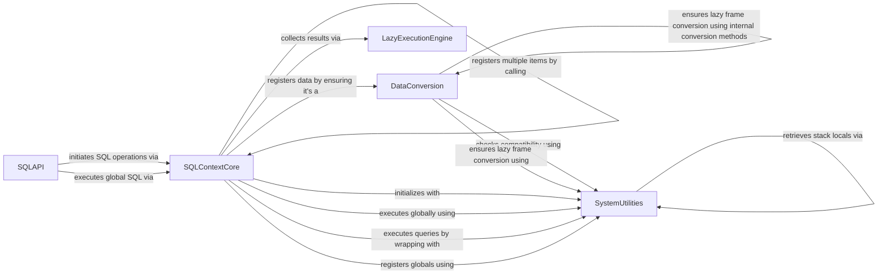

## Component Details

This component overview describes the SQL Interface subsystem within Polars, which enables users to execute SQL queries directly against registered DataFrames. The core functionality revolves around the `SQLContextCore` component, responsible for managing SQL query execution and DataFrame registration. Data compatibility is handled by `DataConversion`, ensuring various data structures are transformed into Polars LazyFrames. `SystemUtilities` provides essential internal support, while `SQLAPI` defines the user-facing interfaces. Finally, `LazyExecutionEngine` handles the collection of results from executed LazyFrames.

### SQLContextCore
Manages the lifecycle and operations of SQL queries within Polars, including registration of dataframes, execution of SQL strings, and handling of global SQL contexts.

**Related Classes/Methods**:

- <a href="https://github.com/pola-rs/polars/blob/master/py-polars/polars/sql/context.py#L99-L677" target="_blank" rel="noopener noreferrer">`polars.sql.context.SQLContext` (99:677)</a>
- <a href="https://github.com/pola-rs/polars/blob/master/py-polars/polars/sql/context.py#L120-L128" target="_blank" rel="noopener noreferrer">`polars.sql.context.SQLContext:__init__` (120:128)</a>
- <a href="https://github.com/pola-rs/polars/blob/master/py-polars/polars/sql/context.py#L328-L330" target="_blank" rel="noopener noreferrer">`polars.sql.context.SQLContext:execute` (328:330)</a>
- <a href="https://github.com/pola-rs/polars/blob/master/py-polars/polars/sql/context.py#L446-L479" target="_blank" rel="noopener noreferrer">`polars.sql.context.SQLContext:register` (446:479)</a>
- <a href="https://github.com/pola-rs/polars/blob/master/py-polars/polars/sql/context.py#L534-L577" target="_blank" rel="noopener noreferrer">`polars.sql.context.SQLContext:register_many` (534:577)</a>
- <a href="https://github.com/pola-rs/polars/blob/master/py-polars/polars/sql/context.py#L481-L532" target="_blank" rel="noopener noreferrer">`polars.sql.context.SQLContext:register_globals` (481:532)</a>
- <a href="https://github.com/pola-rs/polars/blob/master/py-polars/polars/sql/context.py#L222-L224" target="_blank" rel="noopener noreferrer">`polars.sql.context.SQLContext:execute_global` (222:224)</a>
- <a href="https://github.com/pola-rs/polars/blob/master/py-polars/polars/sql/context.py#L297-L301" target="_blank" rel="noopener noreferrer">`polars.sql.context.SQLContext:__enter__` (297:301)</a>
- <a href="https://github.com/pola-rs/polars/blob/master/py-polars/polars/sql/context.py#L303-L318" target="_blank" rel="noopener noreferrer">`polars.sql.context.SQLContext:__exit__` (303:318)</a>
- <a href="https://github.com/pola-rs/polars/blob/master/py-polars/polars/sql/context.py#L320-L322" target="_blank" rel="noopener noreferrer">`polars.sql.context.SQLContext:__repr__` (320:322)</a>
- <a href="https://github.com/pola-rs/polars/blob/master/py-polars/polars/sql/context.py#L641-L677" target="_blank" rel="noopener noreferrer">`polars.sql.context.SQLContext.tables` (641:677)</a>
- <a href="https://github.com/pola-rs/polars/blob/master/py-polars/polars/sql/context.py#L579-L639" target="_blank" rel="noopener noreferrer">`polars.sql.context.SQLContext.unregister` (579:639)</a>

### DataConversion
Handles the conversion of various data structures (e.g., Pandas DataFrames, PyArrow Tables) into Polars LazyFrames, ensuring compatibility for SQL operations.

**Related Classes/Methods**:

- <a href="https://github.com/pola-rs/polars/blob/master/py-polars/polars/sql/context.py#L59-L66" target="_blank" rel="noopener noreferrer">`polars.sql.context:_compatible_frame` (59:66)</a>
- <a href="https://github.com/pola-rs/polars/blob/master/py-polars/polars/sql/context.py#L69-L85" target="_blank" rel="noopener noreferrer">`polars.sql.context:_ensure_lazyframe` (69:85)</a>
- <a href="https://github.com/pola-rs/polars/blob/master/py-polars/polars/convert/general.py#L588-L595" target="_blank" rel="noopener noreferrer">`polars.convert.general.from_pandas` (588:595)</a>
- <a href="https://github.com/pola-rs/polars/blob/master/py-polars/polars/convert/general.py#L458-L584" target="_blank" rel="noopener noreferrer">`polars.convert.general.from_arrow` (458:584)</a>
- <a href="https://github.com/pola-rs/polars/blob/master/py-polars/polars/series/series.py#L1928-L1966" target="_blank" rel="noopener noreferrer">`polars.series.series.Series.to_frame` (1928:1966)</a>
- <a href="https://github.com/pola-rs/polars/blob/master/py-polars/polars/dataframe/frame.py#L9690-L9725" target="_blank" rel="noopener noreferrer">`polars.dataframe.frame.DataFrame.lazy` (9690:9725)</a>
- <a href="https://github.com/pola-rs/polars/blob/master/py-polars/polars/lazyframe/frame.py#L235-L8350" target="_blank" rel="noopener noreferrer">`polars.lazyframe.frame.LazyFrame` (235:8350)</a>

### SystemUtilities
Provides various utility functions for internal operations, including dependency checks, warning mechanisms, deprecation handling, and stack introspection.

**Related Classes/Methods**:

- <a href="https://github.com/pola-rs/polars/blob/master/py-polars/polars/_utils/unstable.py#L23-L48" target="_blank" rel="noopener noreferrer">`polars._utils.unstable.issue_unstable_warning` (23:48)</a>
- <a href="https://github.com/pola-rs/polars/blob/master/py-polars/polars/_utils/pycapsule.py#L17-L19" target="_blank" rel="noopener noreferrer">`polars._utils.pycapsule.is_pycapsule` (17:19)</a>
- <a href="https://github.com/pola-rs/polars/blob/master/py-polars/polars/dependencies.py#L214-L217" target="_blank" rel="noopener noreferrer">`polars.dependencies._check_for_pandas` (214:217)</a>
- <a href="https://github.com/pola-rs/polars/blob/master/py-polars/polars/dependencies.py#L220-L223" target="_blank" rel="noopener noreferrer">`polars.dependencies._check_for_pyarrow` (220:223)</a>
- <a href="https://github.com/pola-rs/polars/blob/master/py-polars/polars/_utils/various.py#L707-L732" target="_blank" rel="noopener noreferrer">`polars._utils.various.qualified_type_name` (707:732)</a>
- <a href="https://github.com/pola-rs/polars/blob/master/py-polars/polars/_utils/various.py#L499-L569" target="_blank" rel="noopener noreferrer">`polars._utils.various._get_stack_locals` (499:569)</a>
- <a href="https://github.com/pola-rs/polars/blob/master/py-polars/polars/sql/context.py#L88-L96" target="_blank" rel="noopener noreferrer">`polars.sql.context:_get_frame_locals` (88:96)</a>
- <a href="https://github.com/pola-rs/polars/blob/master/py-polars/polars/_utils/deprecation.py#L105-L133" target="_blank" rel="noopener noreferrer">`polars._utils.deprecation.deprecate_renamed_parameter` (105:133)</a>
- <a href="https://github.com/pola-rs/polars/blob/master/py-polars/polars/_utils/wrap.py#L16-L17" target="_blank" rel="noopener noreferrer">`polars._utils.wrap.wrap_ldf` (16:17)</a>

### SQLAPI
Represents the primary interfaces through which users interact with the Polars SQL engine, allowing execution of SQL queries on DataFrames or globally.

**Related Classes/Methods**:

- <a href="https://github.com/pola-rs/polars/blob/master/py-polars/polars/dataframe/frame.py#L5715-L5805" target="_blank" rel="noopener noreferrer">`polars.dataframe.frame.DataFrame:sql` (5715:5805)</a>
- <a href="https://github.com/pola-rs/polars/blob/master/py-polars/polars/sql/functions.py#L14-L14" target="_blank" rel="noopener noreferrer">`polars.sql.functions:sql` (14:14)</a>

### LazyExecutionEngine
Responsible for the final execution and collection of results from Polars LazyFrames after SQL operations have been applied.

**Related Classes/Methods**:

- <a href="https://github.com/pola-rs/polars/blob/master/py-polars/polars/lazyframe/frame.py#L2068-L2084" target="_blank" rel="noopener noreferrer">`polars.lazyframe.frame.LazyFrame.collect` (2068:2084)</a>

### [FAQ](https://github.com/CodeBoarding/GeneratedOnBoardings/tree/main?tab=readme-ov-file#faq)