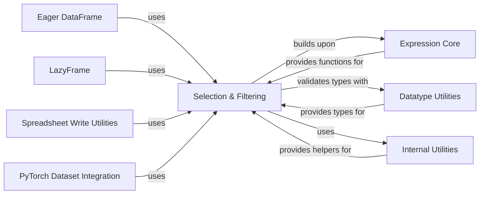

## Component Details

This graph illustrates the structure and interactions of the 'Selection & Filtering' component within the Polars library. It highlights how this component, responsible for column selection and filtering, integrates with core data structures like Eager DataFrames and LazyFrames, and leverages internal utilities, expression building blocks, and datatype handling for its functionality.

### Selection & Filtering
This component offers a specialized API for selecting and filtering columns within DataFrames and LazyFrames based on various criteria, such as names, data types, or regular expressions. It provides a powerful and concise way to specify column subsets for operations.

**Related Classes/Methods**:

- `polars.selectors` (full file reference)
- <a href="https://github.com/pola-rs/polars/blob/master/py-polars/polars/selectors.py#L89-L89" target="_blank" rel="noopener noreferrer">`polars.selectors.is_selector` (89:89)</a>
- <a href="https://github.com/pola-rs/polars/blob/master/py-polars/polars/selectors.py#L115-L191" target="_blank" rel="noopener noreferrer">`polars.selectors.expand_selector` (115:191)</a>
- <a href="https://github.com/pola-rs/polars/blob/master/py-polars/polars/selectors.py#L196-L228" target="_blank" rel="noopener noreferrer">`polars.selectors._expand_selectors` (196:228)</a>
- <a href="https://github.com/pola-rs/polars/blob/master/py-polars/polars/selectors.py#L231-L253" target="_blank" rel="noopener noreferrer">`polars.selectors._expand_selector_dicts` (231:253)</a>
- <a href="https://github.com/pola-rs/polars/blob/master/py-polars/polars/selectors.py#L256-L307" target="_blank" rel="noopener noreferrer">`polars.selectors._combine_as_selector` (256:307)</a>
- <a href="https://github.com/pola-rs/polars/blob/master/py-polars/polars/selectors.py#L310-L515" target="_blank" rel="noopener noreferrer">`polars.selectors._selector_proxy_` (310:515)</a>
- <a href="https://github.com/pola-rs/polars/blob/master/py-polars/polars/selectors.py#L333-L340" target="_blank" rel="noopener noreferrer">`polars.selectors._selector_proxy_:__invert__` (333:340)</a>
- <a href="https://github.com/pola-rs/polars/blob/master/py-polars/polars/selectors.py#L342-L358" target="_blank" rel="noopener noreferrer">`polars.selectors._selector_proxy_:__repr__` (342:358)</a>
- <a href="https://github.com/pola-rs/polars/blob/master/py-polars/polars/selectors.py#L361-L361" target="_blank" rel="noopener noreferrer">`polars.selectors._selector_proxy_:__add__` (361:361)</a>
- <a href="https://github.com/pola-rs/polars/blob/master/py-polars/polars/selectors.py#L378-L378" target="_blank" rel="noopener noreferrer">`polars.selectors._selector_proxy_:__and__` (378:378)</a>
- <a href="https://github.com/pola-rs/polars/blob/master/py-polars/polars/selectors.py#L396-L400" target="_blank" rel="noopener noreferrer">`polars.selectors._selector_proxy_:__rand__` (396:400)</a>
- <a href="https://github.com/pola-rs/polars/blob/master/py-polars/polars/selectors.py#L403-L403" target="_blank" rel="noopener noreferrer">`polars.selectors._selector_proxy_:__or__` (403:403)</a>
- <a href="https://github.com/pola-rs/polars/blob/master/py-polars/polars/selectors.py#L420-L423" target="_blank" rel="noopener noreferrer">`polars.selectors._selector_proxy_:__ror__` (420:423)</a>
- <a href="https://github.com/pola-rs/polars/blob/master/py-polars/polars/selectors.py#L426-L426" target="_blank" rel="noopener noreferrer">`polars.selectors._selector_proxy_:__sub__` (426:426)</a>
- <a href="https://github.com/pola-rs/polars/blob/master/py-polars/polars/selectors.py#L446-L446" target="_blank" rel="noopener noreferrer">`polars.selectors._selector_proxy_:__xor__` (446:446)</a>
- <a href="https://github.com/pola-rs/polars/blob/master/py-polars/polars/selectors.py#L463-L466" target="_blank" rel="noopener noreferrer">`polars.selectors._selector_proxy_:__rxor__` (463:466)</a>
- <a href="https://github.com/pola-rs/polars/blob/master/py-polars/polars/selectors.py#L468-L515" target="_blank" rel="noopener noreferrer">`polars.selectors._selector_proxy_:as_expr` (468:515)</a>
- <a href="https://github.com/pola-rs/polars/blob/master/py-polars/polars/selectors.py#L518-L530" target="_blank" rel="noopener noreferrer">`polars.selectors._re_string` (518:530)</a>
- <a href="https://github.com/pola-rs/polars/blob/master/py-polars/polars/selectors.py#L533-L580" target="_blank" rel="noopener noreferrer">`polars.selectors.all` (533:580)</a>
- <a href="https://github.com/pola-rs/polars/blob/master/py-polars/polars/selectors.py#L583-L691" target="_blank" rel="noopener noreferrer">`polars.selectors.alpha` (583:691)</a>
- <a href="https://github.com/pola-rs/polars/blob/master/py-polars/polars/selectors.py#L694-L791" target="_blank" rel="noopener noreferrer">`polars.selectors.alphanumeric` (694:791)</a>
- <a href="https://github.com/pola-rs/polars/blob/master/py-polars/polars/selectors.py#L794-L827" target="_blank" rel="noopener noreferrer">`polars.selectors.binary` (794:827)</a>
- <a href="https://github.com/pola-rs/polars/blob/master/py-polars/polars/selectors.py#L830-L885" target="_blank" rel="noopener noreferrer">`polars.selectors.boolean` (830:885)</a>
- <a href="https://github.com/pola-rs/polars/blob/master/py-polars/polars/selectors.py#L888-L973" target="_blank" rel="noopener noreferrer">`polars.selectors.by_dtype` (888:973)</a>
- <a href="https://github.com/pola-rs/polars/blob/master/py-polars/polars/selectors.py#L976-L1074" target="_blank" rel="noopener noreferrer">`polars.selectors.by_index` (976:1074)</a>
- <a href="https://github.com/pola-rs/polars/blob/master/py-polars/polars/selectors.py#L1077-L1176" target="_blank" rel="noopener noreferrer">`polars.selectors.by_name` (1077:1176)</a>
- <a href="https://github.com/pola-rs/polars/blob/master/py-polars/polars/selectors.py#L1179-L1226" target="_blank" rel="noopener noreferrer">`polars.selectors.categorical` (1179:1226)</a>
- <a href="https://github.com/pola-rs/polars/blob/master/py-polars/polars/selectors.py#L1229-L1302" target="_blank" rel="noopener noreferrer">`polars.selectors.contains` (1229:1302)</a>
- <a href="https://github.com/pola-rs/polars/blob/master/py-polars/polars/selectors.py#L1305-L1354" target="_blank" rel="noopener noreferrer">`polars.selectors.date` (1305:1354)</a>
- <a href="https://github.com/pola-rs/polars/blob/master/py-polars/polars/selectors.py#L1357-L1510" target="_blank" rel="noopener noreferrer">`polars.selectors.datetime` (1357:1510)</a>
- <a href="https://github.com/pola-rs/polars/blob/master/py-polars/polars/selectors.py#L1513-L1563" target="_blank" rel="noopener noreferrer">`polars.selectors.decimal` (1513:1563)</a>
- <a href="https://github.com/pola-rs/polars/blob/master/py-polars/polars/selectors.py#L1566-L1654" target="_blank" rel="noopener noreferrer">`polars.selectors.digit` (1566:1654)</a>
- <a href="https://github.com/pola-rs/polars/blob/master/py-polars/polars/selectors.py#L1657-L1765" target="_blank" rel="noopener noreferrer">`polars.selectors.duration` (1657:1765)</a>
- <a href="https://github.com/pola-rs/polars/blob/master/py-polars/polars/selectors.py#L1768-L1841" target="_blank" rel="noopener noreferrer">`polars.selectors.ends_with` (1768:1841)</a>
- <a href="https://github.com/pola-rs/polars/blob/master/py-polars/polars/selectors.py#L1844-L1908" target="_blank" rel="noopener noreferrer">`polars.selectors.exclude` (1844:1908)</a>
- <a href="https://github.com/pola-rs/polars/blob/master/py-polars/polars/selectors.py#L1911-L1958" target="_blank" rel="noopener noreferrer">`polars.selectors.first` (1911:1958)</a>
- <a href="https://github.com/pola-rs/polars/blob/master/py-polars/polars/selectors.py#L1961-L2011" target="_blank" rel="noopener noreferrer">`polars.selectors.float` (1961:2011)</a>
- <a href="https://github.com/pola-rs/polars/blob/master/py-polars/polars/selectors.py#L2014-L2064" target="_blank" rel="noopener noreferrer">`polars.selectors.integer` (2014:2064)</a>
- <a href="https://github.com/pola-rs/polars/blob/master/py-polars/polars/selectors.py#L2067-L2129" target="_blank" rel="noopener noreferrer">`polars.selectors.signed_integer` (2067:2129)</a>
- <a href="https://github.com/pola-rs/polars/blob/master/py-polars/polars/selectors.py#L2132-L2196" target="_blank" rel="noopener noreferrer">`polars.selectors.unsigned_integer` (2132:2196)</a>
- <a href="https://github.com/pola-rs/polars/blob/master/py-polars/polars/selectors.py#L2199-L2246" target="_blank" rel="noopener noreferrer">`polars.selectors.last` (2199:2246)</a>
- <a href="https://github.com/pola-rs/polars/blob/master/py-polars/polars/selectors.py#L2249-L2319" target="_blank" rel="noopener noreferrer">`polars.selectors.matches` (2249:2319)</a>
- <a href="https://github.com/pola-rs/polars/blob/master/py-polars/polars/selectors.py#L2322-L2373" target="_blank" rel="noopener noreferrer">`polars.selectors.numeric` (2322:2373)</a>
- <a href="https://github.com/pola-rs/polars/blob/master/py-polars/polars/selectors.py#L2376-L2429" target="_blank" rel="noopener noreferrer">`polars.selectors.object` (2376:2429)</a>
- <a href="https://github.com/pola-rs/polars/blob/master/py-polars/polars/selectors.py#L2432-L2505" target="_blank" rel="noopener noreferrer">`polars.selectors.starts_with` (2432:2505)</a>
- <a href="https://github.com/pola-rs/polars/blob/master/py-polars/polars/selectors.py#L2508-L2569" target="_blank" rel="noopener noreferrer">`polars.selectors.string` (2508:2569)</a>
- <a href="https://github.com/pola-rs/polars/blob/master/py-polars/polars/selectors.py#L2572-L2635" target="_blank" rel="noopener noreferrer">`polars.selectors.temporal` (2572:2635)</a>
- <a href="https://github.com/pola-rs/polars/blob/master/py-polars/polars/selectors.py#L2638-L2687" target="_blank" rel="noopener noreferrer">`polars.selectors.time` (2638:2687)</a>

### Eager DataFrame
This is the primary data structure in Polars for eager (immediate) computation. It provides a wide array of methods for data manipulation, transformation, aggregation, and input/output operations, executing each operation as it is called.

**Related Classes/Methods**:

- <a href="https://github.com/pola-rs/polars/blob/master/py-polars/polars/dataframe/frame.py#L201-L12391" target="_blank" rel="noopener noreferrer">`polars.dataframe.frame.DataFrame` (201:12391)</a>
- <a href="https://github.com/pola-rs/polars/blob/master/py-polars/polars/dataframe/frame.py#L3162-L3720" target="_blank" rel="noopener noreferrer">`polars.dataframe.frame.DataFrame:write_excel` (3162:3720)</a>
- <a href="https://github.com/pola-rs/polars/blob/master/py-polars/polars/dataframe/frame.py#L8918-L9151" target="_blank" rel="noopener noreferrer">`polars.dataframe.frame.DataFrame:pivot` (8918:9151)</a>
- <a href="https://github.com/pola-rs/polars/blob/master/py-polars/polars/dataframe/frame.py#L9153-L9217" target="_blank" rel="noopener noreferrer">`polars.dataframe.frame.DataFrame:unpivot` (9153:9217)</a>
- <a href="https://github.com/pola-rs/polars/blob/master/py-polars/polars/dataframe/frame.py#L9354-L9361" target="_blank" rel="noopener noreferrer">`polars.dataframe.frame.DataFrame:partition_by` (9354:9361)</a>
- <a href="https://github.com/pola-rs/polars/blob/master/py-polars/polars/dataframe/frame.py#L10525-L10601" target="_blank" rel="noopener noreferrer">`polars.dataframe.frame.DataFrame:to_dummies` (10525:10601)</a>

### LazyFrame
This component represents a deferred computation plan, allowing Polars to build an optimized query graph before executing any operations. This approach enables significant performance improvements through query optimization and parallelization.

**Related Classes/Methods**:

- <a href="https://github.com/pola-rs/polars/blob/master/py-polars/polars/lazyframe/frame.py#L235-L8350" target="_blank" rel="noopener noreferrer">`polars.lazyframe.frame.LazyFrame` (235:8350)</a>
- <a href="https://github.com/pola-rs/polars/blob/master/py-polars/polars/lazyframe/frame.py#L3689-L3791" target="_blank" rel="noopener noreferrer">`polars.lazyframe.frame.LazyFrame:cast` (3689:3791)</a>

### Spreadsheet Write Utilities
This internal utility module provides helper functions specifically designed to facilitate the writing of Polars DataFrames to Excel spreadsheet files. It handles complex formatting, styling, and structural aspects of Excel output.

**Related Classes/Methods**:

- `polars.io.spreadsheet._write_utils` (full file reference)
- <a href="https://github.com/pola-rs/polars/blob/master/py-polars/polars/io/spreadsheet/_write_utils.py#L111-L158" target="_blank" rel="noopener noreferrer">`polars.io.spreadsheet._write_utils:_xl_apply_conditional_formats` (111:158)</a>
- <a href="https://github.com/pola-rs/polars/blob/master/py-polars/polars/io/spreadsheet/_write_utils.py#L337-L531" target="_blank" rel="noopener noreferrer">`polars.io.spreadsheet._write_utils:_xl_setup_table_columns` (337:531)</a>

### PyTorch Dataset Integration
This component provides a bridge between Polars DataFrames and PyTorch, allowing users to seamlessly convert their Polars data into a PyTorch Dataset format for use in machine learning models.

**Related Classes/Methods**:

- <a href="https://github.com/pola-rs/polars/blob/master/py-polars/polars/ml/torch.py#L35-L213" target="_blank" rel="noopener noreferrer">`polars.ml.torch.PolarsDataset` (35:213)</a>
- <a href="https://github.com/pola-rs/polars/blob/master/py-polars/polars/ml/torch.py#L119-L151" target="_blank" rel="noopener noreferrer">`polars.ml.torch.PolarsDataset:__init__` (119:151)</a>

### Expression Core
This component encompasses the fundamental building blocks for creating and manipulating expressions within Polars, including column references and various functional operations.

**Related Classes/Methods**:

- <a href="https://github.com/pola-rs/polars/blob/master/py-polars/polars/expr/expr.py#L118-L11133" target="_blank" rel="noopener noreferrer">`polars.expr.expr.Expr` (118:11133)</a>
- <a href="https://github.com/pola-rs/polars/blob/master/py-polars/polars/expr/meta.py#L25-L448" target="_blank" rel="noopener noreferrer">`polars.expr.meta.ExprMetaNameSpace` (25:448)</a>
- <a href="https://github.com/pola-rs/polars/blob/master/py-polars/polars/functions/col.py#L120-L375" target="_blank" rel="noopener noreferrer">`polars.functions.col.Col` (120:375)</a>
- <a href="https://github.com/pola-rs/polars/blob/master/py-polars/polars/functions/aggregation/vertical.py#L11-L70" target="_blank" rel="noopener noreferrer">`polars.functions.aggregation.vertical.all` (11:70)</a>
- <a href="https://github.com/pola-rs/polars/blob/master/py-polars/polars/functions/lazy.py#L675-L719" target="_blank" rel="noopener noreferrer">`polars.functions.lazy.nth` (675:719)</a>
- <a href="https://github.com/pola-rs/polars/blob/master/py-polars/polars/functions/lazy.py#L545-L607" target="_blank" rel="noopener noreferrer">`polars.functions.lazy.first` (545:607)</a>
- <a href="https://github.com/pola-rs/polars/blob/master/py-polars/polars/functions/lazy.py#L610-L672" target="_blank" rel="noopener noreferrer">`polars.functions.lazy.last` (610:672)</a>

### Datatype Utilities
This module provides utilities for working with Polars data types, including type conversion, parsing, and group definitions.

**Related Classes/Methods**:

- <a href="https://github.com/pola-rs/polars/blob/master/py-polars/polars/datatypes/convert.py#L68-L81" target="_blank" rel="noopener noreferrer">`polars.datatypes.convert.is_polars_dtype` (68:81)</a>
- <a href="https://github.com/pola-rs/polars/blob/master/py-polars/polars/datatypes/classes.py#L511-L570" target="_blank" rel="noopener noreferrer">`polars.datatypes.classes.Datetime` (511:570)</a>
- <a href="https://github.com/pola-rs/polars/blob/master/py-polars/polars/datatypes/classes.py#L573-L615" target="_blank" rel="noopener noreferrer">`polars.datatypes.classes.Duration` (573:615)</a>
- <a href="https://github.com/pola-rs/polars/blob/master/py-polars/polars/datatypes/_parse.py#L44-L60" target="_blank" rel="noopener noreferrer">`polars.datatypes._parse.parse_into_dtype` (44:60)</a>

### Internal Utilities
This component consists of various internal helper functions used across different parts of the Polars library for common tasks like parsing inputs, handling warnings, and string manipulation.

**Related Classes/Methods**:

- <a href="https://github.com/pola-rs/polars/blob/master/py-polars/polars/_utils/parse/expr.py#L117-L139" target="_blank" rel="noopener noreferrer">`polars._utils.parse.expr._parse_inputs_as_iterable` (117:139)</a>
- <a href="https://github.com/pola-rs/polars/blob/master/py-polars/polars/_utils/various.py#L164-L168" target="_blank" rel="noopener noreferrer">`polars._utils.various.is_column` (164:168)</a>
- <a href="https://github.com/pola-rs/polars/blob/master/py-polars/polars/_utils/various.py#L647-L652" target="_blank" rel="noopener noreferrer">`polars._utils.various.re_escape` (647:652)</a>
- <a href="https://github.com/pola-rs/polars/blob/master/py-polars/polars/_utils/various.py#L707-L732" target="_blank" rel="noopener noreferrer">`polars._utils.various.qualified_type_name` (707:732)</a>
- <a href="https://github.com/pola-rs/polars/blob/master/py-polars/polars/_utils/unstable.py#L23-L48" target="_blank" rel="noopener noreferrer">`polars._utils.unstable.issue_unstable_warning` (23:48)</a>

### [FAQ](https://github.com/CodeBoarding/GeneratedOnBoardings/tree/main?tab=readme-ov-file#faq)