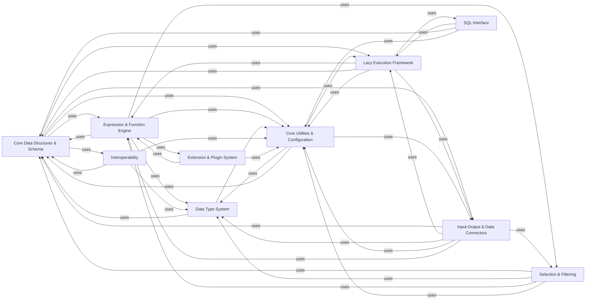

## Component Details

The Polars library is designed for efficient in-memory and out-of-core data manipulation, leveraging a columnar data model and lazy execution. Its core functionality revolves around DataFrames and Series, which are optimized for performance through Rust-based backend operations. The architecture supports a rich Expression API for complex transformations, a Lazy Execution Framework for query optimization, and extensive I/O capabilities for various data formats and sources. It also includes a robust data type system, interoperability with other data science tools, a SQL interface, and a flexible plugin system for extensibility.

### Core Data Structures & Schema
This component forms the bedrock of Polars, defining the fundamental data structures (DataFrame and Series) and their associated schemas. It handles the creation, manipulation, and structural integrity of data, ensuring type consistency and efficient memory layout. This component is central to all data operations within Polars.

**Related Classes/Methods**:

- <a href="https://github.com/pola-rs/polars/blob/master/py-polars/polars/dataframe/frame.py#L201-L12391" target="_blank" rel="noopener noreferrer">`polars.dataframe.frame.DataFrame` (201:12391)</a>
- <a href="https://github.com/pola-rs/polars/blob/master/py-polars/polars/series/series.py#L180-L8011" target="_blank" rel="noopener noreferrer">`polars.series.series.Series` (180:8011)</a>
- <a href="https://github.com/pola-rs/polars/blob/master/py-polars/polars/schema.py#L52-L216" target="_blank" rel="noopener noreferrer">`polars.schema.Schema` (52:216)</a>
- <a href="https://github.com/pola-rs/polars/blob/master/py-polars/polars/datatypes/classes.py#L112-L254" target="_blank" rel="noopener noreferrer">`polars.datatypes.classes.DataType` (112:254)</a>

### Expression & Function Engine
This component provides the powerful and flexible Expression API, allowing users to define complex data transformations and aggregations. It includes various expression types for different data operations (list, array, categorical, string, datetime, etc.) and a rich set of functions for both eager and lazy computations. This is where the core logic for data manipulation resides.

**Related Classes/Methods**:

- <a href="https://github.com/pola-rs/polars/blob/master/py-polars/polars/expr/expr.py#L118-L11133" target="_blank" rel="noopener noreferrer">`polars.expr.expr.Expr` (118:11133)</a>
- <a href="https://github.com/pola-rs/polars/blob/master/py-polars/polars/functions/col.py#L120-L375" target="_blank" rel="noopener noreferrer">`polars.functions.col.Col` (120:375)</a>
- <a href="https://github.com/pola-rs/polars/blob/master/py-polars/polars/functions/lit.py#L30-L202" target="_blank" rel="noopener noreferrer">`polars.functions.lit` (30:202)</a>
- `polars.functions.aggregation.horizontal` (full file reference)

### Lazy Execution Framework
This component is dedicated to Polars' lazy execution model, enabling deferred computation and query optimization. It defines the LazyFrame, which allows chaining operations without immediate execution, leading to highly efficient processing of large datasets. It includes functionalities for query planning, optimization flags, and schema collection in a lazy context.

**Related Classes/Methods**:

- <a href="https://github.com/pola-rs/polars/blob/master/py-polars/polars/lazyframe/frame.py#L235-L8350" target="_blank" rel="noopener noreferrer">`polars.lazyframe.frame.LazyFrame` (235:8350)</a>
- <a href="https://github.com/pola-rs/polars/blob/master/py-polars/polars/lazyframe/group_by.py#L24-L667" target="_blank" rel="noopener noreferrer">`polars.lazyframe.group_by.LazyGroupBy` (24:667)</a>
- <a href="https://github.com/pola-rs/polars/blob/master/py-polars/polars/lazyframe/opt_flags.py#L24-L265" target="_blank" rel="noopener noreferrer">`polars.lazyframe.opt_flags.QueryOptFlags` (24:265)</a>

### Input-Output & Data Connectors
This component manages all data ingress and egress for Polars, supporting a wide array of file formats (CSV, Parquet, IPC, JSON, Excel, etc.) and external data sources like databases and cloud storage. It also includes integration with data catalogs for managing external table metadata and credentials.

**Related Classes/Methods**:

- `polars.io.csv.functions` (full file reference)
- `polars.io.parquet.functions` (full file reference)
- `polars.io.database.functions` (full file reference)
- <a href="https://github.com/pola-rs/polars/blob/master/py-polars/polars/catalog/unity/client.py#L45-L687" target="_blank" rel="noopener noreferrer">`polars.catalog.unity.client.Catalog` (45:687)</a>

### Data Type System
This component is responsible for the definition, parsing, conversion, and overall management of data types within the Polars ecosystem. It provides the necessary utilities to ensure data integrity and compatibility across various operations and data sources.

**Related Classes/Methods**:

- `polars.datatypes.convert` (full file reference)
- `polars.datatypes._parse` (full file reference)

### Interoperability
This component facilitates seamless data exchange and integration between Polars and other data processing and machine learning libraries. It implements the DataFrame Interchange Protocol and provides utilities for converting Polars data structures to formats compatible with frameworks like PyTorch and NumPy.

**Related Classes/Methods**:

- <a href="https://github.com/pola-rs/polars/blob/master/py-polars/polars/interchange/dataframe.py#L18-L230" target="_blank" rel="noopener noreferrer">`polars.interchange.dataframe.PolarsDataFrame` (18:230)</a>
- <a href="https://github.com/pola-rs/polars/blob/master/py-polars/polars/interchange/from_dataframe.py#L25-L50" target="_blank" rel="noopener noreferrer">`polars.interchange.from_dataframe` (25:50)</a>
- <a href="https://github.com/pola-rs/polars/blob/master/py-polars/polars/ml/torch.py#L35-L213" target="_blank" rel="noopener noreferrer">`polars.ml.torch.PolarsDataset` (35:213)</a>

### SQL Interface
This component provides a SQL layer within Polars, allowing users to execute SQL queries directly against registered DataFrames. It bridges the gap between traditional SQL-based data analysis and Polars' native API, enabling flexible data querying.

**Related Classes/Methods**:

- <a href="https://github.com/pola-rs/polars/blob/master/py-polars/polars/sql/context.py#L99-L677" target="_blank" rel="noopener noreferrer">`polars.sql.context.SQLContext` (99:677)</a>

### Selection & Filtering
This component offers a specialized API for selecting and filtering columns within DataFrames and LazyFrames based on various criteria, such as names, data types, or regular expressions. It provides a powerful and concise way to specify column subsets for operations.

**Related Classes/Methods**:

- `polars.selectors` (full file reference)

### Core Utilities & Configuration
This component encompasses a collection of foundational utility functions, global configurations, and dependency management mechanisms used throughout the Polars library. It handles aspects like deprecation warnings, type conversions, asynchronous operations, and CPU feature checks, ensuring the library's stability and adaptability.

**Related Classes/Methods**:

- `polars._utils.deprecation` (full file reference)
- `polars._utils.convert` (full file reference)
- <a href="https://github.com/pola-rs/polars/blob/master/py-polars/polars/config.py#L148-L1513" target="_blank" rel="noopener noreferrer">`polars.config.Config` (148:1513)</a>
- <a href="https://github.com/pola-rs/polars/blob/master/py-polars/polars/dependencies.py#L28-L102" target="_blank" rel="noopener noreferrer">`polars.dependencies._LazyModule` (28:102)</a>

### Extension & Plugin System
This component provides a robust mechanism for extending Polars' functionality through external plugins. It allows developers to register and integrate custom operations and data sources, enhancing the library's versatility and adaptability to diverse use cases.

**Related Classes/Methods**:

- `polars.plugins` (full file reference)

### [FAQ](https://github.com/CodeBoarding/GeneratedOnBoardings/tree/main?tab=readme-ov-file#faq)