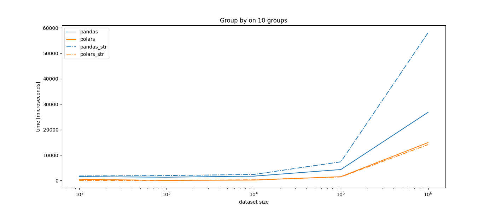
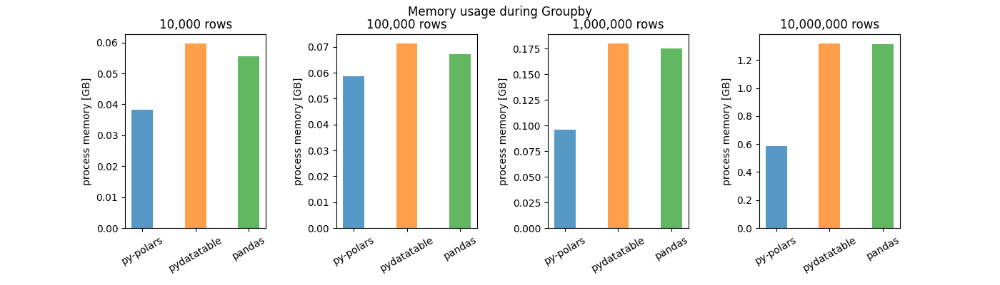
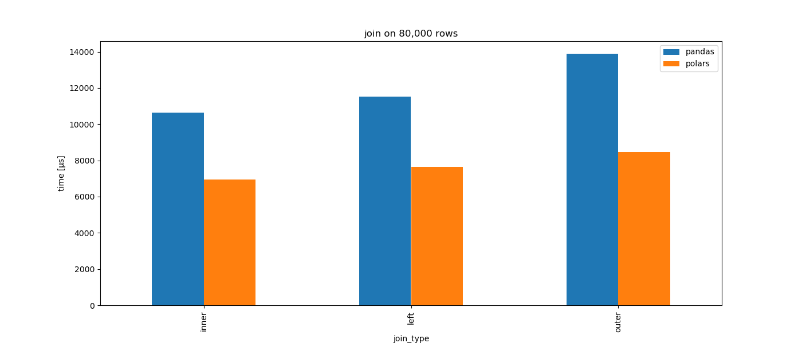

# Polars

## Blazingly fast DataFrames in Rust & Python

Polars is a blazingly fast DataFrames library implemented in Rust. Its memory model uses Apache Arrow as backend. 

It currently consists of an eager API similar to pandas and a lazy API that is somewhat similar to spark. 
Amongst more, Polars has the following functionalities.

| Functionality                                     | Eager | Lazy (DataFrame) | Lazy (Series) |
|---------------------------------------------------|-------|------------------|---------------|
| Filters                                           | ✔     | ✔                | ✔             |
| Shifts                                            | ✔     | ✔                | ✔             |
| Joins                                             | ✔     | ✔                |               |
| GroupBys + aggregations                           | ✔     | ✔                |               |
| Comparisons                                       | ✔     | ✔                | ✔             |
| Arithmetic                                        | ✔     |                  | ✔             |
| Sorting                                           | ✔     | ✔                | ✔             |
| Reversing                                         | ✔     | ✔                | ✔             |
| Closure application (User Defined Functions)      | ✔     |                  | ✔             |
| SIMD                                              | ✔     |                  | ✔             |
| Pivots                                            | ✔     | ✗                |               |
| Melts                                             | ✔     | ✗                |               |
| Filling nulls + fill strategies                   | ✔     | ✗                | ✔             |
| Aggregations                                      | ✔     | ✔                | ✔             |
| Moving Window aggregates                          | ✔     | ✗                | ✗             |
| Find unique values                                | ✔     |                  | ✗             |
| Rust iterators                                    | ✔     |                  | ✔             |
| IO (csv, json, parquet, Arrow IPC                 | ✔     | ✗                |               |
| Query optimization: (predicate pushdown)          | ✗     | ✔                |               |
| Query optimization: (projection pushdown)         | ✗     | ✔                |               |
| Query optimization: (type coercion)               | ✗     | ✔                |               |

**Note that almost all eager operations supported by Eager on `Series`/`ChunkedArrays` can be used in Lazy via UDF's**

## Documentation
Want to know about all the features Polars support? Read the docs!

#### Rust
* [Documentation (stable)](https://docs.rs/polars/latest/polars/). 
* [Documentation (master branch)](https://ritchie46.github.io/polars). 
    * [DataFrame](https://ritchie46.github.io/polars/polars/frame/struct.DataFrame.html) 
    * [Series](https://ritchie46.github.io/polars/polars/series/enum.Series.html)
    * [ChunkedArray](https://ritchie46.github.io/polars/polars/chunked_array/struct.ChunkedArray.html)
    * [Traits for ChunkedArray](https://ritchie46.github.io/polars/polars/chunked_array/ops/index.html)
    * [Time/ DateTime utilities](https://ritchie46.github.io/polars/polars/doc/time/index.html)
    * [Groupby, aggregations and pivots](https://ritchie46.github.io/polars/polars/frame/group_by/struct.GroupBy.html)
    * [Lazy DataFrame](https://ritchie46.github.io/polars/polars/lazy/frame/struct.LazyFrame.html)
* [10 minutes to Polars notebook](examples/10_minutes_to_polars.ipynb)
    
#### Python
* installation guide: `pip install py-polars`
* [Reference guide](https://ritchie46.github.io/polars/pypolars/index.html)
* [10 minutes to py-polars notebook](examples/10_minutes_to_pypolars.ipynb)
* [lazy py-polars notebook](examples/lazy_py-polars.ipynb)

## Performance
Polars is written to be performant. Below are some comparisons with pandas and pydatatable DataFrame library **(lower is better)**.

#### GroupBy

#### Joins

## Cargo Features

Additional cargo features:

* `pretty` (default)
    - pretty printing of DataFrames
* `temporal (default)`
    - Conversions between Chrono and Polars for temporal data
* `simd (default)`
    - SIMD operations
* `parquet`
    - Read Apache Parquet format
* `random`
    - Generate array's with randomly sampled values
* `ndarray`
    - Convert from `DataFrame` to `ndarray`
* `lazy`
    - Lazy api
* `strings`
    - String utilities for `Utf8Chunked`

## Contribution
Want to contribute? Read our [contribution guideline](./CONTRIBUTING.md).
