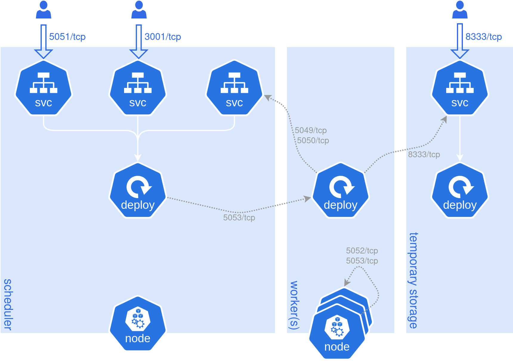
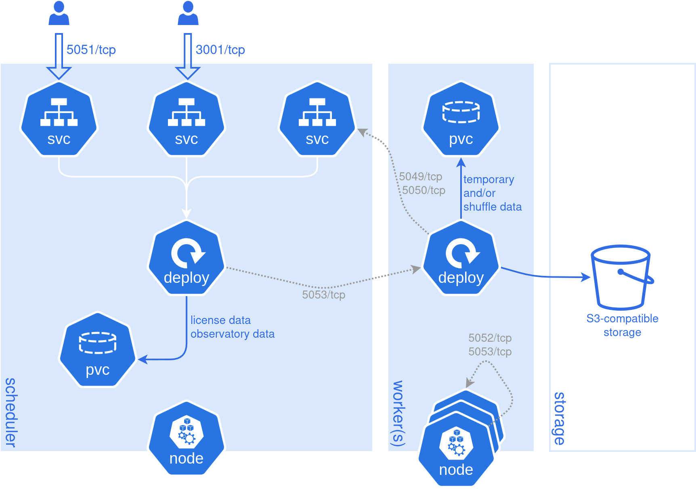

# Getting started

The following section walks you through the few steps required to deploy a cluster on your own
Kubernetes infrastructure. We expect the latter to be provisioned, and the few tools to interact
with it (`kubectl` and Helm) to be installed.

Start by [creating an account](https://cloud.pola.rs/api/redirects/register) if you do not already
have one, and follow the steps to create a Kubernetes Workspace.

#### Create a Polars service account

Each cluster, regardless of its deployment type, needs to authenticate and register with our control
plane. This is done via a _service account_, a credential pair (client ID and client secret) that
you create and store on your end. We do not store it on our side, and in case of loss a new set will
need to be generated. Service accounts are managed (created and revoked) in the settings page of the
workspace or can be created with the CLI.

```bash
pc service-account create --workspace-name my-workspace --name my-sa
```

Note this service account is distinct from any Kubernetes service account object; it is an identity
managed solely within Polars.

#### Deploy your cluster with Helm

Now that the admin is done, the most exciting part: the actual deployment. We distribute a Helm
chart via [this repo](https://github.com/polars-inc/helm-charts), and you can use the following
commands to register the repo and install the chart:

!!! info "Workspace ID"

    The Workspace ID can be found in the workspace settings page or with `pc workspace list`.

```sh
helm repo add polars-inc https://polars-inc.github.io/helm-charts
```

```sh
helm repo update
```

```sh
helm upgrade --install polars polars-inc/polars \
  --set clusterId="My First Cluster" \
  --set workspaceId=<WORKSPACE ID> \
  --set clientId=<SERVICE ACCOUNT ID> \
  --set clientSecret=<SERVICE ACCOUNT SECRET> \
  --set scheduler.deployment.runtimeContainer.resources.requests.memory=1Gi \
  --set worker.deployment.replicaCount=2 \
  --set worker.deployment.runtimeContainer.resources.requests.memory=4Gi \
  --set worker.deployment.runtimeContainer.resources.limits.memory=4Gi \
  --set anonymousResults.temporaryStorage.enabled=true
```

!!! warning "Not for production use"

    The cluster configuration defined above is for a quickstart only and should not be used in a
    production environment! See the [Production configuration](#production-configuration) section
    below.

Key parameters explained:

- The name of the workspace chosen earlier needs to be provided to uniquely identify the cluster.
- The Polars On-Prem service account credentials generated earlier also need to be provided for
  authentication.
- The Helm command deploys a cluster including 2 workers; feel free to increase that number to
  fulfill your needs. Note that we also set up requests and limits thresholds for the deployed
  resources: 1 GiB for the scheduler and 4 GiB for each worker.
- For remote Polars queries without a specific output sink, Polars On-Prem automatically adds a
  persistent sink. We call this sink the "anonymous results" sink. Infrastructure-wise, this sink is
  backed by S3-compatible storage, which should be accessible from all worker nodes and the client.
  For a lightweight quickstart we opted for [SeaweedFS](https://github.com/seaweedfs/seaweedfs),
  backed by an `emptyDir` (all temporary results will be lost upon restart of that service).

Helm will install the cluster in the `default` Kubernetes namespace. During setup, the
`workspaceId`, `clientId` and `clientSecret` values are all prefilled in the frontend.

Once the installation completes, verify that all pods are running:

```bash
kubectl get pods
```

You should see output similar to:

```
NAME                                         READY   STATUS    RESTARTS   AGE
polars-scheduler-xxxxxxxxx-xxxxx             1/1     Running   0          1m
polars-worker-xxxxxxxxx-xxxxx                1/1     Running   0          1m
polars-worker-xxxxxxxxx-xxxxx                1/1     Running   0          1m
polars-temporary-storage-xxxxxxxxx-xxxxx     1/1     Running   0          1m
```

Once all pods show a `Running` status, the cluster is registered with our control plane and ready to
accept queries.

#### Run your first query

Below you can find a very minimal Polars query to test if your deployment was successful. For a
quickstart, port-forward the required endpoints:

```bash
kubectl port-forward svc/polars-scheduler 5051:5051
```

```bash
kubectl port-forward svc/polars-observatory 3001:3001
```

```bash
kubectl port-forward svc/polars-temporary-storage 8333:8333
```

For a more detailed explanation on the requirements behind these port-forwarding commands, see the
[next section](#deployed-kubernetes-resources). Finally, submit your query from a script or notebook
cell:

```python
import polars as pl
import polars_cloud as pc

ctx = pc.ClusterContext(compute_address="localhost")
result = (
    pl.LazyFrame()
    .with_columns(a=pl.arange(0, 100000000).sum())
    .remote(ctx)
    .execute()
)
print(result.head())
```

The cluster is now ready to execute your own Polars queries. The following sections give more
details about the setup, and what knobs to turn to make your deployment production-ready.

### Deployed Kubernetes resources

Each self-hosted deployment creates a few objects, as detailed on the following diagram:



At the moment, no Kubernetes ingress object is provided by our Helm chart. Access to the various
components listed above need to be done via port-forwarding:

- The **scheduler** is available on port 5051, and port-forwarding is required to submit queries to
  the cluster. This is the central service of the cluster, bookkeeping query queue and execution.
- The **dashboard** (_aka_ "observatory") is exposed on port 3001. Port-forwarding means gaining
  access to the locally-exposed cluster dashboard, which lifecycle is tied to the scheduler. The
  dashboard includes information about the cluster itself, status of submitted queries, and of
  course query profiling.
- The **temporary storage** is available on port 8333 (default port for SeaweedFS). Port-forwarding
  allows access to [anonymous results](#anonymous-results-data), that is, tell the Python client
  where to find the result data.

Our Helm chart can easily be wrapped in a parent chart providing the missing Kubernetes objects to
avoid these explicit port-forwards; we chose not to include them for now as users will be bound by
the implementation of the Kubernetes distribution of their choice.

To tune the configuration of each service, refer to the
[Helm chart documentation](https://github.com/polars-inc/helm-charts/tree/main/charts/polars). A few
important configuration options are discussed in the
[Production configuration](#production-configuration) section below.

### Communication with our control plane

Deployed clusters sync with our control plane to verify licensing and power your dashboard
experience. This connection streams query plans, profiling data, and cluster metadata, giving you
full visibility into historical usage and query execution patterns so you can optimize and
troubleshoot queries.

The data your queries process stays entirely within your environment, and is never shared with us.

We also offer custom solutions for running Polars On-Prem in air-gapped environments in which
registration with our servers is not required, and no data is shared with us (see
[On-Prem Enterprise](#on-prem-enterprise) section).

### Production configuration

The complete list of configurable options is provided in the documentation of the
[Helm chart](https://github.com/polars-inc/helm-charts/tree/main/charts/polars). The three topics
listed below are the main configuration sections to tweak to ready your cluster for production use.



_In blue the optional PVC and S3-compatible storage._

#### Anonymous results data

For remote queries without a specific output sink, Polars automatically adds a persistent sink. We
call this sink the "anonymous results" sink. Infrastructure-wise, this sink is backed by
S3-compatible storage, which must be accessible from all worker nodes and the client.

For a lightweight quickstart we opted for [SeaweedFS](https://github.com/seaweedfs/seaweedfs),
backed by an `emptyDir`. In a production environment, any S3-compatible technology can be used
(_i.e._, MinIO, DigitalOcean Spaces, _etc._). Support for Azure Blob Storage (ABS) and Google Cloud
Storage (GCS) is currently being tested (released as beta).

Anonymous results configuration is under the
[`anonymousResults` section](https://github.com/polars-inc/helm-charts/tree/main/charts/polars#anonymous-results-data).

#### Shuffle data

During query execution, data is spread amongst worker nodes. On certain types of events, data from
other nodes needs to be made available to be able to perform next operations; in these situations
the data is _shuffled_ between worker nodes, according to the bookkeeping done by the scheduler.

By default, `emptyDir` volumes are used on each worker node. You can however decide to use ephemeral
volumes instead for more configuration flexibility; as an alternative, your own S3-compatible
storage can be used.

Using S3-compatible storage might improve fault tolerance, since intermediate results are stored
independently of the worker pods themselves. The performance trade-off depends on the latency and
throughput characteristics of your storage backend relative to local volumes. As an example, on AWS,
EBS offers lower latency than S3 but lower throughput. This makes EBS a better fit for workloads
that produce many small shuffle files, while S3 will outperform it when shuffle files are large.

Shuffle configuration is under the
[`shuffleData` section](https://github.com/polars-inc/helm-charts/tree/main/charts/polars#shuffle-data).

#### Resource allocation

Polars On-Prem is best experienced on dedicated Kubernetes nodes, with only one worker pod per node.
If other workloads run on the cluster however (or if multiple instances of the Polars On-Prem chart
are deployed), pod requests and limits should be allocated to worker nodes via the
[Kubernetes API](https://kubernetes.io/docs/concepts/configuration/manage-resources-containers/). In
the same fashion, node selector, taints and tolerations should be used to optimize the topology of
the cluster.

Resource allocation and cluster topology configuration is under the
[`worker.deployment` section](https://github.com/polars-inc/helm-charts/tree/main/charts/polars#resource-allocation-and-node-selectors).

## On-Prem Enterprise

If you are interested in deploying one or several clusters without any resource limitations nor data
sharing, on bare-metal machines or in a Kubernetes setup, and in air-gapped environments, please
[sign up here to apply](https://w0lzyfh2w8o.typeform.com/to/f37L1SRx#form_name=enterprise&form_origin=userguide).
